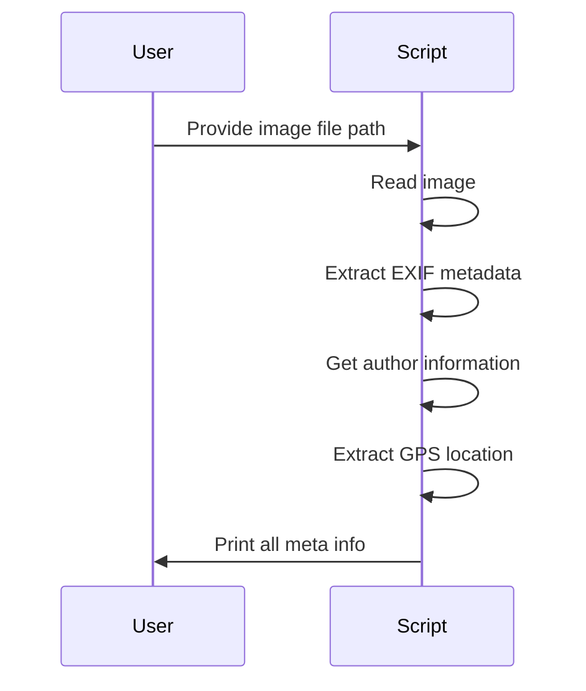

#  Cool_Project_2: Get Meta Information of Images

[](https://github.com/alok-kumar8765/Cool_Project_2/stargazers) 
[](https://github.com/alok-kumar8765/Cool_Project_2/network/members) 
[](https://github.com/alok-kumar8765/Cool_Project_2/issues)
[](https://www.python.org/)
[](https://github.com/alok-kumar8765/Cool_Project_2/blob/main/LICENSE)

---

## **Table of Contents**

<details>
<summary>Click to expand</summary>

1. [Project Description](#project-description)  
2. [Features](#features)  
3. [Architecture & Design](#architecture--design)  
   - [DFD Diagram](#dfd-diagram)  
   - [System Architecture Diagram](#system-architecture-diagram)  
   - [Workflow Diagram](#workflow-diagram)  
4. [Installation](#installation)  
5. [Usage](#usage)  
6. [Code Explanation](#code-explanation)  
   - [author_utils.py](#author_utilspy)  
   - [get_meta_from_pic.py](#get_meta_from_picpy)  
   - [gps_utils.py](#gps_utilspy)  
7. [Pros and Cons](#pros-and-cons)  
8. [Real-world Use Cases](#real-world-use-cases)  
9. [Contributing](#contributing)  
10. [License](#license)

</details>

---

## **Project Description**

This project provides a Python-based **enterprise-grade tool to extract metadata from images**, including EXIF data, GPS coordinates, file ownership (author), file size, creation date, and more. It is ideal for **digital forensics, photography analytics, geotagging, and content management systems**.  

- Extracts detailed **image metadata**.  
- Determines **author/owner of the file** using Windows security descriptors.  
- Extracts **geolocation** using GPS EXIF tags and converts them to human-readable addresses.  
- Supports **cross-functional usage** for personal, professional, or legal applications.

---

## **Features**

<details>
<summary>Click to expand</summary>

- ✅ Get image file properties: name, size, extension.  
- ✅ Extract EXIF data: width, height, date taken, camera info.  
- ✅ Retrieve Windows file owner/author.  
- ✅ Extract GPS coordinates and map to addresses.  
- ✅ Handles errors gracefully for missing metadata.  
- ✅ Easy CLI-based usage.  
- ✅ Python 3.11+ compatible.

</details>

---

## **Architecture & Design**

### **DFD Diagram**

```mermaid
flowchart TD
    A[User provides image] --> B[System reads image file]
    B --> C[EXIF Extraction Module]
    B --> D[Author Extraction Module]
    B --> E[GPS Extraction Module]
    C --> F[Formatted EXIF Data]
    D --> G[Author Info]
    E --> H[Geolocation Info]
    F --> I[Output Console/Report]
    G --> I
    H --> I
````

### **System Architecture Diagram**

```mermaid
graph TD
    subgraph Frontend
        A[CLI Input]
    end
    subgraph Backend
        B[Image Reader]
        C[EXIF Module]
        D[Author Module]
        E[GPS Module]
        F[Data Formatter]
    end
    subgraph Output
        G[Console Output / Reports]
    end

    A --> B
    B --> C
    B --> D
    B --> E
    C --> F
    D --> F
    E --> F
    F --> G
```

### **Workflow Diagram**



---

## **Installation**

<details>
<summary>Click to expand</summary>

```bash
# Clone repository
git clone https://github.com/alok-kumar8765/Cool_Project_2.git
cd Cool_Project_2/Get_meta_information_of_images

# Create virtual environment
python -m venv venv
source venv/bin/activate  # Linux/Mac
venv\Scripts\activate     # Windows

# Install dependencies
pip install -r requirements.txt
# Recommended dependencies:
# Pillow, exifread, geopy, requests
```

</details>

---

## **Usage**

<details>
<summary>Click to expand</summary>

```bash
# Run the main script to extract metadata
python get_meta_from_pic.py "path/to/image.jpg"

# Sample Output:
# ImageName: sample.jpg
# size: 4000x3000
# FileExtension: .jpg
# ImageWidth: 4000
# ImageHeight: 3000
# DateTimeOriginal: 2025-01-12 14:32:11
# CreateDate: 2025-01-12 14:35:00
# Author: COMPUTER\User
# Location: 221B Baker Street, London, UK
```

</details>

---

## **Code Explanation**

### **author_utils.py**

<details>
<summary>Click to expand</summary>

* Retrieves **Windows file security info**.
* Uses **ctypes** to access `kernel32` and `advapi32` DLLs.
* Extracts **owner, group, DACL, SACL** from file.
* Key functions:

  * `get_file_security(filename)` – Returns security descriptor object.
  * `get_author(filename)` – Returns Windows file owner.
* Handles pointers and memory management using custom classes `PSECURITY_DESCRIPTOR`, `PSID`, `PLOCAL`.

</details>

### **get_meta_from_pic.py**

<details>
<summary>Click to expand</summary>

* Reads an image using `PIL.Image`.
* Extracts EXIF metadata using `_getexif()` and maps keys via `ExifTags.TAGS`.
* Gets file properties: size, extension, creation date.
* Combines EXIF, file author, and GPS location.
* Prints a formatted output with all metadata.

</details>

### **gps_utils.py**

<details>
<summary>Click to expand</summary>

* Extracts GPS coordinates from EXIF using `exifread`.
* Converts EXIF GPS data to **decimal degrees**.
* Uses `geopy.Nominatim` to convert coordinates to a **human-readable address**.
* Key functions:

  * `format_lati_long(data)` – Converts EXIF GPS format to decimal.
  * `get_location(filename)` – Returns full address for GPS data.

</details>

---

## **Pros and Cons**

<details>
<summary>Click to expand</summary>

**Pros:**

* Lightweight and fast.
* Cross-functional metadata extraction (EXIF, GPS, author).
* Enterprise-ready with Windows security integration.
* Useful for forensics, analytics, and content verification.

**Cons:**

* Windows-specific author extraction.
* GPS extraction requires EXIF GPS data to exist.
* Reverse geocoding relies on internet connection.
* Limited CLI-only interface.

</details>

---

## **Real-world Use Cases**

<details>
<summary>Click to expand</summary>

* **Digital Forensics:** Identify photo ownership, timestamps, and location.
* **Photography Management:** Automatically tag images with metadata.
* **Geo-tagging:** Extract coordinates from images for maps and travel apps.
* **Content Verification:** Validate image origin and authenticity.
* **Law Enforcement:** Investigate file authorship and location.

**Example:**

```bash
python get_meta_from_pic.py "evidence_photo.jpg"
# Outputs:
# Image details + author info + GPS location
```

</details>

---

## **Contributing**

<details>
<summary>Click to expand</summary>

1. Fork the repository.
2. Create your feature branch: `git checkout -b feature/AmazingFeature`
3. Commit your changes: `git commit -m 'Add some AmazingFeature'`
4. Push to the branch: `git push origin feature/AmazingFeature`
5. Open a Pull Request.

</details>

---

## **License**

<details>
<summary>Click to expand</summary>

This project is licensed under the **MIT License** – see the [LICENSE](https://github.com/alok-kumar8765/Cool_Project_2/blob/main/LICENSE) file for details.

</details>


---

