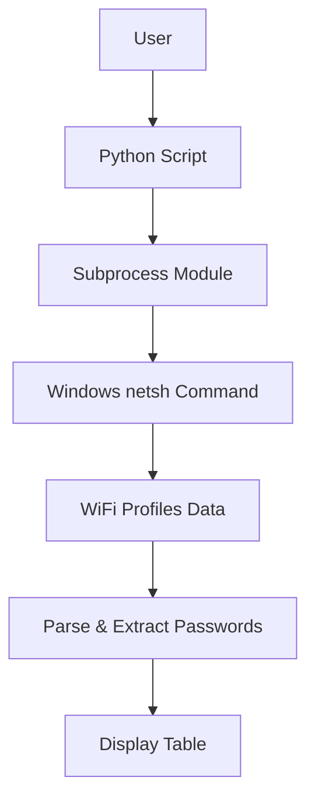
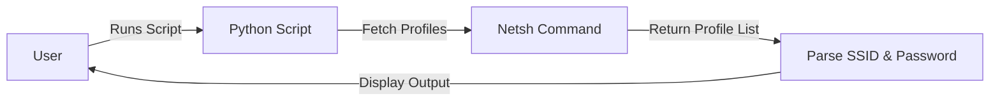

# 🚀 Get WiFi Passwords Automatically

[](https://github.com/alok-kumar8765/Cool_Project_2)
[](https://github.com/alok-kumar8765/Cool_Project_2)
[](https://github.com/alok-kumar8765/Cool_Project_2/issues)
[](https://github.com/alok-kumar8765/Cool_Project_2/blob/main/LICENSE)
[](https://www.python.org/)
[](https://github.com/alok-kumar8765/Cool_Project_2)

---

## 📖 Table of Contents
<details>
<summary>Click to expand</summary>

1. [Project Overview](#project-overview)  
2. [Features](#features)  
3. [Installation](#installation)  
4. [Usage](#usage)  
5. [Architecture & Diagrams](#architecture--diagrams)  
6. [Flow Diagram](#flow-diagram)  
7. [Pros & Cons](#pros--cons)  
8. [Real-World Use Cases](#real-world-use-cases)  
9. [SEO & Best Practices](#seo--best-practices)  
10. [License](#license)  

</details>

---

## 🔹 Project Overview
This Python script extracts all saved WiFi passwords from a Windows machine using the native `netsh` command.  
It automates the process of retrieving network credentials for **all user profiles** and prints them in a structured format.  

**Key Highlights:**
- Works on Windows OS.
- Uses Python's `subprocess` module.
- Displays WiFi SSID and passwords in tabular format.
- Minimal code, highly effective for system administrators and penetration testing purposes.  

---

## 🔹 Features
<details>
<summary>Click to expand</summary>

- Retrieve all saved WiFi profiles on a Windows machine.
- Extract the corresponding passwords for each SSID.
- Display SSID-password pairs in a clean tabular format.
- Minimal dependencies (built-in Python library only).  
- Can be integrated into larger network auditing or IT management scripts.  

</details>

---

## 🔹 Installation
<details>
<summary>Click to expand</summary>

**Prerequisites:**
- Windows OS
- Python 3.8+  

**Steps:**
```bash
# Clone the repository
git clone https://github.com/alok-kumar8765/Cool_Project_2.git

# Navigate to the project directory
cd Cool_Project_2/Get_wifi_password

# Run the script
python get_wifi_password.py
````

</details>

---

## 🔹 Usage

<details>
<summary>Click to expand</summary>

```python
import subprocess

# Get all WiFi profiles
data = subprocess.check_output(["netsh", "wlan", "show", "profiles"]).decode("utf-8").split("\n")
profiles = [i.split(":")[1][1:-1] for i in data if "All User Profile" in i]

# Extract passwords
for i in profiles:
    results = subprocess.check_output(["netsh", "wlan", "show", "profile", i, "key=clear"]).decode("utf-8").split("\n")
    results = [b.split(":")[1][1:-1] for b in results if "Key Content" in b]
    try:
        print("{:<30}|  {:<}".format(i, results[0]))
    except IndexError:
        print("{:<30}|  {:<}".format(i, ""))
```

**Output Example:**

```
SSID Name                     |  password123
Home_WiFi                     |  myhomepass
```

</details>

---

## 🔹 Architecture & Diagrams

<details>
<summary>Click to expand</summary>

**System Architecture:**



**Data Flow Diagram (DFD Level 1):**



**High-Level Architecture:**

* **Input:** Windows machine with stored WiFi profiles.
* **Process:** Python `subprocess` fetches profiles and parses passwords.
* **Output:** Tabular display of SSID-password pairs.

</details>

---

## 🔹 Flow Diagram

<details>
<summary>Click to expand</summary>

```mermaid
flowchart TD
    Start --> Check_OS{Windows?}
    Check_OS -- Yes --> Fetch_Profiles
    Check_OS -- No --> Exit[Print: Unsupported OS]
    Fetch_Profiles --> Loop[Loop through Profiles]
    Loop --> Extract_Passwords
    Extract_Passwords --> Display[Print SSID | Password]
    Display --> End
```

</details>

---

## 🔹 Pros & Cons

<details>
<summary>Click to expand</summary>

**Pros:**

* Extremely lightweight and dependency-free.
* Easy to read and modify.
* Useful for IT admins and security audits.
* Works out-of-the-box on Windows.

**Cons:**

* Only works on Windows.
* Requires administrative permissions for certain profiles.
* Passwords are exposed in plaintext.
* Not suitable for multi-platform environments without modification.

</details>

---

## 🔹 Real-World Use Cases

<details>
<summary>Click to expand</summary>

* **IT Management:** Quickly audit WiFi passwords in corporate networks.
* **Security Testing:** Penetration testers can verify stored credentials security.
* **Personal Backup:** Recover forgotten WiFi passwords at home.
* **Automation Scripts:** Integrate into larger network monitoring or reporting tools.

**Example:**
A system admin wants to document all WiFi credentials of office computers for migration. This script generates a full list automatically.

</details>

---

## 🔹 SEO & Best Practices

<details>
<summary>Click to expand</summary>

* **Keywords:** WiFi password retrieval, netsh, Python, network auditing, Windows script, IT automation, penetration testing, Python network tools.
* **Readable & Indexed Headings:** Helps search engines discover this script for Python and Windows automation topics.
* **Structured Data:** Collapsible sections improve UX and page dwell time.
* **Badges & Social Proof:** Encourages engagement, stars, forks, and contributions.

</details>

---

## 🔹 License

<details>
<summary>Click to expand</summary>

MIT License — free to use, modify, and distribute.
[View License](https://github.com/alok-kumar8765/Cool_Project_2/blob/main/LICENSE)

</details>


---

