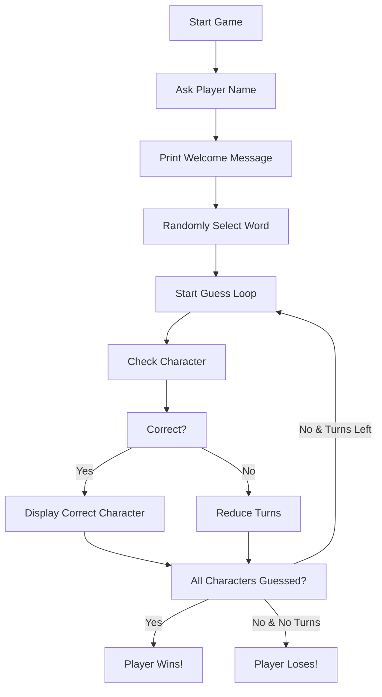

# 🎮 Hangman Game - Cool_Project_2

[](https://www.python.org/)
[](https://github.com/alok-kumar8765/Cool_Project_2)
[](https://github.com/alok-kumar8765/Cool_Project_2)
[](https://github.com/alok-kumar8765/Cool_Project_2/issues)

A simple yet fun **Hangman game** implemented in Python. Guess the word before running out of turns and experience a classic console game with modern Python coding practices.

---

## 📌 Table of Contents

<details>
<summary>Click to expand</summary>

1. [Project Overview](#project-overview)  
2. [Features](#features)  
3. [Architecture & Flow](#architecture--flow)  
    - [System Architecture](#system-architecture)  
    - [Data Flow Diagram](#data-flow-diagram-dfd)  
    - [Game Flow Diagram](#game-flow-diagram)  
4. [Installation & Setup](#installation--setup)  
5. [How to Play](#how-to-play)  
6. [Code Explanation](#code-explanation)  
7. [Pros & Cons](#pros--cons)  
8. [Real World Use Cases](#real-world-use-cases)  
9. [Contributing](#contributing)  
10. [License](#license)  

</details>

---

## 📝 Project Overview

The **Hangman Game** is a console-based game where the player attempts to guess a secret word one character at a time. The player has limited guesses, and incorrect guesses reduce their remaining turns. The game provides instant feedback for each attempt, creating an interactive experience.  

**Key Technologies:** Python 3.x

---

## ✨ Features

- Console-based interactive gameplay  
- Random word selection from a predefined list  
- Limited attempts for guessing  
- Dynamic feedback for correct and wrong guesses  
- Easy-to-understand, beginner-friendly code  
- Fully modular for future enhancements (like GUI or multiplayer)  

---

## 🏗 Architecture & Flow

### System Architecture
<details>
<summary>Click to expand</summary>

```mermaid
graph TD
A[User] --> B[Console Input/Output]
B --> C[Game Engine]
C --> D[Word List]
C --> E[Guess Validation]
E --> F[Win/Loss Logic]
F --> B
````

</details>

### Data Flow Diagram (DFD)

<details>
<summary>Click to expand</summary>

```mermaid
graph LR
User --> Input[Enter Name & Guess]
Input --> Check[Check Character Against Word]
Check --> Output[Update Display & Turns]
Output --> User
Output --> GameEnd{Win/Loss?}
GameEnd -->|Yes| End[Display Result]
GameEnd -->|No| Input
```

</details>

### Game Flow Diagram

<details>
<summary>Click to expand</summary>



</details>

---

## ⚙ Installation & Setup

<details>
<summary>Click to expand</summary>

1. Clone the repository:

```bash
git clone https://github.com/alok-kumar8765/Cool_Project_2.git
```

2. Navigate to the Hangman Game directory:

```bash
cd Cool_Project_2/Hangman\ Game
```

3. Run the game using Python 3:

```bash
python hangman.py
```

</details>

---

## 🎮 How to Play

1. Run the game using Python.
2. Enter your name when prompted.
3. Start guessing characters of the hidden word.
4. You have **5 incorrect attempts**.
5. Game ends when either:

   * You guess all characters correctly (**Win**)
   * Your turns reach zero (**Lose**)

---

## 🧩 Code Explanation

<details>
<summary>Click to expand</summary>

* **Imports:** `time` for delays, `random` for word selection
* **Word List:** `words = ['python','programming','treasure','creative','medium','horror']`
* **User Input:** Prompt player name and guesses
* **Game Loop:**

  * Display guessed characters or `_` for unknown ones
  * Reduce turns if guess is incorrect
  * Win if all letters are guessed
* **Turns Management:** Track remaining attempts and notify player

</details>

---

## ✅ Pros & Cons

<details>
<summary>Click to expand</summary>

**Pros:**

* Lightweight and easy to run
* Interactive and fun for beginners
* Demonstrates basic Python programming concepts
* Can be extended to GUI or multiplayer

**Cons:**

* Limited word list
* Console-based (no graphical interface)
* Single-player only
* No hint system

</details>

---

## 🌍 Real World Use Cases

<details>
<summary>Click to expand</summary>

* **Educational Tool:** Teach programming, loops, and string manipulation
* **Interview Preparation:** Demonstrates logic and problem-solving
* **Entertainment:** Fun casual game for console users
* **Extensions:** Can be adapted to web or mobile apps for interactive learning

**Example Use Case:**

* A beginner Python student uses this game to practice string handling, loops, and conditional statements. Later, they can enhance it with a GUI using Tkinter or web interface using Flask.

</details>

---

## 🤝 Contributing

* Fork the repository
* Create your feature branch (`git checkout -b feature-name`)
* Commit your changes (`git commit -m "Add feature"`)
* Push to the branch (`git push origin feature-name`)
* Open a Pull Request

---

## 📄 License

This project is licensed under the **MIT License**. See the [LICENSE](https://github.com/alok-kumar8765/Cool_Project_2/blob/main/LICENSE) file for details.


---

