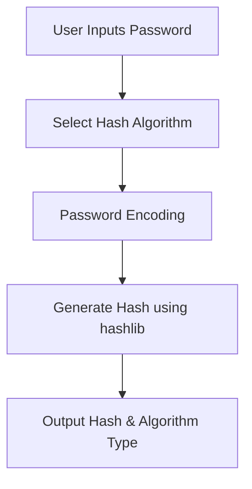
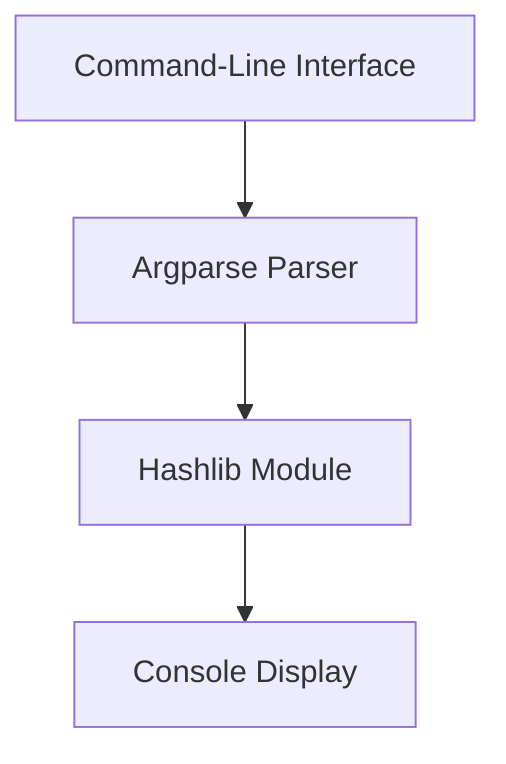

# 🔐 Password Hashing Utility

[](https://github.com/alok-kumar8765/Cool_Project_2)
[](https://github.com/alok-kumar8765/Cool_Project_2/issues)
[](https://github.com/alok-kumar8765/Cool_Project_2/blob/main/LICENSE)
[](https://www.python.org/)
[](https://github.com/alok-kumar8765/Cool_Project_2)

---

## 📖 Table of Contents
<details>
<summary>Click to expand</summary>

1. [Project Overview](#-project-overview)
2. [Features](#-features)
3. [Installation](#-installation)
4. [Usage](#-usage)
5. [Code Explanation](#-code-explanation)
6. [Architecture & Flow](#-architecture--flow)
   - [DFD](#-data-flow-diagram)
   - [Flow Diagram](#-flow-diagram)
   - [System Architecture](#-system-architecture)
7. [Real World Use Cases](#-real-world-use-cases)
8. [Pros and Cons](#-pros-and-cons)
9. [SEO & Optimization](#-seo--optimization)
10. [License](#-license)

</details>

---

## 📝 Project Overview
This Python utility securely hashes passwords using industry-standard algorithms.  
It supports **SHA-256, SHA-512, and MD5**, providing flexibility for different security requirements.  

This project is ideal for **developers, system admins, and security-conscious users** who want a lightweight command-line tool for password hashing.

---

## ✨ Features
<details>
<summary>Click to expand</summary>

- Supports **multiple hashing algorithms**: `SHA256`, `SHA512`, `MD5`.
- **Command-line interface** for easy integration in scripts.
- Lightweight and **dependency-free** (uses only Python built-in `hashlib` and `argparse`).
- Securely encodes and hashes any input password.
- Provides **readable hash output** with algorithm type.

</details>

---

## ⚙️ Installation
<details>
<summary>Click to expand</summary>

1. Clone the repository:

```bash
git clone https://github.com/alok-kumar8765/Cool_Project_2.git
cd Cool_Project_2/Hashing_passwords
````

2. Ensure Python 3.x is installed:

```bash
python --version
```

No additional libraries are required since it uses Python built-ins.

</details>

---

## 🚀 Usage

<details>
<summary>Click to expand</summary>

Run the script from the terminal:

```bash
python hash_password.py "YourPasswordHere" -t sha256
```

### Parameters:

* **password**: The input password to hash.
* **-t / --type**: Hash type (default: `sha256`). Options: `sha256`, `sha512`, `md5`.

### Example:

```bash
python hash_password.py "MySecret123" -t sha512
```

Output:

```
< hash-type : sha512 >
3c6e0b8a9c15224a8228b9a98ca1531d1d...
```

</details>

---

## 🧐 Code Explanation

<details>
<summary>Click to expand</summary>

```python
import argparse
import hashlib

# Command-line argument parsing
parser = argparse.ArgumentParser(description='hashing given password')
parser.add_argument('password', help='input password you want to hash')
parser.add_argument('-t', '--type', default='sha256', choices=['sha256', 'sha512', 'md5'])
args = parser.parse_args()

# Hashing
password = args.password
hashtype = args.type
m = getattr(hashlib, hashtype)()
m.update(password.encode())

# Output
print("< hash-type : " + hashtype + " >")
print(m.hexdigest())
```

**Explanation:**

* Uses `argparse` to take **password** and **hash type** as input.
* `hashlib` dynamically selects hashing algorithm using `getattr`.
* Encodes the password and generates a **secure hash**.
* Prints hash type and result.

</details>

---

## 🏗️ Architecture & Flow

### 🟢 Data Flow Diagram

<details>
<summary>Click to expand</summary>



</details>

### 🔄 Flow Diagram

<details>
<summary>Click to expand</summary>


</details>

### 🏛️ System Architecture

<details>
<summary>Click to expand</summary>



</details>

---

## 🌐 Real World Use Cases

<details>
<summary>Click to expand</summary>

* **User Authentication Systems**: Hash passwords before storing in databases.
* **Security Audits**: Verify password integrity with hash comparisons.
* **API Security**: Protect sensitive API keys and credentials.
* **Educational Purposes**: Demonstrate cryptographic hashing techniques.

**Example:**

```python
stored_hash = hash_password("MySecret123", "sha256")
# Compare with user input
if stored_hash == hash_password(user_input, "sha256"):
    grant_access()
```

</details>

---

## ✅ Pros and Cons

<details>
<summary>Click to expand</summary>

**Pros:**

* Simple, lightweight, and **dependency-free**.
* Supports multiple hashing algorithms.
* Easy to integrate into **Python scripts**.

**Cons:**

* **MD5** is weak for production; only use SHA256/512.
* No salt mechanism included (can be added for enhanced security).
* CLI-only; no GUI interface.

</details>

---

## 📈 SEO & Optimization

<details>
<summary>Click to expand</summary>

* Uses descriptive keywords: `Password Hashing`, `SHA256`, `Python CLI Tool`.
* Structured headings (`H1`, `H2`, `H3`) for readability.
* Badge inclusion for GitHub metrics improves social proof.
* Collapsible sections improve UX on GitHub.
* Mermaid diagrams for **visual comprehension**.

</details>

---

## 📄 License

<details>
<summary>Click to expand</summary>

This project is licensed under the **MIT License**.
See [LICENSE](https://github.com/alok-kumar8765/Cool_Project_2/blob/main/LICENSE) for details.

</details>

---

⭐ **Star this repository** if you find it useful: [alok-kumar8765/Cool_Project_2](https://github.com/alok-kumar8765/Cool_Project_2)


---

