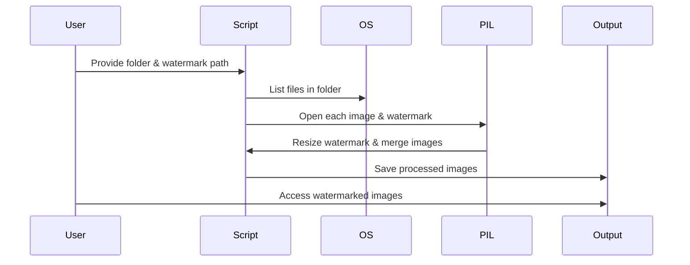

#  Image Watermarking Tool

[](https://github.com/alok-kumar8765/Cool_Project_2/tree/main/Image_watermark)
[](https://www.python.org/)
[](https://opensource.org/licenses/MIT)

---

## Table of Contents
<details>
<summary>Click to expand</summary>

1. [Project Overview](#project-overview)  
2. [Features](#features)  
3. [Installation](#installation)  
4. [Usage](#usage)  
5. [Code Explanation](#code-explanation)  
6. [Architecture & Flow](#architecture--flow)  
    - [DFD Diagram](#dfd-diagram)  
    - [System Architecture](#system-architecture)  
    - [Flow Diagram](#flow-diagram)  
7. [Pros & Cons](#pros--cons)  
8. [Use Cases & Real-World Applications](#use-cases--real-world-applications)  
9. [Contributing](#contributing)  
10. [License](#license)

</details>

---

## Project Overview
<details>
<summary>Click to expand</summary>

**Image Watermarking Tool** is a Python-based utility to automatically apply a watermark to all images in a folder. It supports **JPEG and PNG** formats and allows dynamic scaling and positioning of the watermark. This tool is ideal for **photographers, content creators, and businesses** that want to protect their image assets.  

Key Features:  
- Automatic watermarking for entire folders  
- Resizes watermark proportionally to image size  
- Bottom-right positioning with padding  
- Supports PNG and JPEG images  
- Maintains original image quality  

</details>

---

## Features
<details>
<summary>Click to expand</summary>

- Batch watermark processing  
- Custom watermark images  
- Maintains image quality (100% JPEG, optimized)  
- Automatic output folder creation (`output`)  
- Transparent watermark support (RGBA)  

</details>

---

## Installation
<details>
<summary>Click to expand</summary>

```bash
# Clone the repository
git clone https://github.com/alok-kumar8765/Cool_Project_2.git
cd Cool_Project_2/Image_watermark

# Install required dependencies
pip install pillow
````

</details>

---

## Usage

<details>
<summary>Click to expand</summary>

```bash
# Run the script
python image_watermark.py

# Follow prompts
Enter Folder Path: /path/to/images
Enter Watermark Path: /path/to/watermark.png

# Output will be saved in /output folder
```

---

### Example:

If folder contains `photo1.jpg` and `photo2.png` and watermark is `logo.png`, the output will be:

```
output/photo1.jpg
output/photo2.png
```

</details>

---

## Code Explanation

<details>
<summary>Click to expand</summary>

1. **Imports**

```python
import os
from PIL import Image
```

* `os`: Handle directories and files
* `PIL.Image`: Load, manipulate, and save images

2. **Watermark Function**

```python
def watermark_photo(input_image_path, watermark_image_path, output_image_path):
```

* Opens input image and watermark
* Resizes watermark relative to image size (8%)
* Positions watermark at bottom-right with 20px padding
* Creates a transparent layer, pastes original image and watermark
* Converts final image to original mode
* Saves optimized image in output folder

3. **Main Logic**

```python
folder = input("Enter Folder Path:")
watermark = input("Enter Watermark Path:")
os.chdir(folder)
files = os.listdir(os.getcwd())
```

* Reads all files in folder
* Filters `*.png` and `*.jpg` images
* Applies watermark to each image and saves in `output` folder

</details>

---

## Architecture & Flow

<details>
<summary>Click to expand</summary>

### DFD Diagram

```mermaid
graph TD
A[User Input: Folder & Watermark] --> B[Script Reads Folder Contents]
B --> C[Filter Images (.jpg, .png)]
C --> D[Resize Watermark]
D --> E[Overlay Watermark on Image]
E --> F[Save Image in Output Folder]
```

### System Architecture


### Flow Diagram



</details>

---

## Pros & Cons

<details>
<summary>Click to expand</summary>

**Pros:**

* Simple and lightweight
* Batch processing support
* High-quality output
* Transparent watermark handling
* No external dependencies except Pillow

**Cons:**

* Watermark position fixed (bottom-right)
* No GUI (CLI only)
* Limited to `.jpg` and `.png` formats
* Not asynchronous for very large folders

</details>

---

## Use Cases & Real-World Applications

<details>
<summary>Click to expand</summary>

**Use Cases:**

* Photographers protecting digital portfolios
* E-commerce stores watermarking product images
* Content creators sharing images online
* Businesses protecting brand logos

**Real-World Example:**

* A photographer wants to upload 200 images to Instagram but wants their logo on each image. Using this script, all images can be watermarked automatically without manual editing.

</details>

---

## Contributing

<details>
<summary>Click to expand</summary>

1. Fork the repository
2. Create a new branch `feature/your-feature`
3. Commit your changes and push
4. Open a Pull Request

---

**Tips:**

* Always test on a copy of your images
* Ensure watermark is in `.png` format for transparency

</details>

---

## License

<details>
<summary>Click to expand</summary>

This project is licensed under the **MIT License**.
See [LICENSE](https://opensource.org/licenses/MIT) for details.

</details>


---

