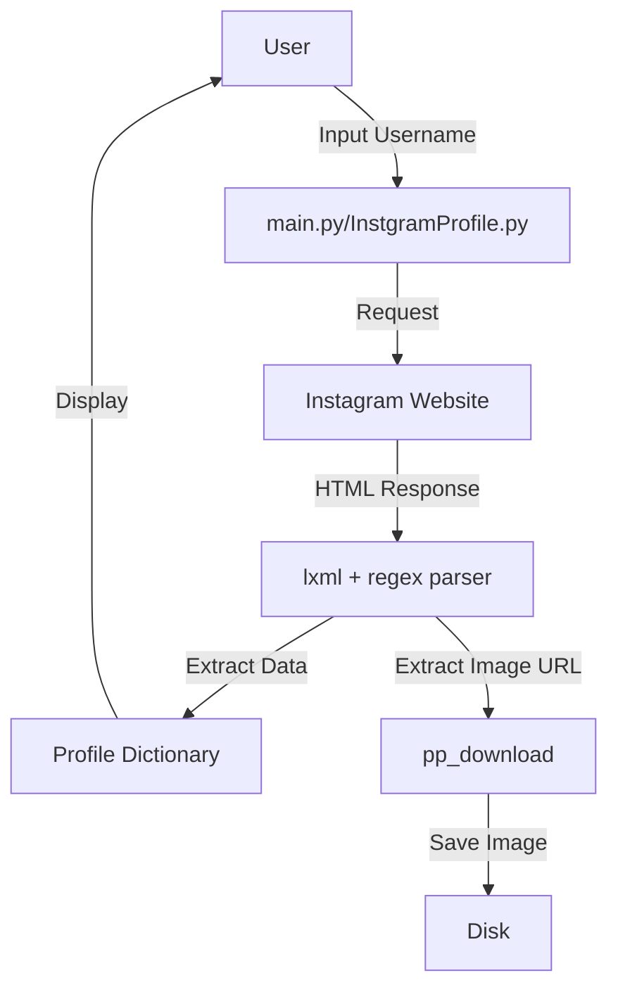

# 📸 Instagram Profile Scraper & Downloader  
[](https://github.com/alok-kumar8765/Cool_Project_2) 
[](https://github.com/alok-kumar8765/Cool_Project_2) 
[](https://github.com/alok-kumar8765/Cool_Project_2/issues) 
[](https://www.python.org/downloads/)  

A powerful Python tool to **scrape Instagram profiles**, fetch profile details, and download profile pictures. This project is designed for **learning, analytics, and social media management**.  

---

## 📌 Table of Contents
<details>
<summary>Click to expand</summary>

1. [Project Overview](#project-overview)  
2. [Features](#features)  
3. [Installation](#installation)  
4. [Usage](#usage)  
    - [InstgramProfile.py](#instagramprofilepy)  
    - [main.py](#mainpy)  
    - [profilepic.py](#profilepicpy)  
5. [Architecture & Flow](#architecture--flow)  
6. [Diagrams](#diagrams)  
7. [Pros & Cons](#pros--cons)  
8. [Use Cases & Real-World Example](#use-cases--real-world-example)  
9. [License](#license)  

</details>

---

## 📝 Project Overview
This repository provides tools to:

- Extract **Instagram profile metadata** (followers, following, posts, bio).  
- Download **high-resolution profile pictures**.  
- Present data in a **structured dictionary format**.  

It leverages: `requests`, `lxml`, `re`, `PIL`, and `tqdm` for robust scraping and downloading.  

---

## ⚡ Features
<details>
<summary>Click to expand</summary>

- Fetch Instagram **profile information** by username.  
- **Download profile pictures** with progress bar and auto-preview.  
- Command-line support for **direct execution**.  
- Modular design: separate scripts for profile info and picture download.  
- **Error handling** for invalid usernames or URLs.  

</details>

---

## 🛠 Installation
<details>
<summary>Click to expand</summary>

```bash
# Clone repo
git clone https://github.com/alok-kumar8765/Cool_Project_2.git
cd Cool_Project_2/Instagram_profile

# Install dependencies
pip install -r requirements.txt
# or manually
pip install requests lxml tqdm Pillow
````

</details>

---

## 🚀 Usage

### InstgramProfile.py

<details>
<summary>Click to expand</summary>

**Description:** Fetches Instagram profile details as a dictionary.

**Command:**

```bash
python InstagramProfile.py <username>
```

**Sample Output:**

```json
{
    "success": true,
    "profile": {
        "name": "John Doe",
        "profileurl": "https://www.instagram.com/johndoe/?hl=en",
        "username": "johndoe",
        "followers": "10k",
        "following": "500",
        "posts": "150",
        "aboutinfo": "Travel blogger & photographer"
    }
}
```

**Function Explanation:**

* `main(username)` → fetches profile HTML, parses meta description and JSON to extract:

  * Name
  * Followers
  * Following
  * Posts
  * Bio

</details>

### main.py

<details>
<summary>Click to expand</summary>

**Description:** Full CLI tool that fetches profile data and downloads profile picture.

**Command:**

```bash
python main.py <username>
```

**Key Functions:**

* `banner()` → prints CLI banner.
* `main(username)` → fetches profile info like `InstagramProfile.py`.
* `pp_download(username)` → downloads profile picture using `profilepic.py`.

**Enhancement:** Combines both scraping and image download in **one execution**.

</details>

### profilepic.py

<details>
<summary>Click to expand</summary>

**Description:** Downloads the high-resolution Instagram profile picture.

**Function:** `pp_download(username)`

* Validates Instagram URL.
* Constructs JSON API endpoint (`?__a=1`).
* Downloads image with **progress bar using tqdm**.
* Opens image in default viewer.

**Dependencies:** `requests`, `PIL`, `tqdm`, `re`.

</details>

---

## 🏗 Architecture & Flow

<details>
<summary>Click to expand</summary>

**Modular Design:**

* `InstgramProfile.py` → Profile metadata scraper.
* `profilepic.py` → Profile picture downloader.
* `main.py` → CLI wrapper combining both modules.

**Flow:**

```mermaid
flowchart TD
A[Start: Provide Username] --> B{main.py?}
B -->|Yes| C[Fetch Profile Data]
B -->|No| D[Use InstgramProfile.py Only]
C --> E[pp_download(username)]
E --> F[Save & Show Profile Picture]
D --> G[Return Profile Dictionary]
F --> H[End]
G --> H
```

**Data Flow Diagram (DFD Level 1):**



---

## ✅ Pros & Cons

<details>
<summary>Click to expand</summary>

**Pros:**

* Lightweight, no API required.
* Works offline once Python environment is set.
* High-quality profile picture downloads.
* Easy to integrate into larger Python projects.

**Cons:**

* Relies on HTML scraping → susceptible to Instagram layout changes.
* Limited error handling for private profiles.
* Does not support bulk downloads.
* Instagram may block frequent requests.

</details>

---

## 🌍 Use Cases & Real-World Examples

<details>
<summary>Click to expand</summary>

* **Social Media Analytics:** Gather followers, posts, and bio info for insights.
* **Brand Monitoring:** Monitor competitor profiles and their engagement metrics.
* **Content Aggregation:** Automatically fetch profile pictures for dashboards.
* **Learning Projects:** Understand web scraping, regex parsing, and image handling.

**Example:**

```python
from InstgramProfile import main as profile_scraper
from profilepic import pp_download

data = profile_scraper("natgeo")
pp_download("natgeo")
print(data)
```

**SEO Keywords:** Instagram profile scraper, Instagram metadata, Instagram profile downloader, Python web scraping, social media analytics Python.

</details>

---

## 🖇 License

<details>
<summary>Click to expand</summary>

MIT License – Free to use, modify, and distribute.

</details>

---

*Repo:* [https://github.com/alok-kumar8765/Cool_Project_2/tree/main/Instagram_profile](https://github.com/alok-kumar8765/Cool_Project_2/tree/main/Instagram_profile)


---

