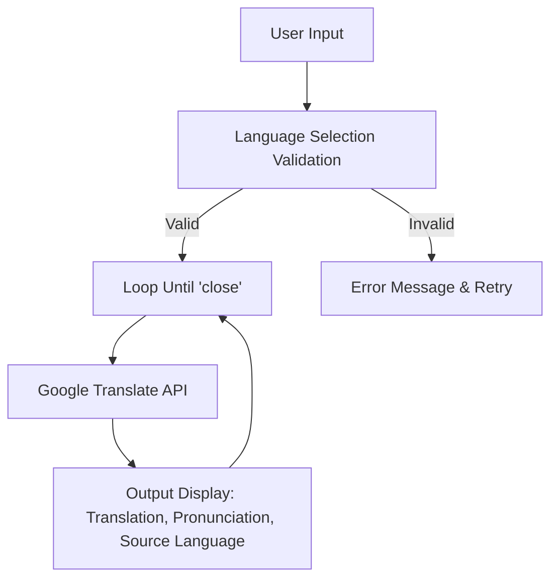
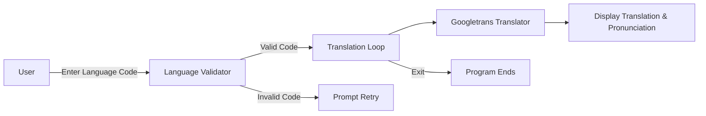

# 🌐 Language Translator - Cool_Project_2

[](https://github.com/alok-kumar8765/Cool_Project_2)
[](https://github.com/alok-kumar8765/Cool_Project_2)
[](https://github.com/alok-kumar8765/Cool_Project_2/issues)
[](https://www.python.org/)
[](https://github.com/alok-kumar8765/Cool_Project_2/blob/main/LICENSE)

## 📖 Table of Contents

<details>
<summary>Click to Expand</summary>

1. [Project Overview](#project-overview)  
2. [Features](#features)  
3. [Supported Languages](#supported-languages)  
4. [Installation](#installation)  
5. [Usage](#usage)  
6. [Code Explanation](#code-explanation)  
7. [Architecture & Flow](#architecture--flow)  
8. [Pros & Cons](#pros--cons)  
9. [Real-world Use Cases](#real-world-use-cases)  
10. [License](#license)  

</details>

---

## 📝 Project Overview

Language Translator is a **Python-based translation utility** that uses the [Googletrans](https://pypi.org/project/googletrans/) library to translate text between multiple languages. This project is **interactive**, **user-friendly**, and ideal for personal and educational purposes.  

**Key Highlights:**  
- Supports **15+ major languages**.  
- Interactive **language selection menu**.  
- Displays both **translation** and **pronunciation**.  
- CLI-based, lightweight, and easy to extend.

---

## ⚡ Features

<details>
<summary>Click to Expand Features</summary>

- Easy **language selection** via codes.  
- Real-time **translation using Google Translate API**.  
- Shows **pronunciation** of translated text.  
- Handles **invalid language code input** gracefully.  
- Continuous translation loop with **exit command** support.  
- Fully **extendable**: add new languages or integrate into larger apps.

</details>

---

## 🌍 Supported Languages

<details>
<summary>Click to Expand Supported Languages</summary>

| Code | Language  |
|------|-----------|
| bn   | Bangla    |
| en   | English   |
| ko   | Korean    |
| fr   | French    |
| de   | German    |
| he   | Hebrew    |
| hi   | Hindi     |
| it   | Italian   |
| ja   | Japanese  |
| la   | Latin     |
| ms   | Malay     |
| ne   | Nepali    |
| ru   | Russian   |
| ar   | Arabic    |
| zh   | Chinese   |
| es   | Spanish   |

</details>

---

## 💻 Installation

<details>
<summary>Click to Expand Installation</summary>

```bash
# Clone the repository
git clone https://github.com/alok-kumar8765/Cool_Project_2.git
cd Cool_Project_2/Language_translator

# Create virtual environment (optional)
python -m venv venv
source venv/bin/activate  # Linux/macOS
venv\Scripts\activate     # Windows

# Install dependencies
pip install googletrans==4.0.0-rc1
````

</details>

---

## 🚀 Usage

<details>
<summary>Click to Expand Usage</summary>

```bash
python translator.py
```

**Steps:**

1. Enter desired **language code** or type `options` to see all available codes.
2. Type the **text to translate**.
3. View **translated text**, **pronunciation**, and **source language**.
4. Type `close` to **exit the program**.

</details>

---

## 🧩 Code Explanation

<details>
<summary>Click to Expand Code Explanation</summary>

1. **Language Dictionary**: Maps short codes to full language names.
2. **Language Validation Loop**: Ensures user enters a valid language code.
3. **Translation Loop**: Continuously prompts for text, translates it using `googletrans`, and displays results.
4. **Output**: Translation text, pronunciation, and detected source language.

**Example:**

```python
# Translate "Hello" to Spanish
You have selected Spanish
Spanish translation: Hola
Pronunciation: Hola
Translated from: English
```

</details>

---

## 🏗 Architecture & Flow

<details>
<summary>Click to Expand Architecture & Flow</summary>

### System Architecture (Mermaid)



### Data Flow Diagram (DFD)



---

## ✅ Pros & Cons

<details>
<summary>Click to Expand Pros & Cons</summary>

**Pros:**

* Simple CLI-based translator.
* Supports multiple languages.
* Lightweight, easy to integrate.
* Open-source, customizable.

**Cons:**

* Depends on Google Translate API availability.
* Limited offline functionality.
* Pronunciation may not be accurate for all languages.

</details>

---

## 🌟 Real-world Use Cases

<details>
<summary>Click to Expand Use Cases</summary>

* **Language Learning:** Practice translation between languages.
* **Travel Applications:** Quickly translate phrases while traveling.
* **Chatbots:** Integrate with chatbots for multi-language support.
* **Content Localization:** Translate user-generated content.
* **Educational Tools:** Teach students language differences interactively.

**Example:**

A Hindi speaker can type:

```text
"Hello, how are you?"
```

And get instant translation in Spanish:

```text
"Hola, ¿cómo estás?"
```

</details>

---

## 📄 License

<details>
<summary>Click to Expand License</summary>

This project is licensed under the MIT License. See the [LICENSE](https://github.com/alok-kumar8765/Cool_Project_2/blob/main/LICENSE) file for details.

</details>

---

## 🔗 GitHub Repository

[https://github.com/alok-kumar8765/Cool_Project_2/tree/main/Language_translator](https://github.com/alok-kumar8765/Cool_Project_2/tree/main/Language_translator)


---

