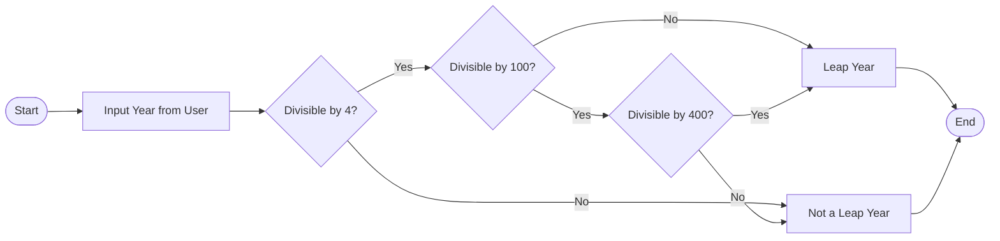

# Leap Year Checker 🗓️


---

## Table of Contents

<details>
<summary>📑 Click to Expand</summary>

1. [Project Overview](#project-overview)  
2. [Features](#features)  
3. [Installation](#installation)  
4. [Usage](#usage)  
5. [Code Explanation](#code-explanation)  
6. [Architecture & Flow](#architecture--flow)  
7. [Data Flow Diagram (DFD)](#data-flow-diagram-dfd)  
8. [Mermaid Flow Diagram](#mermaid-flow-diagram)  
9. [Pros & Cons](#pros--cons)  
10. [Real-World Use Cases](#real-world-use-cases)  
11. [Contributing](#contributing)  
12. [License](#license)  

</details>

---

## Project Overview

Leap Year Checker is a lightweight Python program designed to **determine if a given year is a leap year** based on the standard Gregorian calendar rules. This tool is perfect for developers, students, and professionals needing a **quick and accurate leap year validation** utility.  

✅ SEO Keywords: Python Leap Year Checker, Leap Year Program, Year Validation, Python Beginner Projects  

---

## Features

<details>
<summary>✨ Click to Expand Features</summary>

- Input any year and determine if it is a leap year.  
- Simple, fast, and efficient **Python logic**.  
- User-friendly **console output**.  
- Lightweight and easy to integrate into larger applications.  
- Cross-platform support (Windows, Linux, MacOS).  

</details>

---

## Installation

<details>
<summary>💻 Click to Expand Installation Instructions</summary>

1. Clone the repository:

```bash
git clone https://github.com/alok-kumar8765/Cool_Project_2.git
````

2. Navigate to the project folder:

```bash
cd Cool_Project_2/Leap_Year_Checker
```

3. Run the Python script:

```bash
python leap_year_checker.py
```

> **Note:** Python 3.x is required.

</details>

---

## Usage

<details>
<summary>▶ Click to Expand Usage</summary>

1. Run the program:

```bash
python leap_year_checker.py
```

2. Input a year when prompted:

```
Enter a year: 2024
```

3. Output will display:

```
2024 is a leap year!!
```

</details>

---

## Code Explanation

<details>
<summary>🔍 Click to Expand Code Explanation</summary>

```python
year = int(input("Enter a year:- "))  # Taking user input

if (((year % 4 == 0) and (year % 100 != 0)) or (year % 400 == 0)):
    """
    Leap year logic:
    - Divisible by 4 AND not divisible by 100
    - OR divisible by 400
    """
    print("{0} is a leap year!!".format(year))
else:
    print("{0} is not a leap year!!".format(year))
```

**Logic Breakdown:**

* **Divisible by 4:** Base rule for leap years.
* **Not divisible by 100:** Century years are not leap years unless divisible by 400.
* **Divisible by 400:** Exception to include century leap years (e.g., 2000).
* **Output:** Clear console message indicating whether the year is leap or not.

</details>

---

## Architecture & Flow

<details>
<summary>🏗️ Click to Expand Architecture</summary>

* **User Input Layer:** Accepts a year.
* **Processing Layer:** Applies leap year logic.
* **Output Layer:** Displays results.

**Key Components:**

* Python `input()` for user interaction.
* Conditional statements (`if-else`) for logic.
* `print()` for results display.

</details>

---

## Data Flow Diagram (DFD)

<details>
<summary>📊 Click to Expand DFD</summary>

```mermaid
flowchart TD
    A[User Input: Year] --> B[Leap Year Logic Processor]
    B -->|Leap Year| C[Output: "Year is a Leap Year"]
    B -->|Not Leap Year| D[Output: "Year is Not a Leap Year"]
```

</details>

---

## Mermaid Flow Diagram

<details>
<summary>🔁 Click to Expand Flow Diagram</summary>



</details>

---

## Pros & Cons

<details>
<summary>⚖️ Click to Expand</summary>

**Pros:**

* Simple and beginner-friendly.
* No external dependencies.
* Quick runtime and minimal memory usage.
* Can be embedded in larger applications easily.

**Cons:**

* Only works for Gregorian calendar.
* Console-based; no GUI.
* Minimal input validation (assumes integer input).

</details>

---

## Real-World Use Cases

<details>
<summary>🌍 Click to Expand Use Cases</summary>

* **Calendar Applications:** Validating leap years in scheduling software.
* **Financial Systems:** Calculating interest or maturity dates accounting for leap years.
* **Educational Tools:** Teaching Python logic and conditional statements.
* **Date-Based Algorithms:** Game development, time-based simulations.

**Example:**

```python
# In a calendar app
if leap_year_checker(2024):
    print("February has 29 days this year!")
```

</details>

---

## Contributing

<details>
<summary>🤝 Click to Expand Contributing Guidelines</summary>

* Fork the repository.
* Create a feature branch (`git checkout -b feature-name`).
* Commit changes (`git commit -m "Add feature"`).
* Push to the branch (`git push origin feature-name`).
* Open a pull request.

</details>

---

## License

<details>
<summary>📜 Click to Expand License</summary>

This project is licensed under the **MIT License** - see the [LICENSE](https://github.com/alok-kumar8765/Cool_Project_2/blob/main/LICENSE) file for details.

</details>


---

