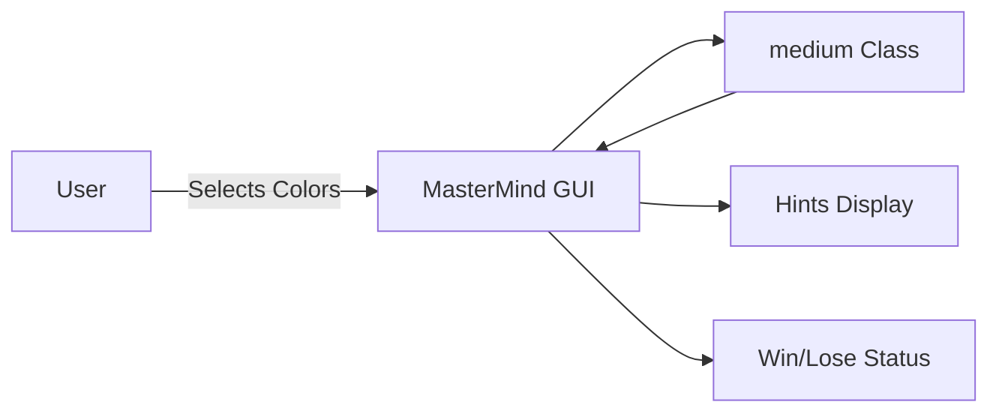

# 🎨 MasterMind Game - Python Tkinter Edition


## Table of Contents
<details>
<summary>📑 Click to expand</summary>

1. [Project Overview](#project-overview)  
2. [Features](#features)  
3. [Installation & Setup](#installation--setup)  
4. [Code Explanation](#code-explanation)  
    - [medium Class](#medium-class)  
    - [MasterMind Class](#mastermind-class)  
5. [Architecture & Diagrams](#architecture--diagrams)  
    - [DFD](#data-flow-diagram-dfd)  
    - [System Architecture](#system-architecture)  
    - [Game Flow Diagram](#game-flow-diagram)  
6. [Pros & Cons](#pros--cons)  
7. [Real-World Use Cases](#real-world-use-cases)  
8. [Contributing](#contributing)  
9. [License](#license)  

</details>

---

## Project Overview
<details>
<summary>📌 Click to expand</summary>

**MasterMind** is a classic color-code guessing game implemented in **Python** using **Tkinter GUI**. The game generates a random 4-color combination, and the player must guess it using hints provided after each attempt.  

**Key Highlights:**
- Randomized color palette
- Interactive GUI with buttons for color selection
- Visual hints (`red` for correct position, `gray` for correct color but wrong position)
- Supports up to 20 attempts
- Simple, modular, and extensible architecture  

</details>

---

## Features
<details>
<summary>📌 Click to expand</summary>

- 🎨 Intuitive **Tkinter GUI** with interactive color palette  
- 🔀 Randomized secret code for replayability  
- ✅ Real-time feedback with **hints**  
- 🏆 Win/Lose notification system  
- ♻️ Modular code: `medium` class handles logic, `MasterMind` class handles UI  
- 🌐 SEO optimized documentation  

</details>

---

## Installation & Setup
<details>
<summary>📌 Click to expand</summary>

1. **Clone the repository:**
```bash
git clone https://github.com/alok-kumar8765/Cool_Project_2.git
cd Cool_Project_2/MasterMind
````

2. **Install Python 3.11+**
   [Python Download Link](https://www.python.org/downloads/)

3. **Run the game:**

```bash
python mastermind.py
```

4. **Requirements:**

* Python 3.11+
* Tkinter (usually included with Python)

</details>

---

## Code Explanation

<details>
<summary>📌 Click to expand</summary>

### medium Class

<details>
<summary>🔹 Click to expand</summary>

Handles the **game logic**:

* `__init__`: Generates a random 4-color code from a palette of 8 colors
* `user(color_list)`: Stores the player's guess
* `compare(user_guess, secret_code)`: Returns a list of hints

  * `'red'` → correct color & position
  * `'gray'` → correct color, wrong position

</details>

### MasterMind Class

<details>
<summary>🔹 Click to expand</summary>

Handles the **Tkinter GUI**:

* Displays **palette buttons** and **user guesses**
* Dynamically binds **color selection** to the guess method
* Provides **real-time hints**
* Handles **win/lose conditions**:

  * If guess matches secret code → display "CONGRATULATIONS"
  * If attempts exhausted → display "You are a LOSER!!!!" and reveal code

**Key Methods:**

* `guess(root, choice, obj)` → Handles user click and updates UI
* `hint(root, key)` → Displays hint colors alongside guesses

</details>

</details>

---

## Architecture & Diagrams

<details>
<summary>📌 Click to expand</summary>

### Data Flow Diagram (DFD)

```mermaid
flowchart TD
    A[User Input] --> B[MasterMind GUI]
    B --> C[medium.compare()]
    C --> D[Generate Hints]
    D --> B
    B --> E[Win/Lose Message]
```

### System Architecture



### Game Flow Diagram

```mermaid
flowchart TD
    Start --> Generate[Generate Random Color Code]
    Generate --> UserGuess[User Makes Guess]
    UserGuess --> Compare[Compare with Secret Code]
    Compare --> Hints[Show Hints]
    Hints -->|Correct| Win[Display "CONGRATULATIONS"]
    Hints -->|Incorrect & Attempts Left| UserGuess
    Hints -->|Incorrect & No Attempts| Lose[Display Answer]
```

</details>

---

## Pros & Cons

<details>
<summary>📌 Click to expand</summary>

### Pros

* ✅ Lightweight, no heavy dependencies
* ✅ Modular and easily extendable
* ✅ Interactive GUI for learning Python GUI programming
* ✅ Ideal for beginners in game development

### Cons

* ❌ Limited to **Tkinter GUI**
* ❌ Only 8 color choices
* ❌ Not web-based
* ❌ No multiplayer support

</details>

---

## Real-World Use Cases

<details>
<summary>📌 Click to expand</summary>

* 🎓 **Educational Tool**: Learn Python GUI programming and logic implementation
* 🕹️ **Casual Game**: Desktop color guessing game for personal use
* 🧠 **Cognitive Training**: Improves memory and logical thinking
* 💡 **Prototype**: Basis for expanding into more complex puzzle games
* 🔧 **Testing GUI Bindings**: Example for learning Tkinter Button bindings

**Example:**
A school coding club can use this project to teach basic event handling, loops, and game logic using Python.

</details>

---

## Contributing

<details>
<summary>📌 Click to expand</summary>

1. Fork the repo
2. Create a new branch (`git checkout -b feature-name`)
3. Make changes & test
4. Submit a **pull request**

---

## License

<details>
<summary>📌 Click to expand</summary>

This project is licensed under the **MIT License**.

See [LICENSE](https://github.com/alok-kumar8765/Cool_Project_2/blob/main/LICENSE) for more information.

</details>


---

