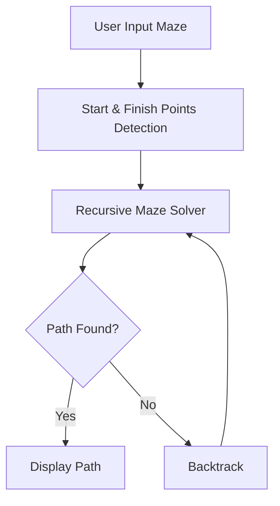
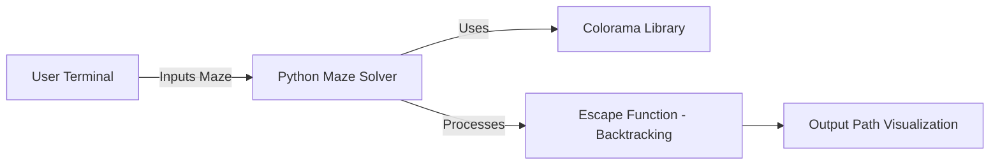
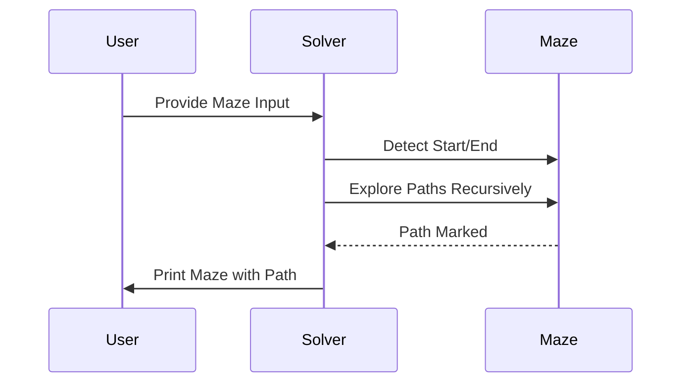

# 🐀 Maze Solver Project

[](https://github.com/alok-kumar8765/Cool_Project_2/blob/main/LICENSE) 
[](https://www.python.org/downloads/) 
[](https://github.com/alok-kumar8765/Cool_Project_2/tree/main/Maze%20Solver)
[](https://github.com/alok-kumar8765/Cool_Project_2/stargazers)
[](https://github.com/alok-kumar8765/Cool_Project_2/network/members)

---

## 📖 Table of Contents
<details>
<summary>Click to expand</summary>

1. [Project Overview](#-project-overview)  
2. [Features](#-features)  
3. [Installation](#-installation)  
4. [Usage](#-usage)  
5. [Code Explanation](#-code-explanation)  
6. [Architecture & Flow](#-architecture--flow)  
   - [DFD](#dfd)  
   - [System Architecture](#system-architecture)  
   - [Flow Diagram](#flow-diagram)  
7. [Pros & Cons](#-pros--cons)  
8. [Real-World Use Cases](#-real-world-use-cases)  
9. [Contributing](#-contributing)  
10. [License](#-license)

</details>

---

## 🏗 Project Overview
The **Maze Solver Project** is a Python-based algorithm that finds a valid path through a maze using **backtracking**. It visualizes the maze in the terminal with color-coded paths:  
- `w` = Wall (Red)  
- `c` = Clear/Available path (Green)  
- `p` = Path traversed by the algorithm (Blue)  
- `Start/End` = Marked as green (`c`)  

This project demonstrates **algorithmic problem solving**, **recursive backtracking**, and **terminal-based visualization**, making it ideal for learning AI pathfinding techniques.

---

## ✨ Features
<details>
<summary>Click to expand</summary>

- Recursive **maze-solving algorithm** (backtracking).  
- **Dynamic start and finish detection**.  
- **Terminal visualization** with color coding using `colorama`.  
- Can handle **any rectangular maze** input.  
- **Simple & scalable** code architecture for future extensions.  

</details>

---

## 🛠 Installation
<details>
<summary>Click to expand</summary>

```bash
# Clone the repository
git clone https://github.com/alok-kumar8765/Cool_Project_2.git

# Navigate to Maze Solver
cd Cool_Project_2/Maze\ Solver

# Install dependencies
pip install colorama

# Run the solver
python maze_solver.py
````

</details>

---

## 🚀 Usage

<details>
<summary>Click to expand</summary>

1. Define your maze as a 2D list in Python.
2. Ensure `c` marks open paths, `w` marks walls.
3. Run `maze_solver.py`.
4. Observe color-coded output showing the solution path.

</details>

---

## 🧩 Code Explanation

<details>
<summary>Click to expand</summary>

* **`get_starting_finishing_points()`**: Detects start (top row) and finish (bottom row) points automatically.
* **`maze_solver()`**: Prints maze with terminal colors (`colorama`).
* **`escape()`**: Recursive backtracking function to explore the maze:

  * Moves in all four directions: down, right, up, left.
  * Marks visited path with `'p'`.
  * Backtracks when a wrong path is chosen.

**Core Logic:** Depth-first search with backtracking.
**Complexity:**

* Time: O(N × M) for N rows and M columns in worst case.
* Space: O(N × M) for recursion stack.

</details>

---

## 🏛 Architecture & Flow

<details>
<summary>Click to expand</summary>

### DFD



### System Architecture



### Flow Diagram



</details>

---

## ⚖️ Pros & Cons

<details>
<summary>Click to expand</summary>

**Pros:**

* Simple, clear, easy-to-understand code.
* Visual feedback using colors.
* Automatically finds start and end points.
* Highly extendable for AI/robotics simulations.

**Cons:**

* Only supports rectangular mazes.
* Recursive stack may overflow for very large mazes.
* Terminal visualization only (no GUI).

</details>

---

## 🌐 Real-World Use Cases

<details>
<summary>Click to expand</summary>

* **Game Development:** Auto-solving levels or AI agents.
* **Robotics:** Simulating pathfinding in grid environments.
* **Education:** Teaching recursion, backtracking, and algorithms.
* **Maze-based puzzles:** Automatic puzzle solvers for apps or challenges.

**Example:**

```python
maze = [
    ['w','c','w'],
    ['c','c','w'],
    ['w','c','c']
]
# Finds the path from top to bottom automatically
```

</details>

---

## 🤝 Contributing

<details>
<summary>Click to expand</summary>

1. Fork the repo
2. Create a feature branch (`git checkout -b feature-name`)
3. Commit changes (`git commit -m 'Add feature'`)
4. Push branch (`git push origin feature-name`)
5. Open a Pull Request

</details>

---

## 📜 License

<details>
<summary>Click to expand</summary>

This project is licensed under the **MIT License** - see [LICENSE](https://github.com/alok-kumar8765/Cool_Project_2/blob/main/LICENSE) for details.

</details>

---

