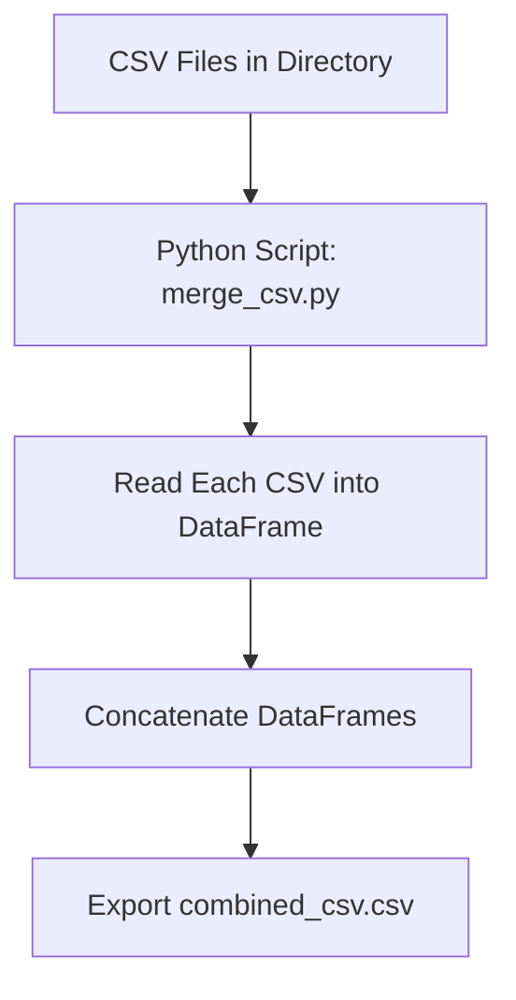
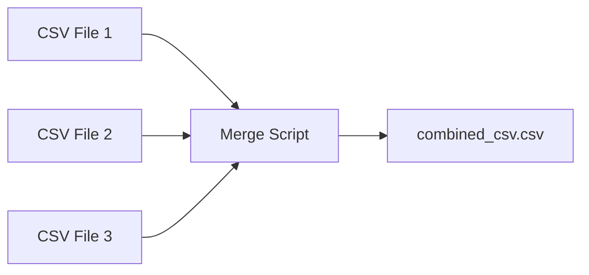
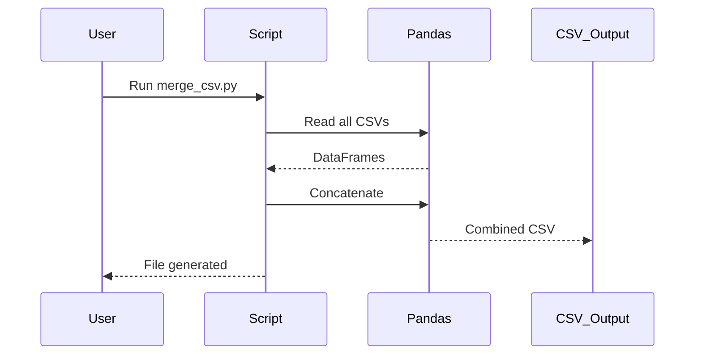

# 📂 Merge CSV Files Project

[](https://github.com/alok-kumar8765/Cool_Project_2)  
[](https://www.python.org/)  
[](https://github.com/alok-kumar8765/Cool_Project_2/blob/main/LICENSE)  
[](https://github.com/alok-kumar8765/Cool_Project_2/issues)  

**Repository Link:** [https://github.com/alok-kumar8765/Cool_Project_2/tree/main/Merge_csv_files](https://github.com/alok-kumar8765/Cool_Project_2/tree/main/Merge_csv_files)

---

## 📖 Table of Contents

<details>
<summary>Click to expand</summary>

1. [Project Overview](#project-overview)  
2. [Features](#features)  
3. [Directory Structure](#directory-structure)  
4. [Installation](#installation)  
5. [Usage](#usage)  
6. [Code Explanation](#code-explanation)  
7. [Architecture & Flow](#architecture--flow)  
    - [DFD](#dfd)  
    - [System Architecture](#system-architecture)  
    - [Flow Diagram](#flow-diagram)  
8. [Pros & Cons](#pros--cons)  
9. [Real-world Use Cases](#real-world-use-cases)  
10. [License](#license)  

</details>

---

## 📝 Project Overview

`Merge_csv_files` is a lightweight Python utility designed to automatically **combine multiple CSV files in a folder into a single CSV file**. This is highly useful for data consolidation, preprocessing for analytics, or merging report outputs in enterprise-grade projects.  

Key advantages include **automation, simplicity, and scalability** for handling large numbers of CSV files efficiently.  

---

## ✨ Features

<details>
<summary>Click to expand</summary>

- Automatically detect all CSV files in the working directory  
- Concatenate multiple CSV files into a single CSV output  
- Preserve UTF-8 encoding for compatibility  
- Simple one-line execution using Python  
- Ready for integration into larger data pipelines  

</details>

---

## 📂 Directory Structure

<details>
<summary>Click to expand</summary>

```

Merge_csv_files/
│
├── merge_csv.py          # Main Python script to merge CSV files
├── combined_csv.csv      # Output CSV file (generated after running the script)
├── README.md             # Project documentation
└── sample_csv/           # Optional folder containing sample CSVs for testing

````

</details>

---

## ⚙️ Installation

<details>
<summary>Click to expand</summary>

1. Clone the repository:

```bash
git clone https://github.com/alok-kumar8765/Cool_Project_2.git
cd Cool_Project_2/Merge_csv_files
````

2. Install required packages:

```bash
pip install pandas
```

3. Place all CSV files in the same folder as `merge_csv.py`

</details>

---

## 🚀 Usage

<details>
<summary>Click to expand</summary>

Run the script:

```bash
python merge_csv.py
```

* Output: `combined_csv.csv` will be generated in the same folder
* Automatically reads all `.csv` files in the current directory

</details>

---

## 🧩 Code Explanation

<details>
<summary>Click to expand</summary>

```python
import glob
import pandas as pd

# Define CSV extension
extension = 'csv'

# List all CSV files in the folder
all_filenames = [i for i in glob.glob('*.{}'.format(extension))]

# Read and concatenate all CSV files
combined_csv = pd.concat([pd.read_csv(f) for f in all_filenames ])

# Export combined CSV
combined_csv.to_csv("combined_csv.csv", index=False, encoding='utf-8-sig')
```

**Step-by-Step Explanation:**

1. **`glob.glob('*.csv')`** – Lists all CSV files in the current directory
2. **`pd.read_csv(f)`** – Reads each CSV into a pandas DataFrame
3. **`pd.concat([...])`** – Combines all DataFrames vertically
4. **`to_csv()`** – Saves the combined DataFrame to a new CSV with UTF-8 encoding

</details>

---

## 🏗 Architecture & Flow

### DFD (Data Flow Diagram)

<details>
<summary>Click to expand</summary>



</details>

---

### System Architecture

<details>
<summary>Click to expand</summary>



</details>

---

### Flow Diagram

<details>
<summary>Click to expand</summary>



</details>

---

## ⚖️ Pros & Cons

<details>
<summary>Click to expand</summary>

**Pros:**

* Simple, minimal codebase
* Fast for small to medium CSV datasets
* Easily extendable for preprocessing pipelines
* Cross-platform and Python-native

**Cons:**

* May be memory-intensive for extremely large CSVs
* Does not handle malformed CSVs automatically
* No GUI (command-line only)

</details>

---

## 🌎 Real-world Use Cases

<details>
<summary>Click to expand</summary>

* **Data Analytics Pipelines**: Merge multiple monthly sales reports for analysis
* **Reporting Automation**: Combine exported CSVs from ERP or CRM tools
* **ETL Processes**: Preprocessing step in data warehousing
* **Research & Academia**: Consolidate survey or experiment datasets

**Example:**
A marketing team receives daily CSV exports from multiple regions. Using this script, they can generate a single CSV for reporting dashboards automatically, saving hours of manual work.

</details>

---

## 📄 License

<details>
<summary>Click to expand</summary>

This project is licensed under the MIT License – see the [LICENSE](https://github.com/alok-kumar8765/Cool_Project_2/blob/main/LICENSE) file for details.

</details>


---

