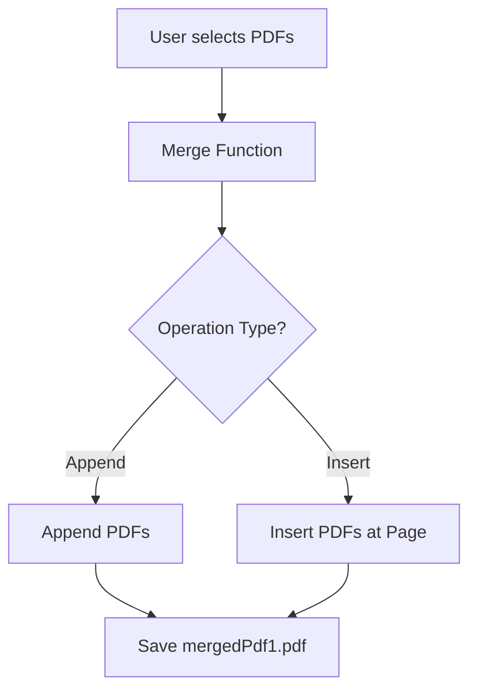
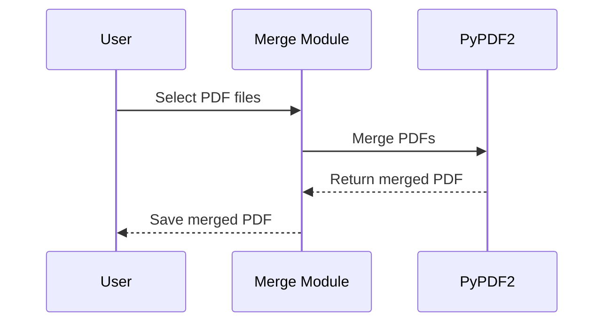

# 📄 Cool_Project_2: Merge PDFs Module

[](https://www.python.org/)
[](https://github.com/alok-kumar8765/Cool_Project_2)
[](https://github.com/alok-kumar8765/Cool_Project_2)
[](https://github.com/alok-kumar8765/Cool_Project_2/issues)
[](https://github.com/alok-kumar8765/Cool_Project_2/network/members)
[](https://github.com/alok-kumar8765/Cool_Project_2/stargazers)

---

## 📌 Table of Contents

<details>
<summary>Click to expand Table of Contents</summary>

1. [Project Overview](#project-overview)  
2. [Features](#features)  
3. [Installation](#installation)  
4. [Usage](#usage)  
5. [Code Explanation](#code-explanation)  
6. [Architecture & Flow](#architecture--flow)  
7. [Diagrams](#diagrams)  
   - [DFD](#data-flow-diagram-dfd)  
   - [System Architecture](#system-architecture)  
   - [Process Flow](#process-flow)  
8. [Pros & Cons](#pros--cons)  
9. [Real-World Use Cases](#real-world-use-cases)  
10. [SEO Optimized Keywords](#seo-optimized-keywords)  
11. [License & Contribution](#license--contribution)  

</details>

---

## 📝 Project Overview

The **Merge PDFs Module** is a lightweight Python utility to combine multiple PDF files into a single document. It supports:

- **Appending PDFs** sequentially.
- **Inserting PDFs** at a specified page.
- Easy integration in **enterprise workflows**, batch processing, and automated document management systems.

**Tech Stack:**  
- Python 3.x  
- PyPDF2 Library

---

## ✨ Features

<details>
<summary>Click to expand Features</summary>

- Append multiple PDFs into a single file.
- Insert a PDF at a specified page position.
- Support for both file paths and file streams.
- Minimal dependencies, fast execution.
- Modular functions: `by_appending()` and `by_inserting()`.

</details>

---

## ⚙️ Installation

<details>
<summary>Click to expand Installation Steps</summary>

```bash
# Clone repository
git clone https://github.com/alok-kumar8765/Cool_Project_2.git

# Navigate to Merge_pdfs folder
cd Cool_Project_2/Merge_pdfs

# Install dependencies
pip install PyPDF2
````

</details>

---

## 🚀 Usage

<details>
<summary>Click to expand Usage Instructions</summary>

```python
# Run the module directly
python merge_pdfs.py

# This will:
# 1. Merge samplePdf1.pdf and samplePdf2.pdf by appending.
# 2. Merge samplePdf2.pdf into samplePdf1.pdf at page 0.
```

</details>

---

## 💡 Code Explanation

<details>
<summary>Click to expand Code Explanation</summary>

**Functions:**

1. **`by_appending()`**

   * Merges PDFs by appending in sequential order.
   * Supports file objects or direct file paths.
   * Writes output as `mergedPdf.pdf`.

2. **`by_inserting()`**

   * Merges PDFs by inserting one PDF into another at a specific page number.
   * Writes output as `mergedPdf1.pdf`.

**Main Execution:**

```python
if __name__ == "__main__":
    by_appending()
    by_inserting()
```

* Executes both append and insert operations sequentially.

</details>

---

## 🏛 Architecture & Flow

<details>
<summary>Click to expand Architecture & Flow</summary>

**Architecture Type:** Modular, File-Based Processing
**Design Pattern:** Procedural with modular separation

* **Input Layer:** PDF files via file path or file object
* **Processing Layer:** PyPDF2 handles merging operations
* **Output Layer:** Merged PDF file saved locally

</details>

---

## 📊 Diagrams

<details>
<summary>Click to expand Diagrams</summary>

### Data Flow Diagram (DFD)



### System Architecture


### Process Flow



</details>

---

## ⚖️ Pros & Cons

<details>
<summary>Click to expand Pros & Cons</summary>

**Pros:**

* Lightweight, dependency-free except PyPDF2.
* Easy to integrate in Python scripts or pipelines.
* Handles both appending and insertion.

**Cons:**

* Cannot edit content inside PDFs (text/images).
* Limited error handling for corrupted PDFs.
* No GUI; purely script-based.

</details>

---

## 🌐 Real-World Use Cases

<details>
<summary>Click to expand Real-World Use Cases</summary>

1. **Enterprise Document Management:** Merge multiple invoices or reports into a single PDF.
2. **Legal Firms:** Combine contracts, agreements, or case files.
3. **Education:** Combine lecture notes, assignments, or student submissions.
4. **Finance:** Generate consolidated monthly statements from multiple PDF sources.

**Example:**

* Combining `January_Invoice.pdf` and `February_Invoice.pdf` to create `Q1_Invoice.pdf`.

</details>

---

## 🔑 SEO Optimized Keywords

<details>
<summary>Click to expand SEO Keywords</summary>

Python PDF merge, PyPDF2 PDF, append PDFs, insert PDF pages, PDF automation Python, Python document management, PDF workflow automation, merge multiple PDFs, Python PDF script, enterprise PDF tools

</details>

---

## 📜 License & Contribution

<details>
<summary>Click to expand License & Contribution</summary>

* **License:** MIT
* **Contributing:** Fork the repository, make changes, and create a pull request.
* **GitHub Repo:** [alok-kumar8765/Cool_Project_2](https://github.com/alok-kumar8765/Cool_Project_2)

</details>


---

