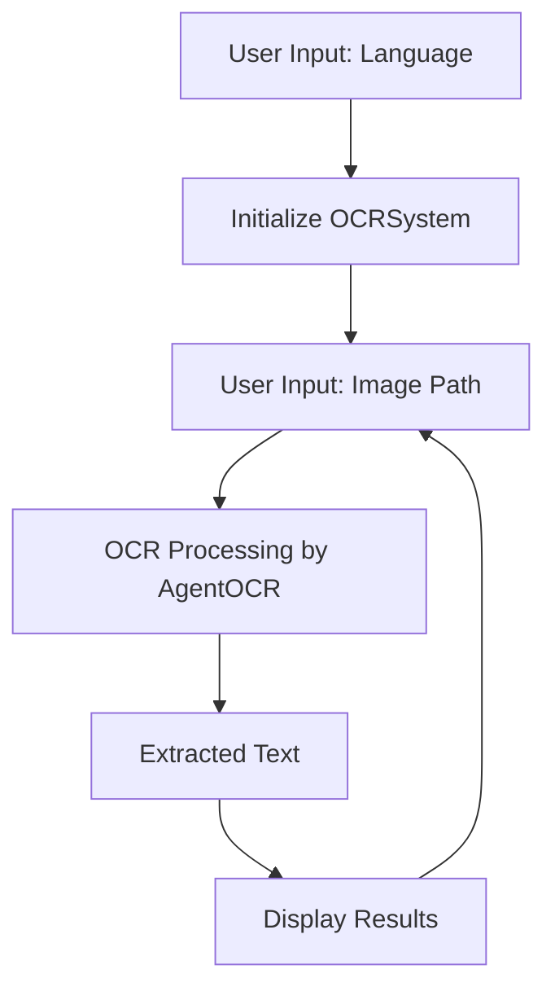
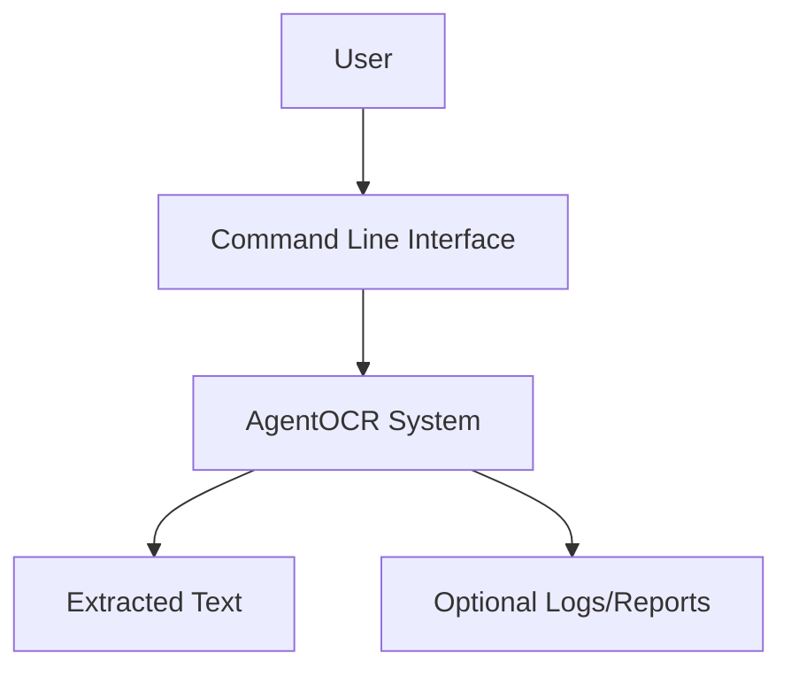
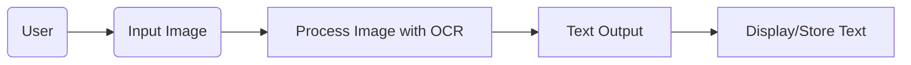

# 📝 Multi-Language OCR System

[](https://github.com/alok-kumar8765/Cool_Project_2) 
[](https://github.com/alok-kumar8765/Cool_Project_2) 
[](https://www.python.org/) 
[](https://github.com/alok-kumar8765/Cool_Project_2/stargazers)  

> **Multi-Language OCR System** is a Python-based Optical Character Recognition (OCR) tool capable of recognizing text from images in multiple languages including Chinese, Arabic, Hindi, English, and over 70+ others. It leverages the `AgentOCR` module for accurate and fast text extraction.

---

## 📖 Table of Contents
<details>
<summary>Click to expand</summary>

1. [Project Description](#project-description)  
2. [Features](#features)  
3. [Installation](#installation)  
4. [Usage](#usage)  
5. [Supported Languages](#supported-languages)  
6. [Architecture & Flow](#architecture--flow)  
7. [Data Flow Diagram (DFD)](#data-flow-diagram-dfd)  
8. [Pros & Cons](#pros--cons)  
9. [Real-World Use Cases](#real-world-use-cases)  
10. [Example](#example)  
11. [License](#license)  

</details>

---

## 🔹 Project Description
<details>
<summary>Click to expand</summary>

This project is designed for **text recognition from images** in multiple languages. It can be applied to document digitization, multilingual content extraction, and automated data entry.  

The system is **interactive**, allowing users to select the language they want to recognize and continuously extract text from multiple images.

</details>

---

## ✨ Features
<details>
<summary>Click to expand</summary>

- Multi-language support (70+ languages)  
- Easy to configure and use via Python CLI  
- Continuous OCR from multiple images  
- Extensible using `AgentOCR` module  
- Lightweight and fast  

</details>

---

## ⚙️ Installation
<details>
<summary>Click to expand</summary>

```bash
# Clone the repository
git clone https://github.com/alok-kumar8765/Cool_Project_2.git
cd Cool_Project_2/Multi_language_OCR

# Install dependencies
pip install agentocr
````

</details>

---

## 🖥️ Usage

<details>
<summary>Click to expand</summary>

```python
from agentocr import OCRSystem

# Display available languages
print(language)
config = input("Please enter the language you want to recognize:")

# Initialize OCR
ocr = OCRSystem(config=config)
print("OCR system Initialization complete!")

# Start OCR loop
while True:
    img = input("Please enter the path where the picture file is located:")
    results = ocr.ocr(img)
    for info in results:
        print(info)
```

</details>

---

## 🌐 Supported Languages

<details>
<summary>Click to expand</summary>

* Chinese & English (`ch`)
* Arabic (`ar`)
* Hindi (`hi`)
* French (`fr`)
* German (`german`)
* Japanese (`japan`)
* Korean (`korean`)
* Russian (`ru`)
* Spanish (`es`)
* Portuguese (`pt`)
* Urdu (`ur`)
* Serbian, Bulgarian, Italian, Vietnamese, and many more (over 70 languages)

</details>

---

## 🏗️ Architecture & Flow

<details>
<summary>Click to expand</summary>



---

### System Architecture



</details>

---

## 📊 Data Flow Diagram (DFD)

<details>
<summary>Click to expand</summary>



</details>

---

## ✅ Pros & Cons

<details>
<summary>Click to expand</summary>

**Pros:**

* Supports 70+ languages
* Interactive and continuous OCR
* Easy Python-based CLI integration
* Lightweight and fast

**Cons:**

* CLI-only (no GUI)
* Requires `AgentOCR` dependency
* Accuracy may vary with low-quality images

</details>

---

## 🌍 Real-World Use Cases

<details>
<summary>Click to expand</summary>

* Digitizing multilingual documents
* Translating printed content in real-time
* Data extraction from invoices, receipts, forms
* Multilingual research and text mining
* Assisting visually impaired users to read printed text

</details>

---

## 💡 Example

<details>
<summary>Click to expand</summary>

1. Run the program
2. Select the language, e.g., `en` for English
3. Enter the image path: `sample_image.png`
4. Output:

```
Hello, this is a sample text extracted from the image.
```

</details>

---

## 📝 License

<details>
<summary>Click to expand</summary>

© 2021 Alok Kumar. All rights reserved.
Please indicate the source for reprinting.

</details>


---
