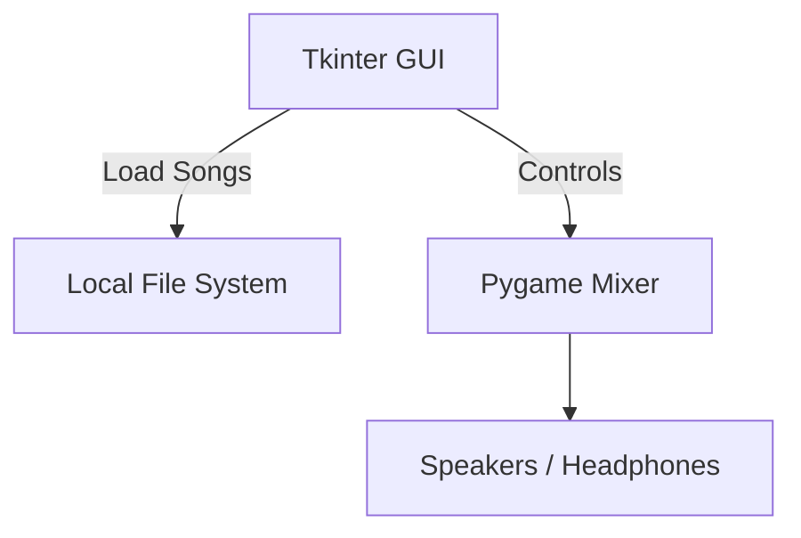
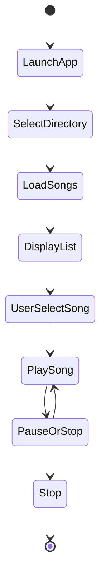

# 🎵 My Music Player GUI


[GitHub Repository](https://github.com/alok-kumar8765/Cool_Project_2/tree/main/Music%20Player%20GUI)

---

## 📖 Table of Contents
<details>
<summary>Click to expand</summary>

1. [Project Overview](#project-overview)
2. [Features](#features)
3. [Installation & Setup](#installation--setup)
4. [Usage](#usage)
5. [Architecture & Diagrams](#architecture--diagrams)
   - [Data Flow Diagram](#data-flow-diagram-dfd)
   - [System Architecture](#system-architecture)
   - [Application Flow](#application-flow)
6. [Pros & Cons](#pros--cons)
7. [Real-World Use Cases](#real-world-use-cases)
8. [Example](#example)
9. [Contributing](#contributing)
10. [License](#license)

</details>

---

## 📝 Project Overview
<details>
<summary>Click to expand</summary>

**My Music Player GUI** is a lightweight desktop music player built with **Python**, **Tkinter**, and **Pygame**. It allows users to browse their local music directory, select songs, and control playback with **Play, Pause, Stop, and Unpause** functionality. This project serves as a perfect example for learning GUI development and audio management in Python.

**Key Highlights:**
- Cross-platform support (Windows, Linux, macOS)
- Simple and intuitive GUI
- Plays local audio files
- Built for educational and practical use

</details>

---

## ✨ Features
<details>
<summary>Click to expand</summary>

- Browse and select a folder containing songs
- List all available songs in a scrollable ListBox
- Play selected song with **Play** button
- Stop music anytime using **Stop** button
- Pause and Resume using **Pause** & **Unpause**
- Responsive and simple **Tkinter GUI**
- Lightweight with minimal dependencies

</details>

---

## ⚙️ Installation & Setup
<details>
<summary>Click to expand</summary>

**Requirements:**
- Python 3.x
- `pygame` library
- `tkinter` (usually pre-installed with Python)

**Setup Steps:**
```bash
# 1. Clone the repo
git clone https://github.com/alok-kumar8765/Cool_Project_2.git

# 2. Navigate to Music Player GUI folder
cd Cool_Project_2/Music\ Player\ GUI

# 3. Install dependencies
pip install pygame
````

**Run the Application:**

```bash
python music_player.py
```

</details>

---

## ▶️ Usage

<details>
<summary>Click to expand</summary>

1. Launch the app.
2. Select the directory containing your music files.
3. Songs will be loaded in a list.
4. Use the buttons to control playback:

   * **PLAY** – Play the selected song
   * **STOP** – Stop playback
   * **PAUSE** – Pause playback
   * **UNPAUSE** – Resume playback
5. The current playing song is displayed above the buttons.

</details>

---

## 🏗️ Architecture & Diagrams

### Data Flow Diagram (DFD)

<details>
<summary>Click to expand</summary>

```mermaid
flowchart TD
    A[User] --> B[Music Player GUI]
    B --> C[Directory Selection]
    C --> D[List Songs]
    D --> E[Song Control Buttons]
    E --> F[Playback Engine (Pygame)]
    F --> G[Audio Output]
```

</details>

### System Architecture

<details>
<summary>Click to expand</summary>



</details>

### Application Flow

<details>
<summary>Click to expand</summary>



</details>

---

## ✅ Pros & Cons

<details>
<summary>Click to expand</summary>

**Pros:**

* Easy-to-use interface
* Lightweight and fast
* Minimal dependencies
* Great learning tool for Python GUI & audio integration

**Cons:**

* Limited to local music files only
* Basic features – no playlists, shuffle, or streaming
* No cross-platform installation package yet

</details>

---

## 🌐 Real-World Use Cases

<details>
<summary>Click to expand</summary>

* Desktop music player for personal use
* Educational demo for **Python GUI & Pygame integration**
* Prototype for building advanced audio apps
* Automation of audio playback in small kiosks or stores

</details>

---

## 📌 Example

<details>
<summary>Click to expand</summary>

**Scenario:**
A user wants to play songs from a folder named `MyMusic` on their PC:

1. Open the music player.
2. Select the `MyMusic` folder.
3. Click on a song from the list.
4. Press **PLAY** to listen.
5. If interrupted, press **PAUSE** and later **UNPAUSE**.

**Output:** The selected song plays immediately, and the GUI shows the song name in real-time.

</details>

---

## 🤝 Contributing

<details>
<summary>Click to expand</summary>

1. Fork the repository.
2. Create a new branch (`git checkout -b feature-name`).
3. Make your changes.
4. Commit your work (`git commit -m "Add feature"`).
5. Push to the branch (`git push origin feature-name`).
6. Create a Pull Request.

</details>

---

## 📝 License

<details>
<summary>Click to expand</summary>

This project is licensed under the MIT License.
See [LICENSE](https://github.com/alok-kumar8765/Cool_Project_2/blob/main/LICENSE) for more details.

</details>


---
