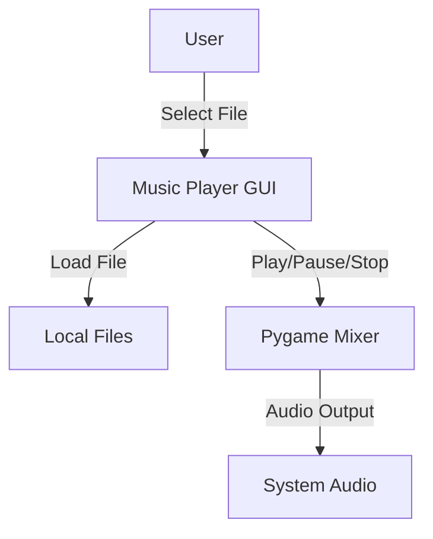
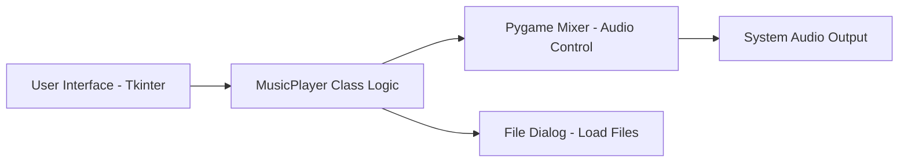
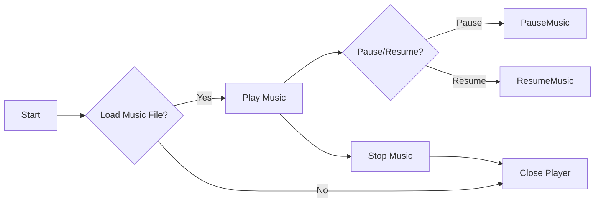

# 🎵 Universal Music Player - Cool_Project_2


> **A simple, universal, lightweight, desktop music player built with Python, Tkinter, and Pygame.**  

---

## 📖 Table of Contents
<details>
<summary>Click to expand</summary>

1. [Project Overview](#project-overview)
2. [Features](#features)
3. [Installation & Requirements](#installation--requirements)
4. [Usage](#usage)
5. [Architecture & Flow](#architecture--flow)
    - [DFD](#dfd-data-flow-diagram)
    - [System Architecture](#system-architecture)
    - [Flow Diagram](#flow-diagram)
6. [Code Explanation](#code-explanation)
7. [Pros & Cons](#pros--cons)
8. [Real-World Use Cases](#real-world-use-cases)
9. [SEO & Optimization Notes](#seo--optimization-notes)
10. [License](#license)

</details>

---

## 📝 Project Overview
<details>
<summary>Click to expand</summary>

This project is a **Desktop Music Player** built using **Python**, **Tkinter**, and **Pygame**. It allows users to load, play, pause, stop, and close music files with a simple and intuitive GUI.  

Key highlights:  
- Lightweight and portable  
- Supports multiple music formats (mp3, wav, etc.)  
- Interactive GUI with responsive buttons  
- Pause/Resume functionality  

</details>

---

## ⚡ Features
<details>
<summary>Click to expand</summary>

- Load audio files via file dialog
- Play selected music
- Pause and resume functionality
- Stop music playback
- Close the application safely
- Responsive GUI with custom colors
- Cross-platform desktop support

</details>

---

## 🛠 Installation & Requirements
<details>
<summary>Click to expand</summary>

**Requirements**:
- Python 3.10+
- Tkinter (comes pre-installed with Python)
- Pygame (`pip install pygame`)

**Installation**:

```bash
git clone https://github.com/alok-kumar8765/Cool_Project_2.git
cd Cool_Project_2/MusicPlayer
python music_player.py
````

</details>

---

## ▶️ Usage

<details>
<summary>Click to expand</summary>

1. Run the script: `python music_player.py`
2. Click **Load** to select a music file
3. Press **Play** to start playback
4. Use **Pause** to pause/resume music
5. Press **Stop** to stop playback
6. Click **Close** to safely exit the application

</details>

---

## 🏗 Architecture & Flow

<details>
<summary>Click to expand</summary>

### DFD (Data Flow Diagram)



### System Architecture



### Flow Diagram



</details>

---

## 💻 Code Explanation

<details>
<summary>Click to expand</summary>

* **Tkinter GUI**: Provides the user interface and buttons

* **Pygame Mixer**: Handles music playback (load, play, pause, stop)

* **MusicPlayer Class**:

  * `load()`: Opens file dialog to select music
  * `play()`: Plays the loaded music file
  * `pause()`: Toggles pause/resume
  * `stop()`: Stops playback
  * `Close Button`: Destroys GUI and stops music

* **Styling**: Custom colors for buttons (`#4b7fa4` for actions, `#cb464e` for exit/stop)

* **Geometry**: `470x150` fixed window size

</details>

---

## ✅ Pros & Cons

<details>
<summary>Click to expand</summary>

**Pros**:

* Lightweight and easy to use
* Minimal dependencies
* Cross-platform support
* Easy to extend with additional features (playlist, volume control)

**Cons**:

* Only supports local files
* No playlist management
* Limited format support without extra libraries
* Basic UI design

</details>

---

## 🌎 Real-World Use Cases

<details>
<summary>Click to expand</summary>

* Personal desktop music player for casual listening
* Integration in **learning or meditation apps** for background music
* **Prototype for music-based Python projects**
* Example:

  > A small office wants a lightweight music player for background music without installing heavy apps like Spotify.

</details>

---

## 📈 Screenshot

<details>
<summary>Click to expand</summary>


</details>

---

## 📄 License

<details>
<summary>Click to expand</summary>

MIT License © [Alok Kumar](https://github.com/alok-kumar8765)

</details>

---

> Repository Link: [Cool_Project_2 / MusicPlayer](https://github.com/alok-kumar8765/Cool_Project_2/tree/main/MusicPlayer)
> Made with ❤️ by **Alok Kumar**

---

