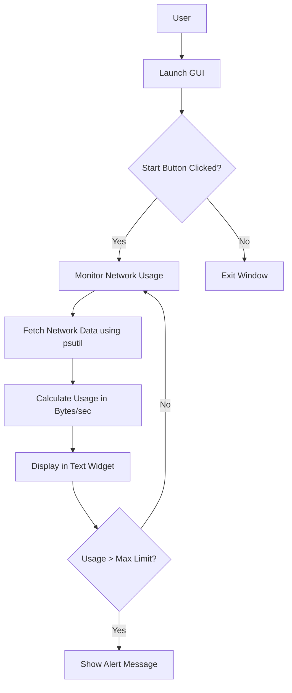
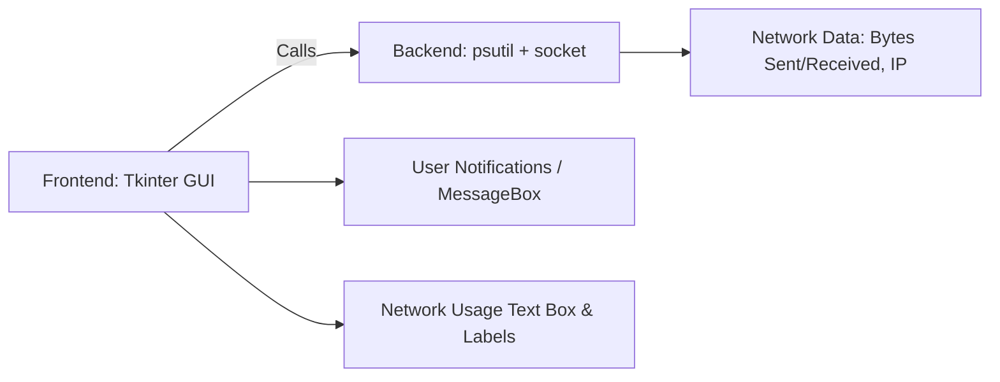
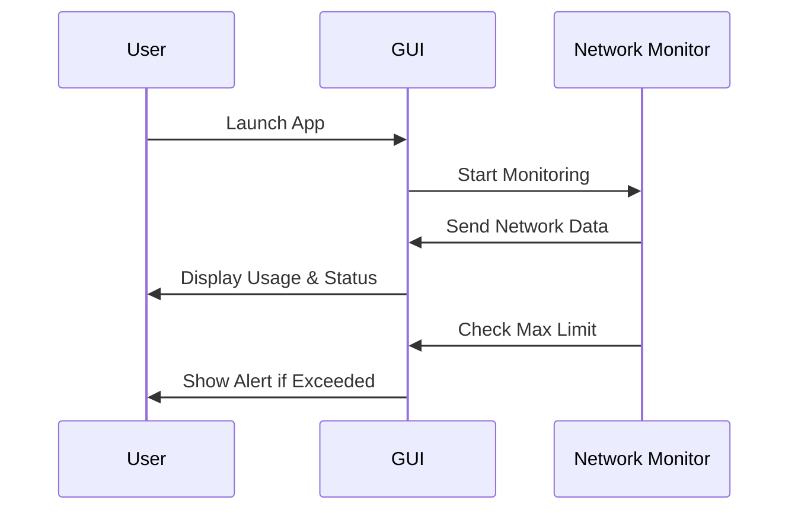

# 🖥️ Network Usage Tracker

    

> **Network Usage Tracker** is a desktop-based Python application that monitors real-time network usage (upload/download), connection status, and alerts users when a defined network limit is exceeded. Built using **Tkinter**, **psutil**, and **socket** libraries, it provides an intuitive GUI and live feedback on network activity.

---

## 📌 Table of Contents

<details>
<summary>Click to expand</summary>

1. [Project Overview](#project-overview)
2. [Features](#features)
3. [Architecture & Diagrams](#architecture--diagrams)

   * [Data Flow Diagram](#data-flow-diagram-dfd)
   * [System Architecture](#system-architecture)
   * [Process Flow](#process-flow)
4. [Installation & Setup](#installation--setup)
5. [Usage](#usage)
6. [Code Explanation](#code-explanation)
7. [Pros & Cons](#pros--cons)
8. [Real-World Applications](#real-world-applications)
9. [Contributing](#contributing)
10. [License](#license)

</details>

---

## 📝 Project Overview

The **Network Usage Tracker**:

* Monitors real-time network upload/download in bytes/sec.
* Shows active internet connection status and local IP address.
* Alerts user if usage exceeds **1 MB/sec** (configurable).
* Built with **Python GUI (Tkinter)**, ensuring cross-platform desktop compatibility.
* Lightweight and easy-to-use for monitoring home or office network activity.

---

## ⚡ Features

<details>
<summary>Click to expand</summary>

* Real-time network usage display
* Maximum network usage limit alert
* Local IP address detection
* Intuitive GUI with **Tkinter**
* Lightweight, no external heavy dependencies
* Start/Exit buttons with confirmation
* Visual integration with images for branding

</details>

---

## 🏗 Architecture & Diagrams

### Data Flow Diagram (DFD)



### System Architecture



### Process Flow



---

## 💻 Installation & Setup

<details>
<summary>Click to expand</summary>

**Requirements:**

* Python ≥ 3.8
* Libraries:

  ```bash
  pip install psutil pillow
  ```

**Steps:**

1. Clone the repository:

   ```bash
   git clone https://github.com/alok-kumar8765/Cool_Project_2.git
   ```
2. Navigate to the project directory:

   ```bash
   cd Cool_Project_2/Network\ Usage\ Tracker
   ```
3. Run the main script:

   ```bash
   python network_usage_tracker.py
   ```

---

## 🚀 Usage

<details>
<summary>Click to expand</summary>

1. Launch the application (`network_usage_tracker.py`).
2. Click **START** to begin monitoring network usage.
3. Monitor live usage in the **Usage Text Box**.
4. Check connection status below the usage display.
5. Close the application via **EXIT** button or window close with confirmation prompt.
6. If network usage exceeds the max limit (1 MB/sec), a popup alert will appear.

</details>

---

## 📖 Code Explanation

<details>
<summary>Click to expand</summary>

* **Tkinter GUI**: Handles windows, buttons, labels, and text display.
* **psutil.net_io_counters()**: Fetches bytes sent/received to calculate usage.
* **socket.gethostbyname(socket.gethostname())**: Retrieves local IP to check connection status.
* **ImageTk.PhotoImage**: Displays a welcome image in the GUI.
* **update_label() function**: Refreshes network usage every 0.5 seconds, updates text widget, and triggers alerts.
* **Max Limit Check**: Displays `mbox.showinfo()` if usage exceeds threshold.
* **Exit Handlers**: Confirmation dialog before closing the app.

---

## ✅ Pros & Cons

<details>
<summary>Click to expand</summary>

**Pros:**

* Lightweight and simple GUI for desktop users
* Real-time monitoring with minimal lag
* Easy to extend and integrate with other Python tools
* Alerts users on excessive usage

**Cons:**

* Basic GUI, not responsive for different resolutions
* Only monitors network on the local machine
* Fixed max limit, needs manual configuration for advanced scenarios
* No logging or historical data tracking

</details>

---

## 🌐 Real-World Applications

<details>
<summary>Click to expand</summary>

**Use Cases:**

* **Home Internet Monitoring**: Keep track of bandwidth usage and avoid ISP throttling.
* **Office Network Management**: Alert employees or admin if network exceeds limits.
* **IT Troubleshooting**: Quickly check if a system is connected to the internet or local network.
* **Educational Labs**: Teach students network monitoring basics with a simple GUI tool.

**Example Scenario:**

> A small office wants to monitor network usage on their shared system to ensure no single machine exceeds 1 MB/sec. This tracker provides instant feedback and alerts, preventing bandwidth abuse.

</details>

---

## 🤝 Contributing

<details>
<summary>Click to expand</summary>

1. Fork the repository
2. Create a new branch (`git checkout -b feature/YourFeature`)
3. Commit your changes (`git commit -m 'Add new feature'`)
4. Push to the branch (`git push origin feature/YourFeature`)
5. Create a Pull Request

</details>

---

## 📜 License

<details>
<summary>Click to expand</summary>

This project is licensed under the MIT License. See [LICENSE](https://github.com/alok-kumar8765/Cool_Project_2/blob/main/LICENSE) for details.

</details>

---

**Repo Link:** [Network Usage Tracker GitHub](https://github.com/alok-kumar8765/Cool_Project_2/tree/main/Network%20Usage%20Tracker)

---

