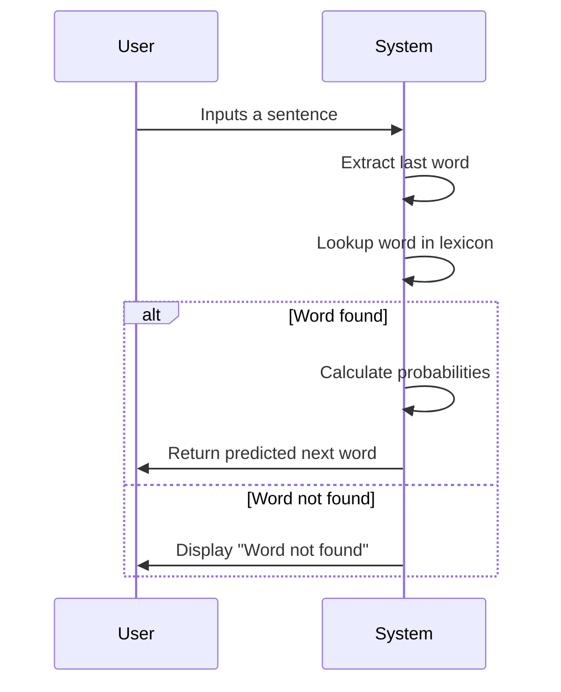

# Next Word Prediction 🔮


[](https://github.com/alok-kumar8765/Cool_Project_2/tree/main/Next%20Word%20Prediction)

---

## 📖 Table of Contents

<details>
<summary>Click to expand</summary>

1. [Project Overview](#project-overview)
2. [Features](#features)
3. [Architecture & Design](#architecture--design)
    - [Data Flow Diagram](#data-flow-diagram)
    - [System Architecture](#system-architecture)
    - [Workflow Diagram](#workflow-diagram)
4. [Installation & Setup](#installation--setup)
5. [Usage](#usage)
6. [Code Explanation](#code-explanation)
7. [Pros & Cons](#pros--cons)
8. [Use Cases & Real-World Applications](#use-cases--real-world-applications)
9. [Contributing](#contributing)
10. [License](#license)

</details>

---

## 🌟 Project Overview

**Next Word Prediction** is a lightweight, AI-powered predictive text system built in **Python**. It reads a dataset of text, builds a probabilistic lexicon of word transitions, and predicts the next most probable word given an input. This tool can be a foundation for:

- Predictive typing
- Chatbots
- Auto-completion systems
- Language modeling research

**SEO Keywords**: Next Word Prediction Python, Predictive Text AI, Lexicon NLP, AI Auto-Completion, Python Language Model.

---

## ✨ Features

<details>
<summary>Click to expand</summary>

- ✅ Simple probabilistic lexicon-based next word prediction.
- ✅ Supports dynamic dataset updates.
- ✅ Generates predictions with weighted probability using NumPy.
- ✅ Lightweight and fast for small to medium datasets.
- ✅ Ready for integration into chatbots, editors, and language tools.
- ✅ Easy to extend with big datasets or neural network enhancements.

</details>

---

## 🏗 Architecture & Design

### Data Flow Diagram

<details>
<summary>Click to expand</summary>

```mermaid
flowchart TD
    A[Input Dataset: dataset.txt] --> B[Lexicon Builder]
    B --> C[Probabilistic Word Transition Table]
    C --> D[User Input Processing]
    D --> E[Next Word Prediction]
    E --> F[Output Predicted Sentence]
````

</details>

### System Architecture

<details>
<summary>Click to expand</summary>

```mermaid
graph LR
    A[User Input] --> B[Preprocessing Module]
    B --> C[Lexicon Lookup]
    C --> D[Probability Calculation]
    D --> E[Next Word Selection]
    E --> F[Output Display]
```

</details>

### Workflow Diagram

<details>
<summary>Click to expand</summary>



</details>

---

## 🛠 Installation & Setup

<details>
<summary>Click to expand</summary>

```bash
# Clone the repository
git clone https://github.com/alok-kumar8765/Cool_Project_2.git

# Navigate to the project folder
cd Cool_Project_2/Next\ Word\ Prediction

# Install dependencies
pip install numpy

# Add your dataset
# Ensure a plain text file named 'dataset.txt' exists in the same folder

# Run the prediction script
python next_word_prediction.py
```

</details>

---

## 💻 Usage

<details>
<summary>Click to expand</summary>

1. Run the script using Python 3.x
2. Enter a sentence or a single word
3. The system predicts the next word probabilistically

**Example:**

```
> I am going
Output: I am going to
```

---

## 📝 Code Explanation

<details>
<summary>Click to expand</summary>

* **Lexicon Construction:** Tracks how often one word follows another.
* **Update Function:** Adds new words or increments existing transition counts.
* **Normalization:** Converts raw counts into probabilities.
* **Prediction:** Uses `np.random.choice` to select the next word based on probability distribution.

**Key Function:**

```python
def update_lexicon(current: str, next_word: str) -> None:
    if current not in lexicon:
        lexicon.update({current: {next_word: 1}})
        return
    options = lexicon[current]
    options[next_word] = options.get(next_word, 0) + 1
    lexicon[current] = options
```

---

## ⚖ Pros & Cons

<details>
<summary>Click to expand</summary>

**Pros:**

* Simple and easy to implement
* Fast on small datasets
* Transparent, interpretable lexicon-based model
* Lightweight: no heavy ML libraries required

**Cons:**

* Limited to dataset coverage
* Struggles with long-term context
* Not as accurate as deep learning models
* Vocabulary updates require manual dataset refresh

</details>

---

## 🌐 Use Cases & Real-World Applications

<details>
<summary>Click to expand</summary>

* **Predictive Text & Auto-Completion**: For messaging apps, code editors, and search engines.
* **Chatbots**: Enhance response suggestions in conversational AI.
* **Language Learning Tools**: Suggest next words for writing exercises.
* **Smart Compose Features**: Integrated into email or text applications.
* **Prototyping NLP Research**: Quick experiments with probabilistic language models.

**Example:**
In a messaging app, typing `I am going` could predict `to`, completing the sentence automatically.

</details>

---

## 🤝 Contributing

<details>
<summary>Click to expand</summary>

Contributions are welcome!

1. Fork the repository
2. Create your branch (`git checkout -b feature/AmazingFeature`)
3. Commit your changes (`git commit -m 'Add amazing feature'`)
4. Push to the branch (`git push origin feature/AmazingFeature`)
5. Open a Pull Request

</details>

---

## 📜 License

<details>
<summary>Click to expand</summary>

This project is **MIT Licensed**. See the [LICENSE](https://github.com/alok-kumar8765/Cool_Project_2/blob/main/LICENSE) file for details.

</details>


---

