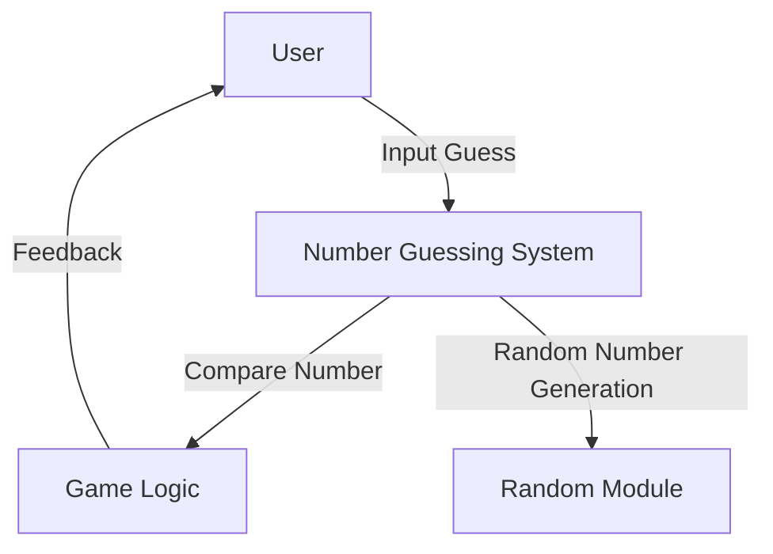
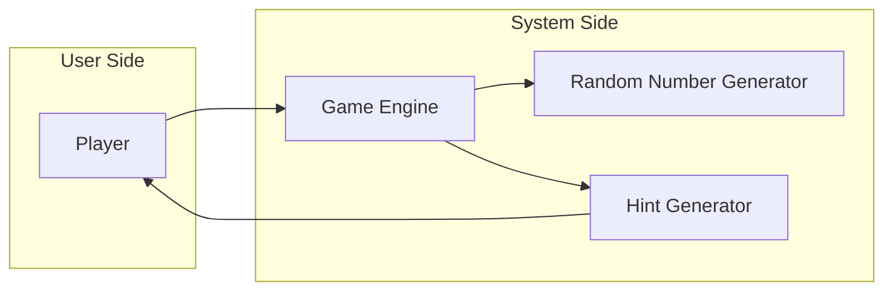

# 🎯 Number Guessing Game

[](https://www.python.org/) 
[](https://github.com/alok-kumar8765/Cool_Project_2/blob/main/LICENSE) 
[](https://github.com/alok-kumar8765/Cool_Project_2/tree/main/Number_guessing_game) 
[](https://github.com/alok-kumar8765/Cool_Project_2/issues) 

---

## 📌 Table of Contents
<details>
<summary>Click to Expand</summary>

1. [Project Overview](#project-overview)  
2. [Features](#features)  
3. [Installation & Setup](#installation--setup)  
4. [Code Explanation](#code-explanation)  
5. [Architecture & Diagrams](#architecture--diagrams)  
    - [Flow Diagram](#flow-diagram)  
    - [DFD (Data Flow Diagram)](#dfd-data-flow-diagram)  
    - [System Architecture](#system-architecture)  
6. [Pros & Cons](#pros--cons)  
7. [Use Cases & Real-World Applications](#use-cases--real-world-applications)  
8. [Contributing](#contributing)  
9. [License](#license)  

</details>

---

## 📝 Project Overview
<details>
<summary>Click to Expand</summary>

The **Number Guessing Game** is a simple Python-based interactive console game. The computer randomly selects a number between 1 and 9, and the user has to guess it. The game provides hints for each attempt, indicating whether the guess is too high or too low, making it a fun and engaging exercise for beginners to learn Python programming.

**Key Highlights:**
- Beginner-friendly Python project.
- Interactive command-line interface.
- Random number generation and user input validation.
- Real-time hints for guesses.

</details>

---

## ⚡ Features
<details>
<summary>Click to Expand</summary>

- Random number generation using `random.randint()`.
- User gets unlimited attempts until the correct number is guessed.
- Provides hints if the guess is too high or too low.
- Displays the number of attempts taken to guess correctly.
- Lightweight and simple codebase for Python learners.

</details>

---

## 🛠 Installation & Setup
<details>
<summary>Click to Expand</summary>

1. **Clone the Repository:**
```bash
git clone https://github.com/alok-kumar8765/Cool_Project_2.git
cd Cool_Project_2/Number_guessing_game
````

2. **Ensure Python 3.x is Installed:**

```bash
python --version
```

3. **Run the Game:**

```bash
python number_guessing_game.py
```

</details>

---

## 🔍 Code Explanation

<details>
<summary>Click to Expand</summary>

1. **Random Number Generation:**

```python
number = random.randint(1, 9)
```

Generates a random number between 1 and 9.

2. **User Input Loop:**

```python
while True:
    guess = int(input())
```

Continuously prompts the user to guess until the correct number is entered.

3. **Comparison & Hints:**

```python
if guess == number:
    print(f'CONGRATULATIONS! YOU HAVE GUESSED THE NUMBER {number} IN {chances} ATTEMPTS!')
elif guess < number:
    print("Your guess was too low: Guess a number higher than", guess)
else:
    print("Your guess was too high: Guess a number lower than", guess)
```

Provides real-time feedback on the guess.

4. **Chances Counter:**

```python
chances += 1
```

Tracks the number of attempts made by the user.

</details>

---

## 🏗 Architecture & Diagrams

<details>
<summary>Click to Expand</summary>

### Flow Diagram

```mermaid
flowchart TD
    A[Start Game] --> B[Generate Random Number 1-9]
    B --> C[User Inputs Guess]
    C --> D{Guess == Number?}
    D -- Yes --> E[Print Success Message]
    D -- No --> F{Guess < Number?}
    F -- Yes --> G[Print "Guess Higher"]
    F -- No --> H[Print "Guess Lower"]
    G --> C
    H --> C
```

### DFD (Data Flow Diagram)



### System Architecture



</details>

---

## ✅ Pros & Cons

<details>
<summary>Click to Expand</summary>

**Pros:**

* Lightweight and beginner-friendly.
* Improves Python programming skills.
* Interactive and engaging.
* Provides a simple example of control structures (`if-else`) and loops.

**Cons:**

* Only supports single-digit numbers.
* Limited to command-line interface (no GUI).
* Lacks advanced error handling for non-integer inputs.

</details>

---

## 🌍 Use Cases & Real-World Applications

<details>
<summary>Click to Expand</summary>

* **Educational Tool:** Perfect for Python beginners to practice loops, conditionals, and random number generation.
* **Entertainment:** Simple console game for casual fun.
* **Algorithm Practice:** Introduces basic logic for guessing and comparison algorithms.

**Example Real-World Use:**

* A teaching assistant uses this game in a classroom to teach conditional statements and loops.
* Can be expanded into mobile apps or web-based games for interactive learning platforms.

</details>

---

## 🤝 Contributing

<details>
<summary>Click to Expand</summary>

Contributions are welcome!
Steps:

1. Fork the repository.
2. Create a new branch: `git checkout -b feature-name`.
3. Make your changes and commit: `git commit -m "Add new feature"`.
4. Push to branch: `git push origin feature-name`.
5. Open a Pull Request.

</details>

---

## 📄 License

<details>
<summary>Click to Expand</summary>

This project is licensed under the **MIT License** - see the [LICENSE](https://github.com/alok-kumar8765/Cool_Project_2/blob/main/LICENSE) file for details.

</details>

---

*Repository maintained by [Alok Kumar](https://github.com/alok-kumar8765)*


---
