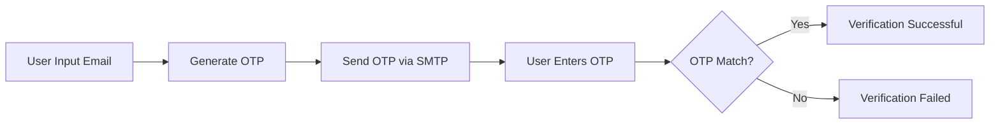
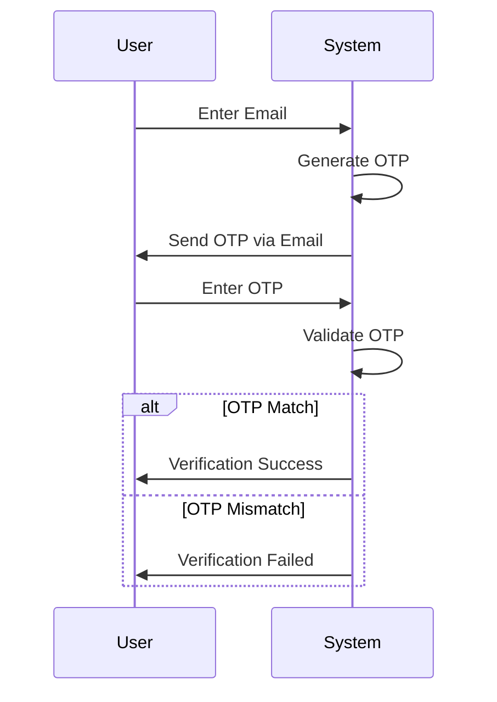
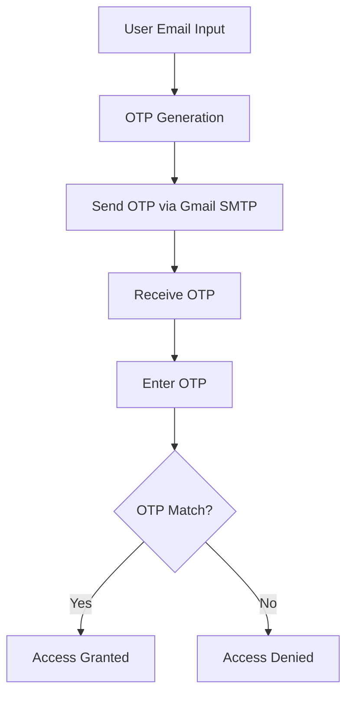

# 📧 OTP Verification System

[](https://github.com/alok-kumar8765/Cool_Project_2/tree/main/OTP%20Verification)
[](https://github.com/alok-kumar8765/Cool_Project_2/issues)
[](https://github.com/alok-kumar8765/Cool_Project_2/blob/main/LICENSE)
[](https://www.python.org/)

---

## Table of Contents
<details>
<summary>Click to expand</summary>

1. [Project Overview](#project-overview)  
2. [Features](#features)  
3. [Installation](#installation)  
4. [Usage](#usage)  
5. [Architecture & Flow](#architecture--flow)  
6. [Data Flow Diagram](#data-flow-diagram)  
7. [Pros & Cons](#pros--cons)  
8. [Real-world Use Cases](#real-world-use-cases)  
9. [SEO & Optimization](#seo--optimization)  
10. [License](#license)

</details>

---

## Project Overview
<details>
<summary>Click to expand</summary>

The **OTP Verification System** is a Python-based solution for secure one-time password (OTP) generation and email verification. This project leverages **Python's built-in `random`, `math`, and `smtplib` libraries** to generate a 6-digit OTP and send it to a user's email. Users must validate the OTP to complete verification.

**Key Highlights:**
- 6-digit OTP generation
- Gmail SMTP email delivery
- User input verification
- Lightweight and easy to integrate

</details>

---

## Features
<details>
<summary>Click to expand</summary>

- ✅ Generates a secure 6-digit OTP  
- ✅ Sends OTP via Gmail SMTP  
- ✅ Verifies user input in real-time  
- ✅ Minimal dependencies (pure Python)  
- ✅ Easy to integrate into web or desktop applications  

</details>

---

## Installation
<details>
<summary>Click to expand</summary>

**Requirements:**
- Python 3.8+  
- Internet access for email sending  
- Gmail account & App Password  

**Steps:**
```bash
git clone https://github.com/alok-kumar8765/Cool_Project_2.git
cd Cool_Project_2/OTP\ Verification
pip install -r requirements.txt   # Optional if additional packages used
````

**Note:**
Set up Gmail App Password for secure SMTP login:
[Google App Password Guide](https://support.google.com/accounts/answer/185833?hl=en)

</details>

---

## Usage

<details>
<summary>Click to expand</summary>

```python
import smtplib, random, math

# OTP Generation
digits = "0123456789"
OTP = "".join([digits[math.floor(random.random()*10)] for _ in range(6)])
msg = OTP + " is your OTP"

# Email Setup
s = smtplib.SMTP('smtp.gmail.com', 587)
s.starttls()
s.login("Your Gmail Account", "Your App Password")
emailid = input("Enter your email: ")
s.sendmail('Your Gmail Account', emailid, msg)

# OTP Verification
user_input = input("Enter Your OTP >>: ")
if user_input == OTP:
    print("Verified ✅")
else:
    print("Please Check your OTP again ❌")
```

**Execution:**

1. Run the script
2. Enter your email address
3. Receive OTP and input it to verify

</details>

---

## Architecture & Flow

<details>
<summary>Click to expand</summary>

**System Architecture:**



**Explanation:**

* User provides email
* System generates OTP dynamically
* OTP is sent via Gmail SMTP
* User inputs OTP to verify
* System confirms match

**Flow Diagram:**



</details>

---

## Data Flow Diagram

<details>
<summary>Click to expand</summary>



</details>

---

## Pros & Cons

<details>
<summary>Click to expand</summary>

**Pros:**

* Simple, lightweight Python implementation
* Minimal dependencies
* Can be integrated into web, desktop, and mobile apps
* Provides basic security for verification

**Cons:**

* Relies on Gmail SMTP (limits scalability)
* Not suitable for high-volume OTP systems
* No encryption for OTP in transit (SMTP security depends on TLS)
* Hard-coded sender email requires secure app password

</details>

---

## Real-world Use Cases

<details>
<summary>Click to expand</summary>

* ✅ User registration verification in web apps
* ✅ Two-factor authentication (2FA) for sensitive platforms
* ✅ Temporary password for account recovery
* ✅ Secure OTP login in small-scale SaaS projects

**Example Scenario:**
A website allows users to sign up. When users enter their email, an OTP is sent via Gmail. They must enter the OTP to verify ownership of the email before proceeding.

</details>

---

## SEO & Optimization

<details>
<summary>Click to expand</summary>

* Keywords: OTP Verification, Python Email OTP, Two-factor Authentication, Secure OTP, Python SMTP
* Light-weight Python script optimized for small-scale email verification
* Expandable to use **Twilio SMS API**, **AWS SES**, or **SendGrid** for higher scalability
* Easily integrated with Django, Flask, or FastAPI backend for full-stack solutions

</details>

---

## License

<details>
<summary>Click to expand</summary>

This project is **MIT Licensed**. You are free to use, modify, and distribute.

[View License](https://github.com/alok-kumar8765/Cool_Project_2/blob/main/LICENSE)

</details>

---

⭐ **GitHub Repository:** [alok-kumar8765/Cool_Project_2](https://github.com/alok-kumar8765/Cool_Project_2/tree/main/OTP%20Verification)


---
