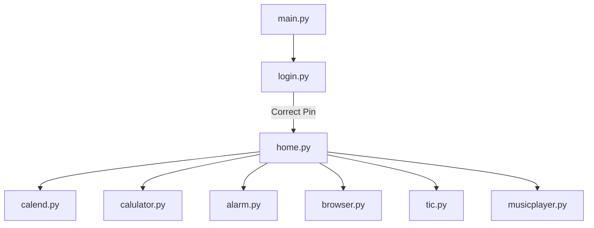
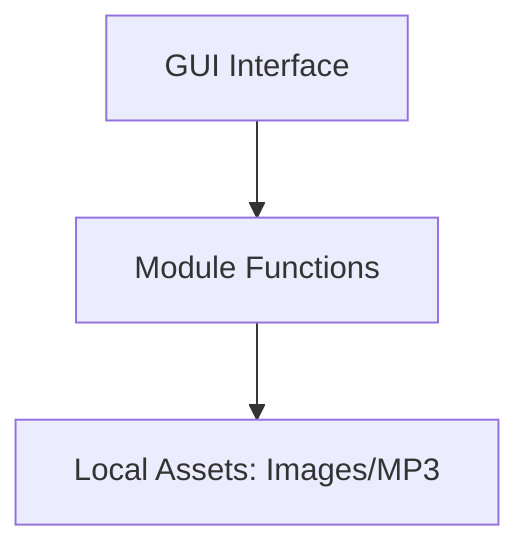
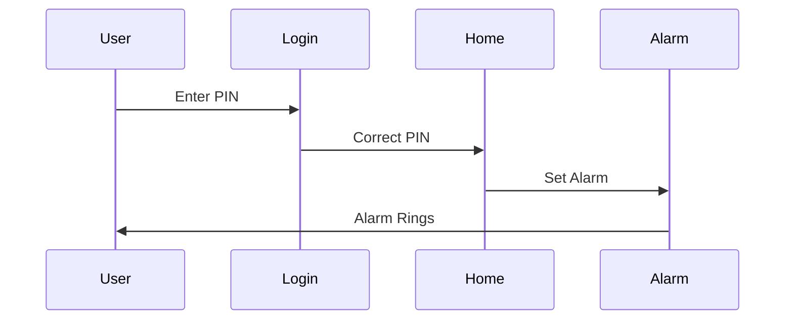

# 🖥️ Cool Project 2 - Operating System Utilities Suite

[](https://github.com/alok-kumar8765/Cool_Project_2)
[](https://github.com/alok-kumar8765/Cool_Project_2/stargazers)
[](https://github.com/alok-kumar8765/Cool_Project_2/blob/main/LICENSE)
[](https://www.python.org/)
[](https://github.com/alok-kumar8765/Cool_Project_2/issues)

---

## 📌 Table of Contents
<details>
<summary>Click to Expand</summary>

1. [Project Overview](#-project-overview)
2. [Features](#-features)
3. [Installation](#-installation)
4. [Code Modules](#-code-modules)
5. [Architecture & Flow](#-architecture--flow)
6. [Diagrams](#-diagrams)
7. [Use Cases & Real-World Applications](#-use-cases--real-world-applications)
8. [Pros & Cons](#-pros--cons)
9. [Contribution](#-contribution)
10. [License](#-license)

</details>

---

## 📖 Project Overview
`Cool_Project_2` is an **all-in-one desktop utility suite** built using Python's Tkinter library. It combines multiple daily-use tools under one GUI-based operating system interface:  

- Alarm Clock  
- Web Browser Launcher  
- Calendar Viewer  
- Calculator (Custom)  
- Music Player  
- Tic-Tac-Toe Game  

This project provides a **full-screen, user-friendly interface**, replicating a mini OS experience.  

**SEO Keywords:** Python GUI, Tkinter utilities, Alarm Clock Python, Desktop OS App, Python Projects, OS Automation, Desktop Tools Suite

---

## ✨ Features
<details>
<summary>Click to Expand</summary>

- **Alarm Clock:** Set alarms with audio notification.  
- **Calendar:** View yearly calendar for any given year.  
- **Browser Launcher:** Search the web directly via a mini GUI.  
- **Calculator:** Basic calculator for quick calculations.  
- **Tic-Tac-Toe Game:** Play classic Tic-Tac-Toe.  
- **Music Player:** Play local music files from the system.  
- **Full-Screen GUI:** Provides immersive, OS-like experience.  
- **Easy Navigation:** Central home interface for all modules.  

</details>

---

## 🛠️ Installation
<details>
<summary>Click to Expand</summary>

1. **Clone the Repository**
```bash
git clone https://github.com/alok-kumar8765/Cool_Project_2.git
cd Cool_Project_2/Operating\ System
````

2. **Install Dependencies**

```bash
pip install tk pillow youtube_dl
```

3. **Run the Application**

```bash
python main.py
```

> Ensure `sound.mp3` and all icon/image assets are in the same folder as the scripts.

</details>

---

## 🧩 Code Modules

<details>
<summary>Click to Expand</summary>

| Module       | Description                                                     |
| ------------ | --------------------------------------------------------------- |
| `alarm.py`   | Tkinter-based Alarm Clock with sound notification.              |
| `browser.py` | Mini web browser/search utility using Tkinter and `webbrowser`. |
| `calend.py`  | Displays yearly calendar for user-specified year.               |
| `home.py`    | Main OS interface linking all modules with clickable icons.     |
| `login.py`   | PIN-based login system for access control.                      |
| `main.py`    | Entry point; triggers video module (if any) and login screen.   |
| `video.py`   | (Optional) Handles video functionalities if implemented.        |

</details>

---

## 🏗️ Architecture & Flow

<details>
<summary>Click to Expand</summary>

**Architecture:**

* Layered modular design:

  * **Presentation Layer:** Tkinter GUI (home, login, modules)
  * **Application Layer:** Functional logic of alarm, browser, calendar
  * **Data Layer:** Local assets (images, mp3)

**Module Flow (Mermaid Diagram):**



**DFD (Data Flow Diagram):**

```mermaid
flowchart LR
    User -->|Inputs Pin| Login
    Login -->|Validation| Home
    Home --> Calendar
    Home --> Alarm
    Home --> Browser
    Home --> Calculator
    Home --> Music Player
    Home --> TicTacToe
    Calendar -->|Display Year| User
    Alarm -->|Trigger Sound| User
```

</details>

---

## 🗺️ Diagrams

<details>
<summary>Click to Expand</summary>

**System Architecture:**



**Module Interaction Flow:**



</details>

---

## 📂 Use Cases & Real-World Applications

<details>
<summary>Click to Expand</summary>

**1. Personal Productivity Suite:**

* Users can manage time with alarms and calendars.

**2. Mini Desktop OS Launcher:**

* Provides a single-window access to essential tools without switching apps.

**3. Learning/Teaching Tool:**

* Ideal for Python students to understand GUI development, modularity, and Tkinter events.

**4. Demonstration in Hackathons:**

* Shows full Python GUI capabilities including multimedia, OS-like behavior, and interactive applications.

**Real-World Example:**

* A student sets an alarm for study sessions, checks calendar for holidays, opens browser for research, and plays background music via the same OS-like GUI.

</details>

---

## ⚖️ Pros & Cons

<details>
<summary>Click to Expand</summary>

**Pros:**

* Fully modular & extendable.
* Easy-to-use GUI interface.
* Covers multiple utilities in one application.
* Lightweight and pure Python-based.

**Cons:**

* Runs only on Windows (for `winsound`).
* Limited error handling for invalid inputs.
* Browser search is basic; requires internet.
* Media and images must be pre-downloaded.

</details>

---

## 🤝 Contribution

<details>
<summary>Click to Expand</summary>

Contributions are welcome!

1. Fork the repository.
2. Create a feature branch (`git checkout -b feature/NewModule`).
3. Commit your changes (`git commit -m 'Add new module'`).
4. Push to the branch (`git push origin feature/NewModule`).
5. Open a Pull Request.

</details>

---

## 📄 License

<details>
<summary>Click to Expand</summary>

This project is licensed under the **MIT License** - see [LICENSE](https://github.com/alok-kumar8765/Cool_Project_2/blob/main/LICENSE) for details.

</details>

---

**🔗 GitHub Repository:** [Cool_Project_2](https://github.com/alok-kumar8765/Cool_Project_2)

---


