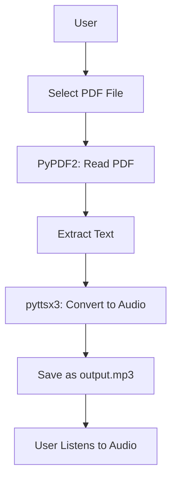
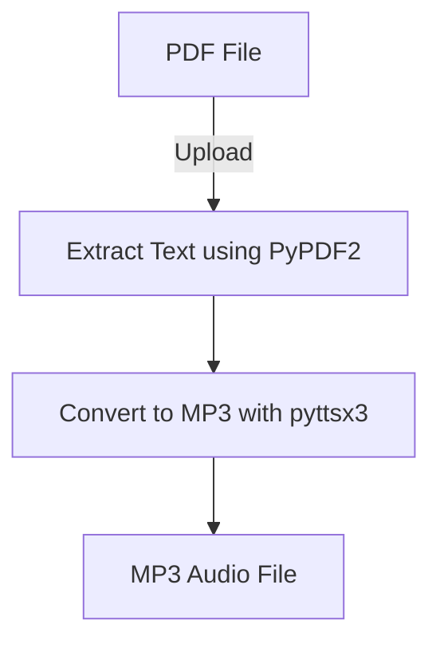

# 📚 PDF to MP3 Converter

[](https://github.com/alok-kumar8765/Cool_Project_2) 
[](https://www.python.org/) 
[](https://github.com/alok-kumar8765/Cool_Project_2/blob/main/LICENSE) 
[](https://github.com/alok-kumar8765/Cool_Project_2/issues) 

---

## 📌 Description

**PDF to MP3 Converter** is a Python-based utility that allows users to convert any PDF document into an MP3 audio file using **text-to-speech technology**. Ideal for students, professionals, or visually impaired users, this project provides an effortless way to **listen to PDF content on the go**.  

Powered by **PyPDF2** for PDF extraction and **pyttsx3** for audio generation, the tool supports **custom reading speed** for a personalized experience.  

---

## 🗂 Table of Contents

<details>
<summary>Click to Expand</summary>

1. [Features](#-features)  
2. [Installation](#-installation)  
3. [Usage](#-usage)  
4. [Code Explanation](#-code-explanation)  
5. [Architecture & Flow](#-architecture--flow)  
6. [Pros & Cons](#-pros--cons)  
7. [Use Cases & Real-World Applications](#-use-cases--real-world-applications)  
8. [License](#-license)  

</details>

---

## 🚀 Features

<details>
<summary>Click to Expand</summary>

- Converts **any PDF document** to MP3.  
- **Customizable reading speed** for personalized audio experience.  
- **GUI file picker** using `tkinter` for easy PDF selection.  
- **Lightweight** and dependency-free except for PyPDF2 and pyttsx3.  
- **Offline processing** – no internet connection required.  
- Provides **user-friendly console feedback** for progress tracking.  

</details>

---

## 💻 Installation

<details>
<summary>Click to Expand</summary>

```bash
# Clone the repository
git clone https://github.com/alok-kumar8765/Cool_Project_2.git
cd Cool_Project_2/PDF\ to\ MP3

# Install dependencies
pip install pyttsx3 PyPDF2
````

</details>

---

## 📝 Usage

<details>
<summary>Click to Expand</summary>

1. Run the script:

```bash
python pdf_to_mp3.py
```

2. Select a PDF file via the **file dialog**.
3. Input your preferred reading speed (recommended: 115).
4. Wait for the audio file `output.mp3` to be generated in the working directory.

</details>

---

## 🔍 Code Explanation

<details>
<summary>Click to Expand</summary>

* **PyPDF2**: Reads the PDF file and extracts text page by page.
* **pyttsx3**: Converts extracted text into speech and saves it as `output.mp3`.
* **tkinter filedialog**: Opens a GUI dialog for easy PDF selection.
* **Error handling**: Ensures invalid PDFs or unsupported files don’t crash the program.
* **User Input**: Allows setting reading speed dynamically for customization.

</details>

---

## 🏗 Architecture & Flow

<details>
<summary>Click to Expand</summary>

### 1. High-Level Architecture (Mermaid Diagram)



### 2. Data Flow Diagram (DFD)



### 3. System Flow

1. User selects PDF file using **tkinter dialog**.
2. PDF content is read page-by-page using **PyPDF2**.
3. Full text is concatenated and processed by **pyttsx3**.
4. Audio is saved as `output.mp3`.
5. User receives notification on completion.

</details>

---

## ⚖️ Pros & Cons

<details>
<summary>Click to Expand</summary>

### Pros

* Easy-to-use GUI file selection.
* Works **offline**, no internet required.
* Supports **custom reading speed**.
* Lightweight with minimal dependencies.
* Cross-platform compatibility (Windows, Mac, Linux).

### Cons

* Cannot handle **scanned PDFs** (needs OCR).
* Audio quality depends on **system TTS voices**.
* Large PDFs may take **longer to process**.

</details>

---

## 🌐 Use Cases & Real-World Applications

<details>
<summary>Click to Expand</summary>

* **Students**: Convert textbooks or notes into audio for on-the-go learning.
* **Professionals**: Listen to research papers, manuals, or reports while commuting.
* **Visually Impaired Users**: Access PDF content audibly.
* **Content Creators**: Generate **voiceovers** from PDF guides or scripts.

**Example:**
A medical student can convert a 100-page textbook PDF into an MP3 to revise concepts while exercising or traveling.

</details>

---

## 📄 License

<details>
<summary>Click to Expand</summary>

This project is licensed under the MIT License. See [LICENSE](https://github.com/alok-kumar8765/Cool_Project_2/blob/main/LICENSE) for more details.

</details>

---

## 🔗 Repository

[GitHub Link to PDF to MP3 Project](https://github.com/alok-kumar8765/Cool_Project_2/tree/main/PDF%20to%20MP3)

---

