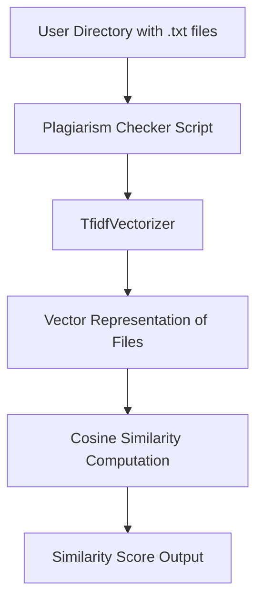
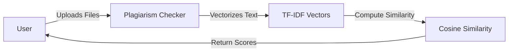
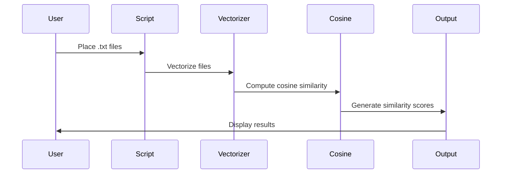

# 📝 Plagiarism Checker

[](https://www.python.org/)
[](https://github.com/alok-kumar8765/Cool_Project_2/tree/main/Plagarism_checker)
[](https://opensource.org/licenses/MIT)
[](https://github.com/alok-kumar8765/Cool_Project_2)

---

## 📖 Table of Contents
<details>
<summary>Click to expand</summary>

1. [Project Overview](#project-overview)  
2. [Features](#features)  
3. [Installation](#installation)  
4. [Usage](#usage)  
5. [Code Explanation](#code-explanation)  
6. [Architecture & Flow](#architecture--flow)  
    - [System Architecture](#system-architecture)  
    - [Data Flow Diagram (DFD)](#data-flow-diagram-dfd)  
    - [Workflow Diagram](#workflow-diagram)  
7. [Pros & Cons](#pros--cons)  
8. [Use Cases & Real-World Examples](#use-cases--real-world-examples)  
9. [License](#license)  

</details>

---

## 🏗 Project Overview
The **Plagiarism Checker** is a Python-based tool designed to detect similarities between `.txt` files using **TF-IDF vectorization** and **cosine similarity**. Ideal for educational institutions, content verification, or code/document plagiarism detection, it efficiently flags duplicate content.

**Key Highlights:**
- Lightweight, no database required.
- Fully Python-based; leverages `scikit-learn`.
- Supports bulk file comparison in a directory.
- Produces similarity scores for every document pair.

---

## ✨ Features
<details>
<summary>Click to expand</summary>

- Automatic detection of `.txt` files in the current working directory.
- TF-IDF vectorization of text content for semantic analysis.
- Cosine similarity calculation for accurate plagiarism detection.
- Displays results as `(File1, File2, Similarity_Score)`.
- Easily extensible for integration with larger systems.

</details>

---

## ⚙ Installation
<details>
<summary>Click to expand</summary>

```bash
# Clone the repository
git clone https://github.com/alok-kumar8765/Cool_Project_2.git

# Navigate to Plagarism_checker folder
cd Cool_Project_2/Plagarism_checker

# Install dependencies
pip install -U scikit-learn
````

</details>

---

## 🚀 Usage

<details>
<summary>Click to expand</summary>

1. Place all `.txt` files that need plagiarism checking in the same directory as the script.
2. Run the script:

```bash
python plagiarism_checker.py
```

3. Output will display document pairs with similarity scores:

```
('document1.txt', 'document2.txt', 0.87)
('document3.txt', 'document1.txt', 0.32)
```

---

## 🧩 Code Explanation

<details>
<summary>Click to expand</summary>

* **File Loading**: Automatically loads all `.txt` files in the directory.
* **Vectorization**: `TfidfVectorizer` converts text into numerical vectors representing word importance.
* **Similarity**: `cosine_similarity` computes similarity between document vectors.
* **Plagiarism Check**: Iterates over all file pairs, computes similarity, and stores results in a set.

**Core Functions:**

```python
def vectorize(Text):
    return TfidfVectorizer().fit_transform(Text).toarray()

def similarity(doc1, doc2):
    return cosine_similarity([doc1, doc2])
```

---

## 🏛 Architecture & Flow

### System Architecture

<details>
<summary>Click to expand</summary>



</details>

### Data Flow Diagram (DFD)

<details>
<summary>Click to expand</summary>



</details>

### Workflow Diagram

<details>
<summary>Click to expand</summary>



</details>

---

## ✅ Pros & Cons

<details>
<summary>Click to expand</summary>

**Pros:**

* Fast for small-medium datasets.
* No database required.
* Simple and modular.

**Cons:**

* Not suitable for very large datasets.
* Only supports `.txt` files currently.
* May miss paraphrased plagiarism (semantic-level detection limited).

</details>

---

## 🌍 Use Cases & Real-World Examples

<details>
<summary>Click to expand</summary>

**Use Cases:**

* Academic institutions: Check student submissions for copied content.
* Online content platforms: Ensure originality of articles/blogs.
* Code/Documentation plagiarism detection.
* Corporate compliance: Detect repeated reports or document reuse.

**Example:**

* A university instructor uploads 50 student essays; the script outputs pairs with similarity scores, allowing quick detection of potential plagiarism.

</details>

---

## 📄 License

<details>
<summary>Click to expand</summary>

This project is licensed under the **MIT License** - see the [LICENSE](https://opensource.org/licenses/MIT) file for details.

</details>


---
