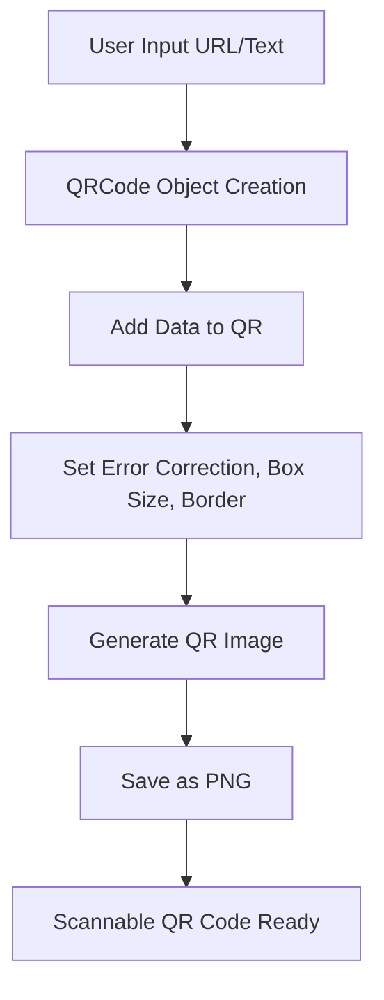
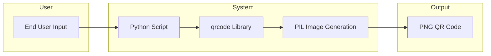

# QR Code Generator 📱✨

[](https://github.com/alok-kumar8765/Cool_Project_2)
[](https://github.com/alok-kumar8765/Cool_Project_2/blob/main/LICENSE)
[](https://www.python.org/)
[](https://github.com/alok-kumar8765/Cool_Project_2/issues)

---

## Table of Contents 📚

<details>
<summary>Click to expand</summary>

1. [Project Overview](#project-overview)
2. [Features](#features)
3. [Installation & Setup](#installation--setup)
4. [Usage](#usage)
5. [Code Explanation](#code-explanation)
6. [Architecture & Flow](#architecture--flow)
7. [Mermaid Diagrams](#mermaid-diagrams)
8. [Pros & Cons](#pros--cons)
9. [Real-World Use Cases](#real-world-use-cases)
10. [SEO & Best Practices](#seo--best-practices)
11. [License](#license)

</details>

---

## Project Overview 🔍

The **QR Code Generator** is a simple, lightweight Python project that generates QR codes for URLs. It allows customization of **size, color, error correction**, and **border**, making it suitable for personal or enterprise-level projects such as **marketing, inventory tracking, or digital payments**.

**Repository:** [Cool_Project_2/Qr_code_generator](https://github.com/alok-kumar8765/Cool_Project_2/tree/main/Qr_code_generator)

---

## Features ✨

<details>
<summary>Click to expand</summary>

- Generate QR codes from any URL.
- Customize **fill color** and **background color**.
- Set **box size** and **border width** for high-resolution output.
- Error correction levels (L, M, Q, H) for reliable scanning.
- Export QR codes as `.png` images.
- Lightweight and easy to integrate into web or desktop apps.

</details>

---

## Installation & Setup ⚙️

<details>
<summary>Click to expand</summary>

**Prerequisites:**

- Python >= 3.7
- pip package manager

**Installation Steps:**

```bash
# Clone the repository
git clone https://github.com/alok-kumar8765/Cool_Project_2.git
cd Cool_Project_2/Qr_code_generator

# Install dependencies
pip install qrcode[pil]
````

**Run the Script:**

```bash
python qr_generator.py
```

Output: `url_qrcode.png` will be generated in the same directory.

</details>

---

## Usage 🚀

<details>
<summary>Click to expand</summary>

**Example URL:** `https://www.google.com/`

```python
import qrcode

input_URL = "https://www.google.com/"

qr = qrcode.QRCode(
    version=1,
    error_correction=qrcode.constants.ERROR_CORRECT_L,
    box_size=15,
    border=4,
)

qr.add_data(input_URL)
qr.make(fit=True)

img = qr.make_image(fill_color="red", back_color="white")
img.save("url_qrcode.png")

print(qr.data_list)
```

* Opens the URL `https://www.google.com/` in QR form.
* The QR code has a **red foreground** and **white background**.
* **Box size = 15** for higher resolution.

</details>

---

## Code Explanation 📝

<details>
<summary>Click to expand</summary>

* **QRCode()**: Initializes the QR code object with version, error correction, box size, and border.
* **add_data()**: Adds the URL or text to be encoded.
* **make(fit=True)**: Adjusts QR code size dynamically to fit the data.
* **make_image()**: Generates a PIL image of the QR code.
* **save()**: Saves the QR code as a `.png` file.
* **data_list**: Prints the raw data stored in the QR code.

</details>

---

## Architecture & Flow 🏗️

<details>
<summary>Click to expand</summary>

**1. Input**: User provides a URL or text.
**2. QR Generation**: Python `qrcode` library processes the input.
**3. Customization**: Set colors, box size, border, and error correction.
**4. Image Output**: QR code saved as `.png`.
**5. Usage**: QR code can be scanned by any standard QR reader.

</details>

---

## Mermaid Diagrams 🪄

<details>
<summary>Click to expand</summary>

**System Flow Diagram:**



**High-Level Architecture:**



</details>

---

## Pros & Cons ⚖️

<details>
<summary>Click to expand</summary>

**Pros ✅:**

* Lightweight and easy to use.
* Customizable colors and sizes.
* High compatibility with scanners.
* Pure Python solution; no heavy dependencies.
* Can be integrated into web apps, e-commerce, or payment systems.

**Cons ❌:**

* Limited to static QR codes (no dynamic URLs by default).
* Requires Python environment.
* No built-in analytics for scanning metrics.

</details>

---

## Real-World Use Cases 🌐

<details>
<summary>Click to expand</summary>

* **Marketing Campaigns:** QR codes on posters, flyers, or social media for instant link access.
* **Event Management:** Tickets and passes as QR codes for scanning.
* **Digital Payments:** Simplifying transactions (e.g., UPI, PayPal).
* **Inventory Management:** Track products in warehouses.
* **Contact Sharing:** vCard QR codes for quick contact import.

**Example:**

A company prints QR codes linking to their website on business cards; scanning opens the homepage instantly.

</details>

---

## SEO & Best Practices 📈

<details>
<summary>Click to expand</summary>

* Use **relevant keywords** in README: QR code generator, Python QR code, QR code PNG, dynamic URL QR code.
* Include **image previews** of generated QR codes.
* Add **badges** for GitHub metrics to improve credibility.
* Use **structured headings** and collapsible sections for better readability.
* Provide **mermaid diagrams** to visualize flow and architecture.

</details>

---

## License 🛡️

<details>
<summary>Click to expand</summary>

This project is licensed under the **MIT License**.
See [LICENSE](https://github.com/alok-kumar8765/Cool_Project_2/blob/main/LICENSE) for more details.

</details>

---

**Repository Link:** [Cool_Project_2](https://github.com/alok-kumar8765/Cool_Project_2)
**Author:** Alok Kumar

---

⭐ If you find this project useful, give it a star on GitHub!


---

