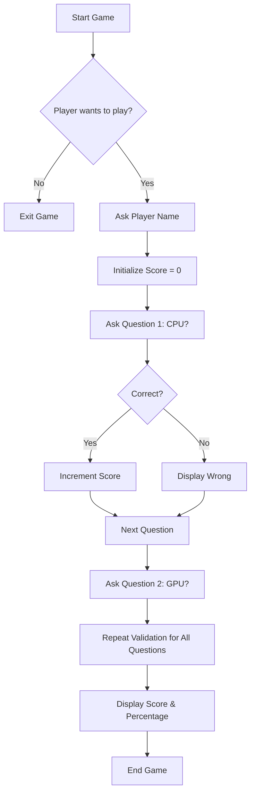
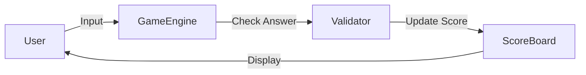

# 🎮 Cool Quiz Game


**Repository:** [Cool_Project_2 – Quiz Games](https://github.com/alok-kumar8765/Cool_Project_2/tree/main/Quiz%20Games)

---

## 📖 Table of Contents

<details>
<summary>Click to Expand</summary>

1. [Project Overview](#project-overview)
2. [Features](#features)
3. [Installation & Setup](#installation--setup)
4. [Usage](#usage)
5. [Code Explanation](#code-explanation)
6. [Architecture & Flow](#architecture--flow)
7. [Pros & Cons](#pros--cons)
8. [Use Cases & Real World Applications](#use-cases--real-world-applications)
9. [License](#license)

</details>

---

## 📌 Project Overview

<details>
<summary>Click to Expand</summary>

**Cool Quiz Game** is a Python-based interactive quiz game designed for beginners and casual users. The game asks multiple-choice and open-ended questions about computer hardware and basic technology knowledge. It tracks the score and provides instant feedback for each answer.

**Purpose:**

* Learn Python basics with a real-world mini-project.
* Interactive fun educational tool for IT/CS students.
* Demonstrates input handling, conditional statements, and scoring logic.

</details>

---

## ✨ Features

<details>
<summary>Click to Expand</summary>

* Interactive CLI (Command Line Interface) game.
* Validates answers case-insensitively.
* Tracks score and calculates percentage.
* User-friendly prompts and real-time feedback.
* Easy to extend with more questions.

</details>

---

## ⚙️ Installation & Setup

<details>
<summary>Click to Expand</summary>

1. **Clone the Repository**

```bash
git clone https://github.com/alok-kumar8765/Cool_Project_2.git
cd Cool_Project_2/Quiz\ Games
```

2. **Ensure Python 3.x is installed**

```bash
python --version
```

3. **Run the Game**

```bash
python quiz_game.py
```

</details>

---

## 🕹 Usage

<details>
<summary>Click to Expand</summary>

* Launch the game via terminal or command prompt.
* Answer `yes` to start or `no` to quit.
* Enter your name when prompted.
* Answer the five questions provided.
* View your final score and percentage.

**Example:**

```
Welcome To My Quiz Game
Do you want to play the game?
> yes
Enter Your Name:
> Alice
Let's Start the Game :)
What is CPU stands for?
> Central Processing Unit
Correct
...
You got the 4 correct answers
You got the 80.0 correct answers
```

</details>

---

## 🧩 Code Explanation

<details>
<summary>Click to Expand</summary>

**Step-by-step:**

* `print` → Display messages.
* `input` → Collects user responses.
* `if` → Validates answers and updates `score`.
* `score` → Tracks correct answers.
* `str.lower()` → Makes comparison case-insensitive.
* `final print` → Displays correct answers and percentage.

**Snippet:**

```python
score = 0
answer = input(' What is CPU stands for? \n ')
if answer.lower() == 'central processing unit':
    score += 1
```

</details>

---

## 🏗 Architecture & Flow

<details>
<summary>Click to Expand</summary>

### System Flow (Mermaid Diagram)



### Data Flow Diagram



### Architecture

* **Input Layer:** Collects user responses.
* **Processing Layer:** Validates answers, calculates score.
* **Output Layer:** Displays feedback and final result.

</details>

---

## ✅ Pros & Cons

<details>
<summary>Click to Expand</summary>

**Pros:**

* Lightweight and easy to run.
* Beginner-friendly Python project.
* Easily extendable for more questions.
* Provides instant feedback.

**Cons:**

* CLI-based, no GUI.
* Limited question set by default.
* Not scalable for multiplayer or web deployment.

</details>

---

## 🌐 Use Cases & Real World Applications

<details>
<summary>Click to Expand</summary>

**Use Cases:**

* Educational tool for tech beginners.
* Pre-interview practice quiz for students.
* Fun, interactive learning in classrooms or workshops.

**Example:**

* A CS teacher can run the quiz to teach hardware basics.
* Students can practice online or locally by modifying the Python script.
* Could be expanded into a web-based quiz platform using Flask/Django.

</details>

---

## 📄 License

<details>
<summary>Click to Expand</summary>

This project is licensed under the **MIT License**.
See [LICENSE](https://github.com/alok-kumar8765/Cool_Project_2/blob/main/LICENSE) for details.

</details>

---

