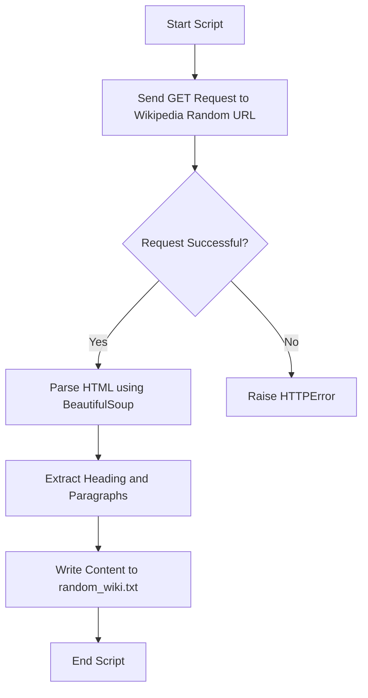
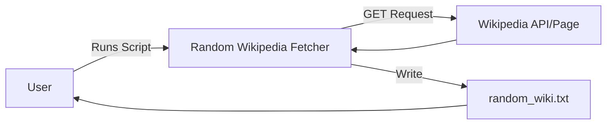
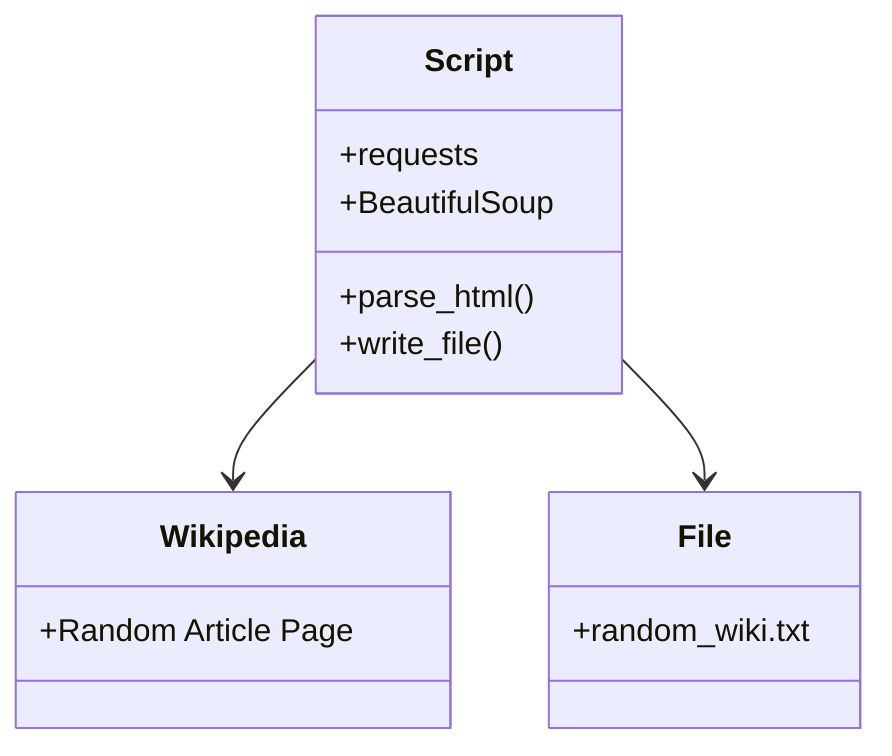

# 📰 Random Wikipedia Article Fetcher

[](https://github.com/alok-kumar8765/Cool_Project_2) 
[](https://github.com/alok-kumar8765/Cool_Project_2) 
[](https://github.com/alok-kumar8765/Cool_Project_2)
[](https://www.python.org/downloads/)

## 📖 Table of Contents
<details>
<summary>Click to Expand</summary>

1. [Project Overview](#project-overview)  
2. [Features](#features)  
3. [Installation](#installation)  
4. [Usage](#usage)  
5. [Code Explanation](#code-explanation)  
6. [Architecture & Flow Diagrams](#architecture--flow-diagrams)  
7. [Pros & Cons](#pros--cons)  
8. [Use Cases & Real-World Examples](#use-cases--real-world-examples)  
9. [Contributing](#contributing)  
10. [License](#license)  

</details>

---

## 📝 Project Overview
<details>
<summary>Click to Expand</summary>

This Python project fetches a **random Wikipedia article** and saves its content locally into a text file. It leverages the **`requests`** library for HTTP requests and **`BeautifulSoup`** for HTML parsing.  

**Objective:** Quickly grab random educational content from Wikipedia for offline reading, text processing, or NLP applications.

**Repo Link:** [Cool_Project_2/Random_Wikipedia_Article](https://github.com/alok-kumar8765/Cool_Project_2/tree/main/Random_Wikipedia_Article)

</details>

---

## ⚡ Features
<details>
<summary>Click to Expand</summary>

- Fetches **random Wikipedia articles** dynamically.  
- Saves the **heading and all paragraphs** into a text file (`random_wiki.txt`).  
- Encodes the text in **UTF-8** to preserve special characters.  
- **Minimal dependencies:** Only `requests` and `BeautifulSoup4`.  
- Easy to **extend** for NLP, summarization, or educational projects.  

</details>

---

## 🛠 Installation
<details>
<summary>Click to Expand</summary>

1. **Clone the repository**:
```bash
git clone https://github.com/alok-kumar8765/Cool_Project_2.git
cd Cool_Project_2/Random_Wikipedia_Article
````

2. **Install dependencies**:

```bash
pip install requests beautifulsoup4
```

3. **Run the script**:

```bash
python random_wiki_fetcher.py
```

4. **Output**: `random_wiki.txt` will be created in the same directory.

</details>

---

## 🚀 Usage

<details>
<summary>Click to Expand</summary>

```python
from bs4 import BeautifulSoup
import requests

res = requests.get("https://en.wikipedia.org/wiki/Special:Random")
res.raise_for_status()

wiki = BeautifulSoup(res.text, "html.parser")
r = open("random_wiki.txt", "w+", encoding='utf-8')

heading = wiki.find("h1").text
r.write(heading + "\n")

for i in wiki.select("p"):
    r.write(i.getText())

r.close()
print("File Saved as random_wiki.txt")
```

**Output Example:**

```
Title of Random Article
Paragraph 1 text...
Paragraph 2 text...
...
```

</details>

---

## 🧩 Code Explanation

<details>
<summary>Click to Expand</summary>

* **`requests.get`** → Fetches HTML content from Wikipedia.
* **`res.raise_for_status()`** → Ensures request success, raises error if failed.
* **`BeautifulSoup(res.text, "html.parser")`** → Parses HTML content.
* **`wiki.find("h1").text`** → Extracts the article title.
* **`wiki.select("p")`** → Extracts all paragraphs.
* **`open(..., "w+", encoding="utf-8")`** → Writes text to file, supports special characters.

</details>

---

## 🏗 Architecture & Flow Diagrams

<details>
<summary>Click to Expand</summary>

### 1️⃣ High-Level Architecture



### 2️⃣ Data Flow Diagram (DFD)



### 3️⃣ Component Diagram



</details>

---

## ✅ Pros & Cons

<details>
<summary>Click to Expand</summary>

**Pros:**

* Extremely simple and lightweight.
* Offline access to Wikipedia content.
* Useful for **data scraping**, **learning**, and **content analysis**.
* Minimal dependencies.

**Cons:**

* Only grabs plain text, not images or tables.
* Dependent on Wikipedia’s HTML structure (may break if website updates).
* No built-in error handling for empty paragraphs or redirects.

</details>

---

## 🌎 Use Cases & Real-World Examples

<details>
<summary>Click to Expand</summary>

* **Educational Apps:** Auto-generate random article quizzes.
* **NLP Projects:** Use fetched text for summarization or sentiment analysis.
* **Offline Reading:** Export Wikipedia articles for offline access.
* **Research Automation:** Quickly collect sample content for text mining.

**Example:**
A data scientist building an **AI summarization model** can run this script to fetch 100 random articles, then preprocess them for training.

</details>

---

## 🤝 Contributing

<details>
<summary>Click to Expand</summary>

1. Fork the repository
2. Create a feature branch (`git checkout -b feature/your-feature`)
3. Commit your changes (`git commit -m 'Add new feature'`)
4. Push to the branch (`git push origin feature/your-feature`)
5. Open a Pull Request

</details>

---

## 📄 License

<details>
<summary>Click to Expand</summary>

This project is licensed under the MIT License - see the [LICENSE](https://github.com/alok-kumar8765/Cool_Project_2/blob/main/LICENSE) file for details.

</details>


---

