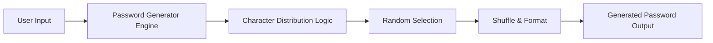
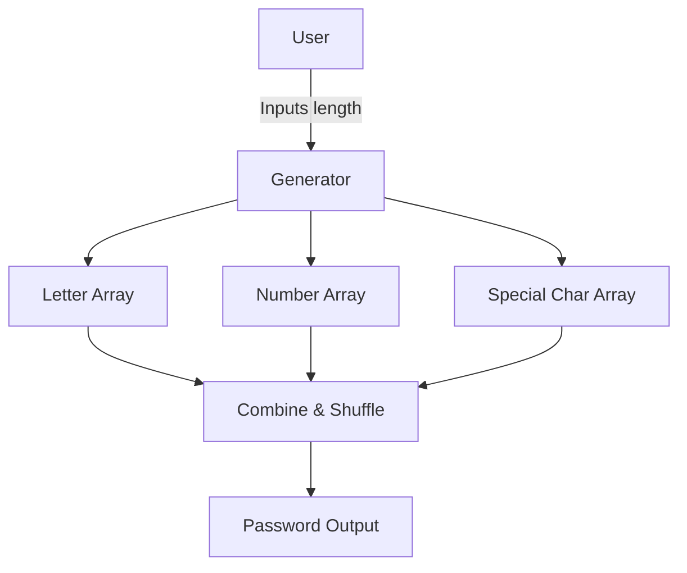
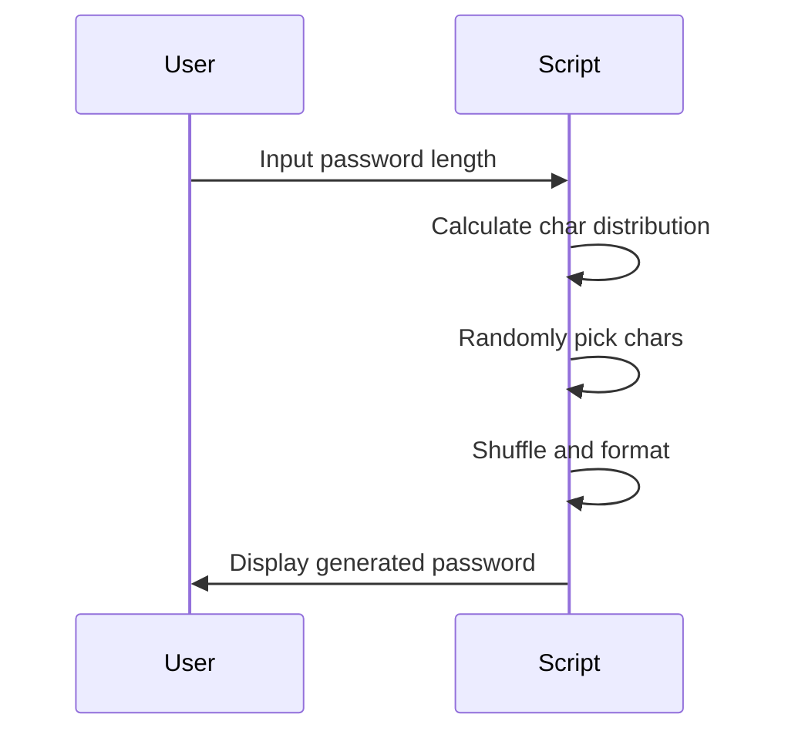

# 🔐 Random Password Generator

[](https://github.com/alok-kumar8765/Cool_Project_2) 
[](https://github.com/alok-kumar8765/Cool_Project_2/issues) 
[](https://github.com/alok-kumar8765/Cool_Project_2) 
[](https://www.python.org/downloads/) 

---

## Table of Contents
<details>
<summary>Click to expand</summary>

1. [Project Description](#project-description)  
2. [Features](#features)  
3. [Installation](#installation)  
4. [Usage](#usage)  
5. [Code Explanation](#code-explanation)  
    - [Code 1](#code-1-python-password-generatorpy)  
    - [Code 2](#code-2-random_password_genpy)  
6. [Architecture & Diagrams](#architecture--diagrams)  
7. [Pros & Cons](#pros--cons)  
8. [Real-World Use Cases](#real-world-use-cases)  
9. [License](#license)  

</details>

---

## Project Description
<details>
<summary>Click to expand</summary>

This project provides **secure, random password generation** using Python. It includes two approaches:

- **Simple Random Password Generation**  
- **Customizable Password Generation with Alpha-Numeric-Special ratio**

The project ensures **strong password creation** suitable for **personal, enterprise, and web applications**.

</details>

---

## Features
<details>
<summary>Click to expand</summary>

- Generates random passwords of configurable length  
- Supports letters, numbers, and special characters  
- Customizable alpha-numeric-special distribution  
- Shuffles characters for better security  
- Easy to use Python scripts  
- Cross-platform compatibility  

</details>

---

## Installation
<details>
<summary>Click to expand</summary>

1. Clone the repository:
```bash
git clone https://github.com/alok-kumar8765/Cool_Project_2.git
````

2. Navigate to the project folder:

```bash
cd Cool_Project_2/Random_password_generator
```

3. Install Python (if not already installed):

```bash
https://www.python.org/downloads/
```

4. Run scripts directly using Python:

```bash
python python-password-generator.py
python random_password_gen.py
```

</details>

---

## Usage

<details>
<summary>Click to expand</summary>

### Code 1: Simple Random Password

* Generates a **16-character password** including letters, digits, and symbols.

```bash
python python-password-generator.py
```

### Code 2: Customizable Random Password

* User inputs **desired password length**
* Generates password using **50% letters, 30% numbers, 20% special characters**

```bash
python random_password_gen.py
```

</details>

---

## Code Explanation

<details>
<summary>Click to expand</summary>

### Code 1: `python-password-generator.py`

* **Imports:** `random` & `string` for character selection
* **Process:**

  * Concatenates letters, digits, symbols
  * Uses `random.sample` to pick `16` characters
  * Prints secure password

**Pros:** Simple, fast, secure
**Cons:** Fixed length, no user input

---

### Code 2: `random_password_gen.py`

* **Imports:** `random`, `math` for calculations
* **Process:**

  * User inputs password length
  * Distributes characters: 50% letters, 30% numbers, 20% special
  * Randomly chooses uppercase/lowercase letters
  * Shuffles final password for added security
  * Converts list to string and prints

**Pros:** User-defined length, configurable ratios, shuffled password
**Cons:** Slightly complex

</details>

---

## Architecture & Diagrams

<details>
<summary>Click to expand</summary>

### System Architecture



### Data Flow Diagram (DFD Level 0)



### Process Flow



</details>

---

## Pros & Cons

<details>
<summary>Click to expand</summary>

**Pros**

* Easy-to-use scripts
* Generates strong, unpredictable passwords
* Supports user customization
* Cross-platform compatible

**Cons**

* Code 1 has fixed length
* Code 2 slightly longer execution for large lengths
* No direct GUI interface

</details>

---

## Real-World Use Cases

<details>
<summary>Click to expand</summary>

* **Website account creation**: Ensures strong passwords
* **Enterprise security**: For temporary passwords or API keys
* **IoT devices**: Random passwords for device authentication
* **Password managers**: Can be integrated for auto-generated passwords

**Example:**

```python
# Generate 20-character password for secure database
Enter Password Length: 20
Generated Password: jK3@f9Z&hL1#pQ8rS2!
```

</details>

---

## License

<details>
<summary>Click to expand</summary>

This project is licensed under the **MIT License**.
See [LICENSE](https://github.com/alok-kumar8765/Cool_Project_2/blob/main/LICENSE) for details.

</details>


---

