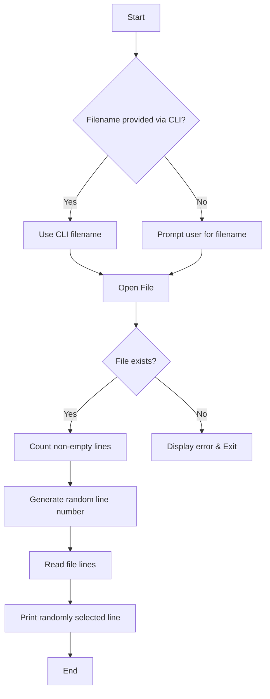

# 📄 Random Word From List

[](https://github.com/alok-kumar8765/Cool_Project_2)
[](https://github.com/alok-kumar8765/Cool_Project_2)
[](https://github.com/alok-kumar8765/Cool_Project_2/issues)
[](https://github.com/alok-kumar8765/Cool_Project_2/blob/main/LICENSE)

---

## 📌 Table of Contents
<details>
<summary>Click to expand</summary>

1. [Project Overview](#project-overview)  
2. [Features](#features)  
3. [Installation](#installation)  
4. [Usage](#usage)  
5. [Code Explanation](#code-explanation)  
6. [Architecture & Flow](#architecture--flow)  
7. [Pros and Cons](#pros-and-cons)  
8. [Use Cases & Real World Applications](#use-cases--real-world-applications)  
9. [Contributing](#contributing)  
10. [License](#license)  

</details>

---

## 📖 Project Overview
<details>
<summary>Click to expand</summary>

**Random Word From List** is a lightweight Python utility that reads a user-specified text file and returns a random line (word/phrase) from it. This tool is ideal for applications requiring random selections, such as quizzes, word games, or automated testing scenarios.

**Key Highlights:**
- Reads any text file dynamically.
- Handles file errors gracefully.
- Picks a truly random line efficiently.
- Minimalistic and fast Python implementation.

</details>

---

## ⚡ Features
<details>
<summary>Click to expand</summary>

- ✅ **Command-Line & Interactive Input:** Accepts filename either via CLI or user prompt.  
- ✅ **Random Selection:** Selects a line randomly using Python’s `random` module.  
- ✅ **Error Handling:** Gracefully handles `FileNotFoundError` or `IOError`.  
- ✅ **Lightweight & Fast:** Reads file line by line without loading entire content in memory.  

</details>

---

## 🛠 Installation
<details>
<summary>Click to expand</summary>

**Prerequisites:**
- Python 3.6+ installed
- Basic familiarity with command-line operations

**Steps:**
```bash
# Clone the repository
git clone https://github.com/alok-kumar8765/Cool_Project_2.git

# Navigate to the project folder
cd Cool_Project_2/Random_word_from_list

# Run the script
python random_word.py <filename>
````

</details>

---

## 🚀 Usage

<details>
<summary>Click to expand</summary>

**Example 1: Command Line**

```bash
python random_word.py words.txt
```

**Example 2: Interactive Input**

```bash
python random_word.py
What is the name of the file? (extension included): words.txt
```

**Output:**
Displays a randomly selected line from `words.txt`.

</details>

---

## 🧩 Code Explanation

<details>
<summary>Click to expand</summary>

1. **Import modules**: `sys` for CLI args, `random` for random selection.
2. **File Input Handling**:

   * Accept filename via CLI if provided.
   * Otherwise, prompt user for input.
3. **Error Handling**: Wrap file open operation in `try-except` to catch missing or inaccessible files.
4. **Count Lines**: Efficiently count non-empty lines.
5. **Generate Random Line Number**: Use `random.randint()` within the total line count.
6. **Retrieve Random Line**: Iterate through file and print line matching random index.

**Snippet Highlight:**

```python
num_lines = sum(1 for line in file if line.rstrip())
random_line = random.randint(0, num_lines)
file.seek(0)
for i, line in enumerate(file):
    if i == random_line:
        print(line.rstrip())
        break
```

</details>

---

## 🏗 Architecture & Flow

<details>
<summary>Click to expand</summary>

### 1️⃣ Flow Diagram



### 2️⃣ High-Level Architecture


</details>

---

## ⚖️ Pros and Cons

<details>
<summary>Click to expand</summary>

**Pros:**

* ✅ Extremely lightweight and fast.
* ✅ Easy to integrate into larger Python projects.
* ✅ Handles exceptions gracefully.
* ✅ Works with any text file format.

**Cons:**

* ❌ Limited to line-based random selection.
* ❌ Not optimized for extremely large files (>1M lines).
* ❌ No GUI interface; strictly CLI-based.

</details>

---

## 🌎 Use Cases & Real-World Applications

<details>
<summary>Click to expand</summary>

* **Educational Tools:** Random vocabulary or quiz word generator.
* **Gaming:** Randomly pick challenges, trivia, or items from a list.
* **Testing & QA:** Generate random test inputs from predefined datasets.
* **Creative Writing:** Pick random prompts for writers or brainstorming.

**Example:**

```bash
python random_word.py motivational_quotes.txt
```

> Output: "The only limit to our realization of tomorrow is our doubts of today."

</details>

---

## 🤝 Contributing

<details>
<summary>Click to expand</summary>

Contributions are welcome!

1. Fork the repository
2. Create a feature branch (`git checkout -b feature-name`)
3. Commit your changes (`git commit -m 'Add feature'`)
4. Push to the branch (`git push origin feature-name`)
5. Open a Pull Request

</details>

---

## 📄 License

<details>
<summary>Click to expand</summary>

This project is licensed under the **MIT License**.
See [LICENSE](https://github.com/alok-kumar8765/Cool_Project_2/blob/main/LICENSE) for details.

</details>


---

