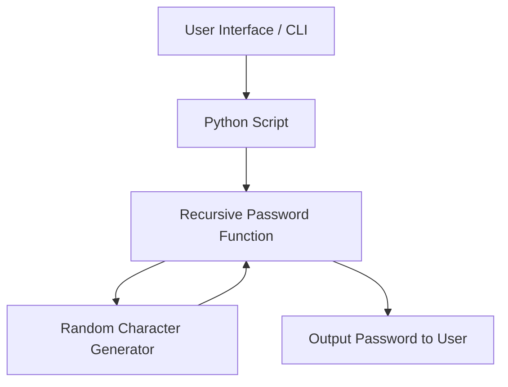
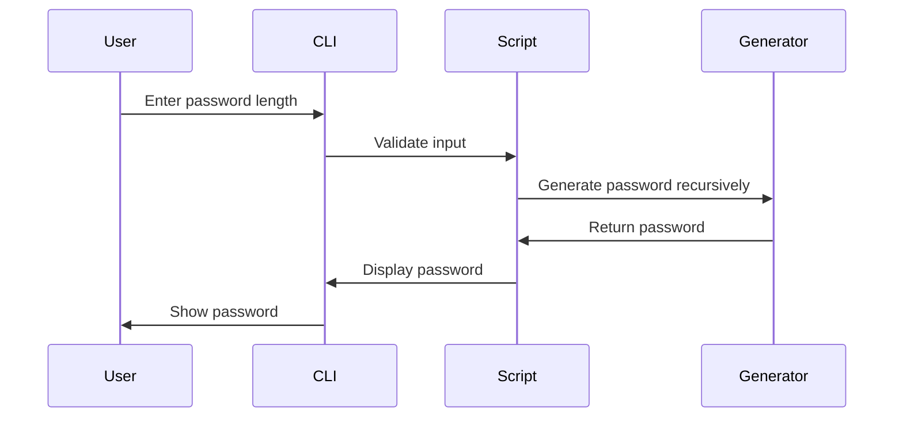

# 🔐 Recursive Password Generator


## 📖 Table of Contents
<details>
<summary>Click to Expand</summary>

1. [Description](#description)  
2. [Features](#features)  
3. [Installation](#installation)  
4. [Usage](#usage)  
5. [Code Explanation](#code-explanation)  
6. [Architecture & Flow](#architecture--flow)  
    - [DFD](#data-flow-diagram)  
    - [System Architecture](#system-architecture)  
    - [Flow Diagram](#flow-diagram)  
7. [Pros & Cons](#pros--cons)  
8. [Use Cases & Real-World Applications](#use-cases--real-world-applications)  
9. [Contributing](#contributing)  
10. [License](#license)  

</details>

---

## 🔹 Description
The **Recursive Password Generator** is a Python-based tool that generates strong, random passwords using a **recursive algorithm**. It supports **customizable password lengths** and includes all printable ASCII characters for maximum entropy.  

This tool is ideal for developers, system administrators, and security-conscious users who need secure passwords for applications, databases, or accounts.

---

## 🔹 Features
<details>
<summary>Click to Expand</summary>

- Recursive algorithm for dynamic password generation  
- Supports **custom password length** input  
- Uses all **printable ASCII characters** for high entropy  
- Input validation for integer values  
- Easy exit mechanism (`e`)  

</details>

---

## 🔹 Installation
<details>
<summary>Click to Expand</summary>

```bash
# Clone the repository
git clone https://github.com/alok-kumar8765/Cool_Project_2.git

# Navigate to project folder
cd Cool_Project_2/Recursive_password_generator

# Ensure Python 3.x is installed
python3 --version

# Run the generator
python3 recursive_password_generator.py
````

</details>

---

## 🔹 Usage

<details>
<summary>Click to Expand</summary>

1. Run the script:

   ```bash
   python3 recursive_password_generator.py
   ```
2. Enter the desired password length (integer).
3. To exit, type `e`.
4. The generator will return a password with the requested length.

Example:

```
[?] Enter a length for your password (e for exit): 12
'G!8v@R^kZ1p$'
```

</details>

---

## 🔹 Code Explanation

<details>
<summary>Click to Expand</summary>

* **`stretch(text, maxlength)`**
  Recursively appends random characters to `text` until `maxlength` is reached.

* **`get_random_char()`**
  Returns a single random character from Python’s `string.printable` (letters, digits, symbols, whitespace).

* **Main Loop**
  Continuously asks the user for password length until the user exits.
  Handles non-integer inputs gracefully.

</details>

---

## 🔹 Architecture & Flow

### Data Flow Diagram

<details>
<summary>Click to Expand</summary>

```mermaid
flowchart TD
    A[User Input: Password Length] --> B{Is input 'e'?}
    B -- Yes --> C[Exit Program]
    B -- No --> D{Is input valid integer?}
    D -- No --> E[Show Error Message]
    D -- Yes --> F[Call stretch('', maxlength)]
    F --> G[Recursively Add Random Characters]
    G --> H[Password Generated]
    H --> A
```

</details>

### System Architecture

<details>
<summary>Click to Expand</summary>



</details>

### Flow Diagram

<details>
<summary>Click to Expand</summary>



</details>

---

## 🔹 Pros & Cons

<details>
<summary>Click to Expand</summary>

**Pros:**

* Simple, lightweight Python implementation
* Recursion ensures elegant, readable code
* Full ASCII support for strong, unpredictable passwords
* Real-time user input validation

**Cons:**

* Recursive approach may hit maximum recursion depth for extremely long passwords (>1000 chars)
* CLI-only interface, no GUI

</details>

---

## 🔹 Use Cases & Real-World Applications

<details>
<summary>Click to Expand</summary>

* **System Administrators:** Generate strong passwords for servers, databases, and user accounts.
* **Web Developers:** Auto-generate user passwords during account creation.
* **Security Tools:** Integration with password managers or security scripts.
* **Real-World Example:**
  A company automates password generation for 50 new employees. Using this script, each employee receives a **unique 12-character random password** at account creation.

</details>

---

## 🔹 Contributing

<details>
<summary>Click to Expand</summary>

1. Fork the repository
2. Create a branch: `git checkout -b feature-name`
3. Make your changes
4. Commit your changes: `git commit -m 'Add new feature'`
5. Push to the branch: `git push origin feature-name`
6. Open a Pull Request

</details>

---

## 🔹 License

<details>
<summary>Click to Expand</summary>

This project is licensed under the MIT License.
See the [LICENSE](https://github.com/alok-kumar8765/Cool_Project_2/blob/main/LICENSE) file for details.

</details>

---

**🔗 Repository:** [Recursive Password Generator](https://github.com/alok-kumar8765/Cool_Project_2/tree/main/Recursive_password_generator)
**🌟 Author:** Alok Kumar
**📅 Last Updated:** 2026-01-12


---

