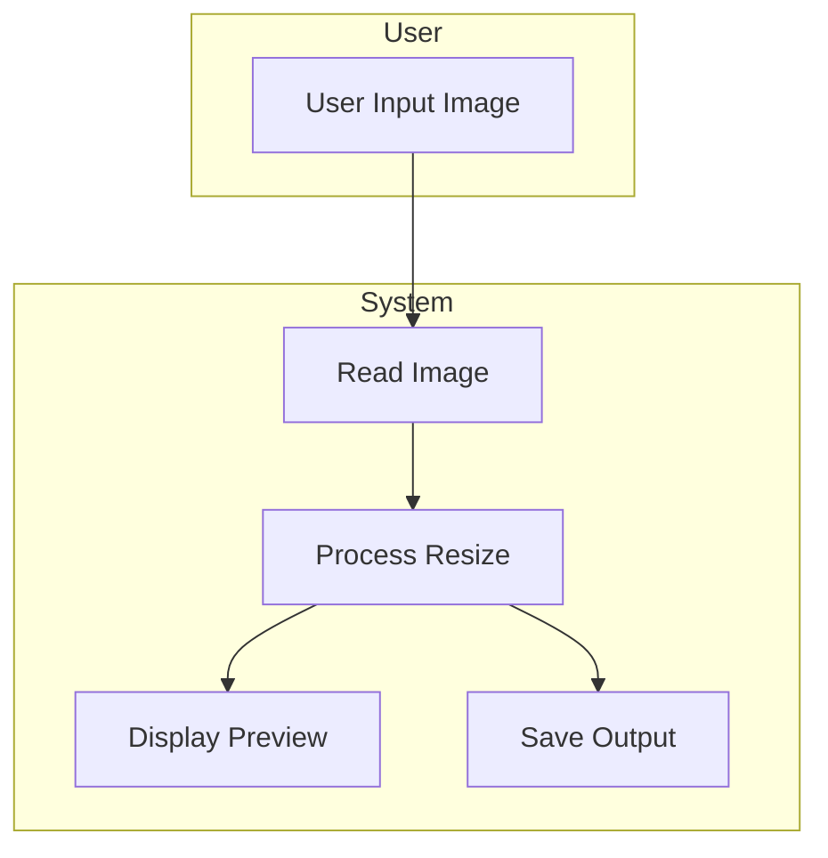
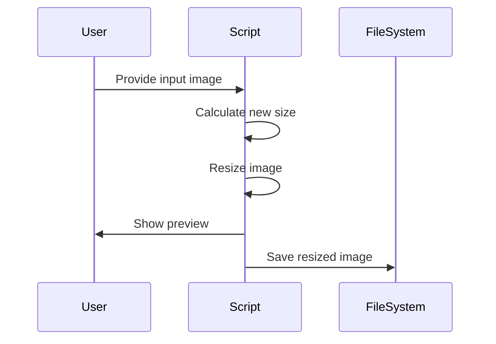

#  Reduce Image File Size using OpenCV

[](https://github.com/alok-kumar8765/Cool_Project_2/tree/main/Reduce_image_file_size)  
[](https://www.python.org/)  
[](https://opencv.org/)  
[](https://github.com/alok-kumar8765/Cool_Project_2/blob/main/LICENSE)

---

## Table of Contents
<details>
<summary>Click to expand</summary>

1. [Project Overview](#project-overview)  
2. [Features](#features)  
3. [Installation](#installation)  
4. [Usage](#usage)  
5. [Code Explanation](#code-explanation)  
6. [Flow & Architecture Diagrams](#flow--architecture-diagrams)  
7. [Pros & Cons](#pros--cons)  
8. [Real-world Use Cases](#real-world-use-cases)  
9. [SEO Optimized Description](#seo-optimized-description)  
10. [License](#license)  

</details>

---

## Project Overview
<details>
<summary>Click to expand</summary>

This project demonstrates **reducing image file size** using **OpenCV** in Python by resizing images to a smaller scale while maintaining quality. It is optimized for desktop applications and small-scale automation scripts where storage and bandwidth efficiency are required.

**Key Highlights:**
- Simple and lightweight Python code.
- Supports any image format readable by OpenCV.
- Adjustable resizing ratio.
- Generates new resized images for storage or web optimization.

</details>

---

## Features
<details>
<summary>Click to expand</summary>

- Resize images dynamically using a scaling factor.  
- Preserve aspect ratio automatically.  
- Preview resized images before saving.  
- Output image saved locally with `imwrite()`.  
- Minimal dependencies (only OpenCV).  

</details>

---

## Installation
<details>
<summary>Click to expand</summary>

**Prerequisites:**  
- Python >= 3.9  
- OpenCV (`cv2` module)

**Install OpenCV:**
```bash
pip install opencv-python
````

**Clone the repository:**

```bash
git clone https://github.com/alok-kumar8765/Cool_Project_2.git
cd Cool_Project_2/Reduce_image_file_size
```

</details>

---

## Usage

<details>
<summary>Click to expand</summary>

1. Place the input image in the same folder and rename it to `input.jpg` or update the file path in the script.
2. Run the script:

```bash
python reduce_image_size.py
```

3. The resized image will appear in a new window briefly and saved as `resized_output_image.jpg`.

**Adjust the scale factor:**

```python
k = 5  # reduce size by factor of 5
```

</details>

---

## Code Explanation

<details>
<summary>Click to expand</summary>

```python
import cv2

# Load the input image
img = cv2.imread('input.jpg')
print(img.shape)

# Define resize factor
k = 5
width = int(img.shape[1]/k)
height = int(img.shape[0]/k)

# Resize image
scaled = cv2.resize(img, (width, height), interpolation=cv2.INTER_AREA)
print(scaled.shape)

# Display resized image
cv2.imshow("Output", scaled)
cv2.waitKey(500)
cv2.destroyAllWindows()

# Save the resized image
cv2.imwrite('resized_output_image.jpg', scaled)
```

**Explanation:**

* `cv2.imread()` → Reads input image.
* `img.shape` → Prints original image dimensions `(height, width, channels)`.
* Resize calculation → Maintain aspect ratio using scaling factor `k`.
* `cv2.resize()` → Resizes image with interpolation for quality.
* `cv2.imshow()` → Preview image in a window.
* `cv2.imwrite()` → Save resized image to disk.

</details>

---

## Flow & Architecture Diagrams

<details>
<summary>Click to expand</summary>

### Data Flow Diagram (DFD)

```mermaid
flowchart LR
A[Input Image] --> B[Read Image using OpenCV]
B --> C[Compute New Dimensions]
C --> D[Resize Image with cv2.resize()]
D --> E[Display Preview]
D --> F[Save Resized Image]
```

### Architecture Diagram



### Workflow



</details>

---

## Pros & Cons

<details>
<summary>Click to expand</summary>

**Pros:**

* Lightweight and fast.
* Easy to integrate into existing Python projects.
* Supports batch processing (can be extended).
* Reduces storage and bandwidth requirements.

**Cons:**

* Only downsizes; cannot enhance resolution.
* Limited to images supported by OpenCV.
* GUI display requires `waitKey` and `destroyAllWindows`, which may block automation scripts if not handled.

</details>

---

## Real-world Use Cases

<details>
<summary>Click to expand</summary>

* **Web Optimization:** Reduce image size for faster website loading.
* **Cloud Storage:** Save storage by resizing high-resolution images before upload.
* **Email Attachments:** Reduce image size for sending via email.
* **Data Processing:** Preprocess images for machine learning pipelines.

**Example:**
A photographer can batch resize RAW images before sharing them online or sending them to clients.

</details>

---

## SEO Optimized Description

<details>
<summary>Click to expand</summary>

This **Python OpenCV project** demonstrates **efficient image resizing** to **reduce file size** while preserving quality. The solution is ideal for **web developers, photographers, and data scientists** who need **optimized images** for faster load times, cloud storage savings, and better performance in image processing pipelines. The project is simple, lightweight, and easily customizable for **any image resolution or format** supported by OpenCV.

</details>

---

## License

<details>
<summary>Click to expand</summary>

This project is licensed under the **MIT License**. See the [LICENSE](https://github.com/alok-kumar8765/Cool_Project_2/blob/main/LICENSE) file for details.

</details>


---

