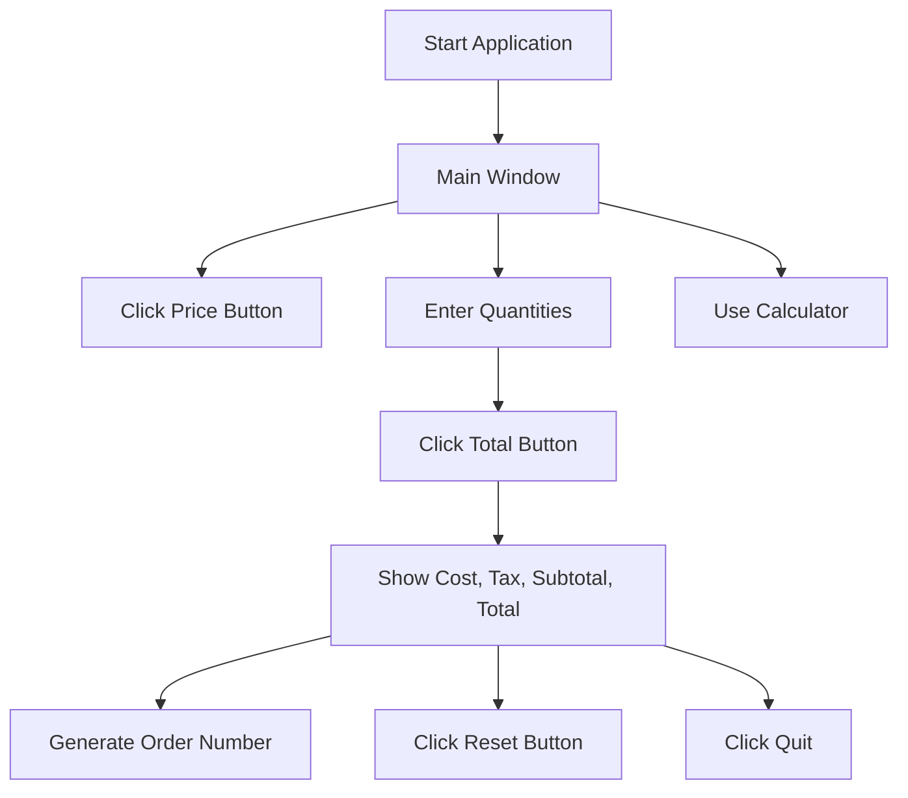

# 🍽️ Restaurant Management System - GUI Application


**Author:** [Alok Kumar](https://github.com/alok-kumar8765)  
**Repository:** [Cool_Project_2/Restaurant Management](https://github.com/alok-kumar8765/Cool_Project_2/tree/main/Restaurant%20Management)

---

## 📖 Table of Contents
<details>
<summary>Click to Expand</summary>

1. [Project Description](#-project-description)  
2. [Features](#-features)  
3. [System Architecture & Diagrams](#-system-architecture--diagrams)  
   - [DFD](#data-flow-diagram-dfd)  
   - [Architecture Diagram](#architecture-diagram)  
   - [Application Flow Diagram](#application-flow-diagram)  
4. [Installation & Setup](#-installation--setup)  
5. [Usage](#-usage)  
6. [Code Explanation](#-code-explanation)  
7. [Pros & Cons](#-pros--cons)  
8. [Real-World Use Cases](#-real-world-use-cases)  
9. [Future Enhancements](#-future-enhancements)

</details>

---

## 📝 Project Description
This project is a **Restaurant Management System** with a **Graphical User Interface (GUI)** built using **Python's Tkinter**. It allows users to:

- View menu prices
- Place food orders
- Calculate cost, service charges, taxes, subtotal, and total amount
- Generate random order numbers
- Use an integrated calculator for quick calculations

This system is ideal for **small restaurants, cafes, and canteens** to manage orders efficiently.

---

## ⚡ Features
<details>
<summary>Click to Expand</summary>

- **GUI-Based**: User-friendly interface using Tkinter
- **Menu & Price Display**: Separate window showing all item prices
- **Order Management**: Input quantities, calculate costs and taxes automatically
- **Random Order Number Generation**: Unique order IDs for each transaction
- **Integrated Calculator**: Supports basic arithmetic operations (`+`, `-`, `*`, `/`)
- **Reset & Clear Functions**: Easily clear fields or reset the order
- **Real-Time Clock Display**: Shows current system time
- **Responsive Layout**: Organized frames for items, cost summary, buttons, and calculator

</details>

---

## 🏗️ System Architecture & Diagrams

### Data Flow Diagram (DFD)
```mermaid
flowchart TD
    A[User] --> B[Enter Item Quantity]
    B --> C[Calculate Cost]
    C --> D[Calculate Service & Tax]
    D --> E[Generate Order Number]
    E --> F[Display Total & Summary]
    B --> G[Use Calculator]
    G --> F
````

### Architecture Diagram

```mermaid
flowchart LR
    UI[Tkinter GUI] --> Input[User Input]
    Input --> Calculation[Cost & Tax Computation]
    Calculation --> Output[Display Results]
    UI --> Calculator[Integrated Calculator Module]
```

### Application Flow Diagram



---

## 💻 Installation & Setup

<details>
<summary>Click to Expand</summary>

1. **Clone Repository**

```bash
git clone https://github.com/alok-kumar8765/Cool_Project_2.git
cd Cool_Project_2/Restaurant\ Management
```

2. **Install Dependencies**

```bash
pip install tk
```

3. **Run Application**

```bash
python restaurant_management.py
```

4. **Supported Platforms**

* Windows
* Linux
* macOS (with Python & Tkinter installed)

</details>

---

## 🖥️ Usage

<details>
<summary>Click to Expand</summary>

1. Launch the application.
2. Click **Price** to view menu prices.
3. Enter quantity for each food item.
4. Click **Total** to calculate:

   * Cost
   * Service Charge
   * Tax
   * Subtotal
   * Total
5. Generate **Order Number** automatically.
6. Use **Reset** to clear all entries.
7. Optional: Use the integrated **Calculator** for any quick calculation.
8. Click **Quit** to exit the program.

</details>

---

## 🔍 Code Explanation

<details>
<summary>Click to Expand</summary>

* **Tkinter GUI**: All windows, frames, labels, and buttons created using Tkinter.
* **Price Function**: Displays a separate window with a static price list.
* **Total Function**:

  * Retrieves user input quantities
  * Calculates individual item costs
  * Computes service charges and tax
  * Updates GUI labels dynamically
* **Reset & Clear Functions**: Clear input fields and output labels
* **Clock Function**: Updates system time every second
* **Calculator Module**:

  * Basic arithmetic operations (`+`, `-`, `*`, `/`)
  * Handles division by zero errors
  * Updates GUI label in real-time

</details>

---

## ✅ Pros & Cons

<details>
<summary>Click to Expand</summary>

**Pros**

* Simple and lightweight GUI
* Easy to understand and use
* Self-contained (no database required)
* Randomized order numbers reduce conflicts

**Cons**

* Hard-coded prices
* Not suitable for very large restaurants
* No persistent storage or database integration
* Limited error handling for invalid inputs

</details>

---

## 🌎 Real-World Use Cases

<details>
<summary>Click to Expand</summary>

* **Small Cafes & Restaurants**: Track orders and calculate bills quickly
* **School/College Canteens**: Generate bills for students
* **Event Management Catering**: Quick billing for temporary setups
* **POS (Point-of-Sale) Training**: Educational tool for teaching billing systems

**Example Scenario:**
A customer orders 2 Burgers, 1 Pizza, and 3 Drinks:

1. Enter quantities in the GUI
2. Click **Total**
3. System calculates cost, service tax, and total
4. Generates order number for tracking

</details>

---

## 🚀 Future Enhancements

<details>
<summary>Click to Expand</summary>

* Integrate **Database** for persistent order storage (SQLite/MySQL)
* Add **Dynamic Menu Management** (CRUD for menu items)
* Include **Receipt Printing**
* Enhance **Calculator** to support decimals and advanced operations
* Add **User Authentication** for multi-user support
* Convert GUI into **Web App** using Flask/Django for online access

</details>

---

**GitHub Repository:** [https://github.com/alok-kumar8765/Cool_Project_2/tree/main/Restaurant%20Management](https://github.com/alok-kumar8765/Cool_Project_2/tree/main/Restaurant%20Management)

---
---

