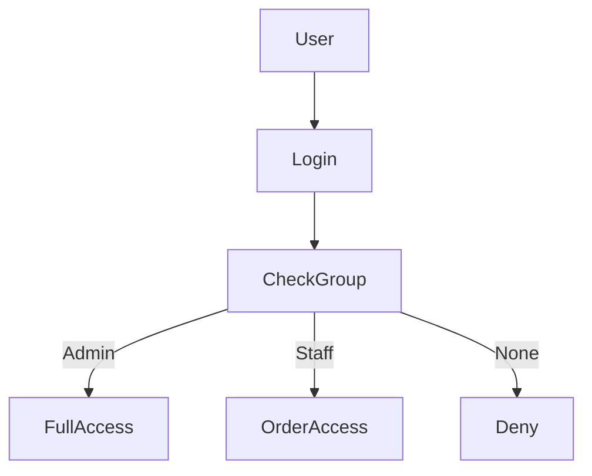

# ✅ Goal

| Role          | Permissions                                                      |
| ------------- | ---------------------------------------------------------------- |
| **Admin**     | Manage menu (CRUD), view all orders, download PDFs, manage users |
| **Staff**     | Create orders, view receipts, search orders                      |
| **Anonymous** | ❌ No access                                                      |

---

# 🧠 Best Practice (Django Way)

👉 **Use Django’s built-in:**

* `User`
* `Groups`
* `Permissions`
* Decorators / Mixins

❌ Don’t reinvent RBAC
❌ Don’t hardcode roles in views

---

# 1️⃣ Create Roles Using Django Groups

Run once:

```bash
python manage.py shell
```

```python
from django.contrib.auth.models import Group, Permission
from django.contrib.contenttypes.models import ContentType
from management.models import MenuItem, Order

# Create Groups
admin_group, _ = Group.objects.get_or_create(name='Admin')
staff_group, _ = Group.objects.get_or_create(name='Staff')

# Menu permissions
menu_ct = ContentType.objects.get_for_model(MenuItem)
order_ct = ContentType.objects.get_for_model(Order)

menu_perms = Permission.objects.filter(content_type=menu_ct)
order_perms = Permission.objects.filter(content_type=order_ct)

# Admin gets everything
admin_group.permissions.add(*menu_perms, *order_perms)

# Staff: only order permissions
staff_group.permissions.add(
    Permission.objects.get(codename='add_order'),
    Permission.objects.get(codename='view_order'),
)
```

✅ Done — roles exist in DB

---

# 2️⃣ Assign Role to Users (Admin Panel)

```bash
python manage.py createsuperuser
```

Go to:

```
/admin/
```

➡ Users → Select user → **Groups**

* Assign `Admin` or `Staff`

---

# 3️⃣ Protect Views (Function-Based Views)

### 🔐 Admin-Only View (Menu CRUD)

```python
from django.contrib.auth.decorators import login_required, permission_required

@login_required
@permission_required('management.add_menuitem', raise_exception=True)
def add_menu_item(request):
    ...
```

### 🔐 Staff + Admin (Create Order)

```python
@login_required
@permission_required('management.add_order', raise_exception=True)
def create_order(request):
    ...
```

### 🔐 View Orders

```python
@login_required
@permission_required('management.view_order', raise_exception=True)
def order_receipt(request, order_id):
    ...
```

---

# 4️⃣ Class-Based Views (Recommended)

```python
from django.contrib.auth.mixins import LoginRequiredMixin, PermissionRequiredMixin

class MenuListView(LoginRequiredMixin, PermissionRequiredMixin, ListView):
    model = MenuItem
    permission_required = 'management.view_menuitem'
```

---

# 5️⃣ Hide UI Buttons Based on Role (Templates)

### `base.html`

```html

    <a href="" class="btn btn-outline-light btn-sm">
        Manage Menu
    </a>

```

### Staff sees:

✔ Create Order
❌ Menu CRUD

---

# 6️⃣ Restrict URLs (Defense in Depth)

### `urls.py`

```python
from django.contrib.auth.decorators import permission_required

urlpatterns = [
    path(
        'menu/',
        permission_required('management.view_menuitem')(menu_crud),
        name='menu_crud'
    ),
]
```

---

# 7️⃣ Custom Role Check (Optional Helper)

```python
def is_admin(user):
    return user.groups.filter(name='Admin').exists()
```

Use in templates:

```html

```

(register as template filter)

---

# 8️⃣ Prevent Staff from Accessing Admin Panel

```python
# settings.py
LOGIN_URL = '/login/'
LOGIN_REDIRECT_URL = '/'
LOGOUT_REDIRECT_URL = '/login/'

# Optional
ADMIN_LOGIN_REQUIRED = True
```

---

# 9️⃣ Security Best Practices ✅

✔ Use Django permissions
✔ Never trust frontend only
✔ Always protect views + URLs
✔ Use HTTPS in production
✔ Rotate admin passwords

---

# 🔍 Role Flow Summary



---

# 🧪 Test Matrix

| Action       | Admin | Staff |
| ------------ | ----- | ----- |
| Menu CRUD    | ✅     | ❌     |
| Create Order | ✅     | ✅     |
| View Receipt | ✅     | ✅     |
| Manage Users | ✅     | ❌     |

---

