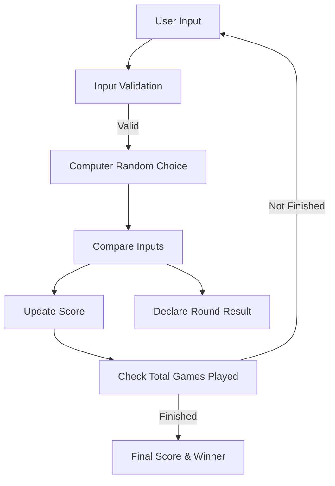
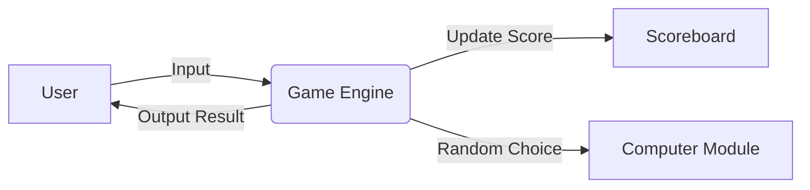
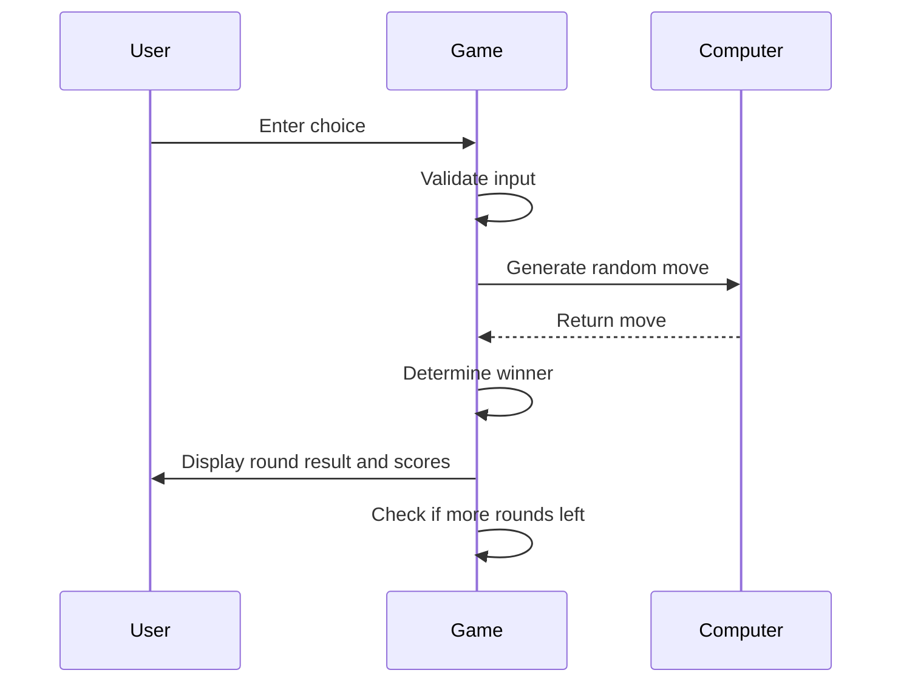

# 🎮 Rock Paper Scissors Game

[](https://github.com/alok-kumar8765/Cool_Project_2) 
[](https://github.com/alok-kumar8765/Cool_Project_2) 
[](https://github.com/alok-kumar8765/Cool_Project_2/issues) 
[](https://github.com/alok-kumar8765/Cool_Project_2/blob/main/LICENSE)

---

## 📌 Table of Contents
<details>
<summary>Click to expand</summary>

1. [Project Overview](#project-overview)  
2. [Features](#features)  
3. [Installation](#installation)  
4. [How It Works](#how-it-works)  
   - [Game Flow](#game-flow)  
   - [Input Handling](#input-handling)  
5. [Architecture & Diagrams](#architecture--diagrams)  
   - [DFD](#data-flow-diagram)  
   - [System Architecture](#system-architecture)  
   - [Game Flow Diagram](#game-flow-diagram)  
6. [Usage](#usage)  
7. [Pros & Cons](#pros--cons)  
8. [Real-World Use Cases](#real-world-use-cases)  
9. [Contributing](#contributing)  
10. [License](#license)

</details>

---

## 📝 Project Overview
<details>
<summary>Click to expand</summary>

The **Rock Paper Scissors Game** is a simple yet interactive Python console application where a user can play multiple rounds of Rock-Paper-Scissors against the computer. It demonstrates core programming concepts such as:

- Conditional logic
- Loops and iteration
- Randomization
- Input validation
- Score tracking

This project is perfect for beginners and serves as a foundation for building **CLI-based interactive games**.

</details>

---

## ✨ Features
<details>
<summary>Click to expand</summary>

- User-friendly input handling (accepts `r`, `rock`, `R`, etc.)
- Randomized computer moves
- Multi-round gameplay
- Real-time score tracking
- Clear win/lose/tie results
- Console-based output

</details>

---

## 💻 Installation
<details>
<summary>Click to expand</summary>

1. Clone the repository:

```bash
git clone https://github.com/alok-kumar8765/Cool_Project_2.git
cd Cool_Project_2/RockPaperScissors_Game
````

2. Ensure Python 3.x is installed.
3. Run the game:

```bash
python3 RockPaperScissors.py
```

</details>

---

## 🕹 How It Works

<details>
<summary>Click to expand</summary>

### Game Flow

* User inputs their choice: Rock, Paper, or Scissors
* Computer randomly chooses one option
* The game determines the winner based on standard rules
* Score is updated
* Game continues until the user-specified number of rounds is completed

### Input Handling

* Accepts flexible user input (first character used)
* Validates input; prompts again if invalid
* Ensures game is robust and error-free

</details>

---

## 🏗 Architecture & Diagrams

<details>
<summary>Click to expand</summary>

### Data Flow Diagram



### System Architecture



### Game Flow Diagram



</details>

---

## 🚀 Usage

<details>
<summary>Click to expand</summary>

1. Run the script
2. Enter number of games to play
3. Enter your choice for each round (`R`, `P`, or `S`)
4. View real-time score updates
5. At the end, see final winner

**Example:**

```
Enter the number of games you want to play: 3
User's Input: R
Computer's Input: Paper
SCORE:
User Score: 0  Computer Score: 1
```

</details>

---

## ✅ Pros & Cons

<details>
<summary>Click to expand</summary>

**Pros:**

* Easy to understand and extend
* Beginner-friendly
* Demonstrates core Python concepts
* Fun and interactive

**Cons:**

* CLI-only (no GUI)
* Limited to single-player vs computer
* Does not persist scores between sessions

</details>

---

## 🌐 Real-World Use Cases

<details>
<summary>Click to expand</summary>

* Teaching programming logic and flow control
* Demonstrating randomization in games
* Prototype for building larger turn-based games
* Fun team-building exercises or coding workshops

**Example:**
Use as a mini-game in Python learning bootcamps or coding tutorials to teach loops, conditionals, and input handling.

</details>

---

## 🤝 Contributing

<details>
<summary>Click to expand</summary>

1. Fork the repository
2. Create your branch (`git checkout -b feature-name`)
3. Commit your changes (`git commit -m 'Add feature'`)
4. Push to the branch (`git push origin feature-name`)
5. Open a pull request

</details>

---

## 📄 License

<details>
<summary>Click to expand</summary>

This project is licensed under the MIT License. See [LICENSE](https://github.com/alok-kumar8765/Cool_Project_2/blob/main/LICENSE) for details.

</details>


---

