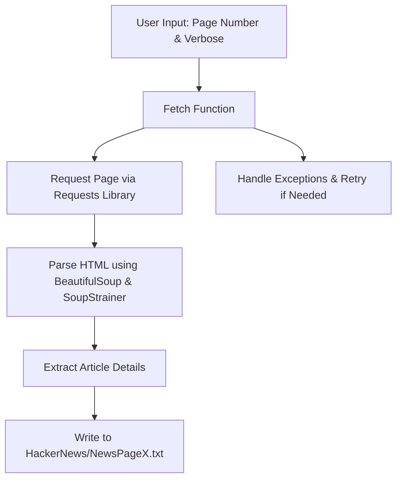
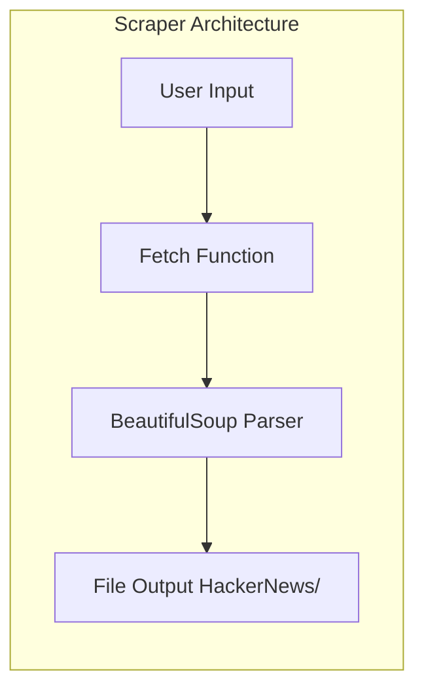
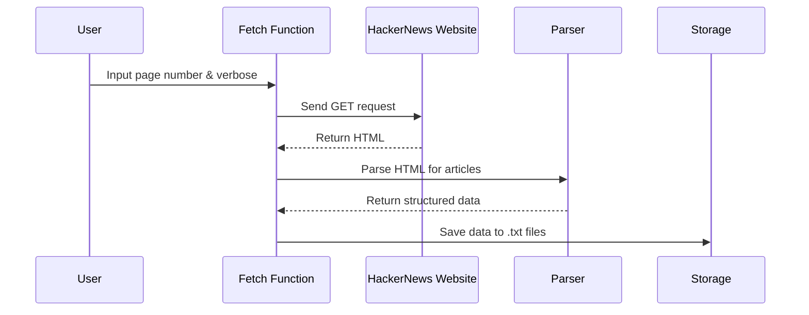

# 🚀 Hacker News Scraper - Cool_Project_2

[](https://github.com/alok-kumar8765/Cool_Project_2)  
[](https://github.com/alok-kumar8765/Cool_Project_2/stargazers)  
[](https://github.com/alok-kumar8765/Cool_Project_2/issues)  
[](https://github.com/alok-kumar8765/Cool_Project_2/blob/main/LICENSE)

---

## 📖 Description
**Hacker News Scraper** is a Python-based web scraping utility designed to extract top news stories from [Hacker News](https://news.ycombinator.com/). It fetches article details including title, URL, author, score, source website, and posting time. Data is stored in structured `.txt` files for easy offline access.  

This project supports multi-page scraping (up to 20 pages) and is designed for scalability, with future-ready support for multiprocessing.

---

## 🗂 Table of Contents

<details>
<summary>Click to expand</summary>

1. [Installation](#installation)  
2. [Usage](#usage)  
3. [Code Explanation](#code-explanation)  
4. [Architecture & Flow](#architecture--flow)  
5. [Mermaid Diagrams](#mermaid-diagrams)  
6. [Pros & Cons](#pros--cons)  
7. [Real-world Use Cases](#real-world-use-cases)  
8. [Contributing](#contributing)  
9. [License](#license)  

</details>

---

## ⚙️ Installation

<details>
<summary>Click to expand</summary>

```bash
# Clone the repository
git clone https://github.com/alok-kumar8765/Cool_Project_2.git
cd Cool_Project_2/Scrape_Hacker_News

# Install dependencies
pip install requests beautifulsoup4
````

</details>

---

## 🏃 Usage

<details>
<summary>Click to expand</summary>

```bash
python scrape_hacker_news.py
```

* Enter the number of pages to scrape (max 20).
* Optional: Choose verbose output (`y`) to print progress in console.
* Output files are saved in `HackerNews/` directory as `NewsPage1.txt`, `NewsPage2.txt`, etc.

</details>

---

## 📝 Code Explanation

<details>
<summary>Click to expand</summary>

* **fetch(page_no, verbose=False)**: Fetches articles for a given page number.

* **BeautifulSoup + SoupStrainer**: Parses only `<td>` elements to optimize memory usage.

* **Data Extracted**:

  * `Article Number`
  * `Article Title`
  * `Source Website`
  * `Source URL`
  * `Article Author`
  * `Article Score`
  * `Posted Time`

* **Exception Handling**: Handles connection errors and ambiguous request exceptions.

* **Directory Management**: Creates `HackerNews/` folder if not present.

* **Future-ready**: Supports multi-page scraping for multiprocessing enhancements.

</details>

---

## 🏛 Architecture & Flow

<details>
<summary>Click to expand</summary>

### 1️⃣ High-Level Architecture

* **Input Layer**: User specifies number of pages & verbose mode.
* **Processing Layer**: Requests pages, parses HTML using BeautifulSoup.
* **Output Layer**: Writes structured `.txt` files in `HackerNews/` directory.

### 2️⃣ Flow

1. User inputs number of pages.
2. Fetch function requests page from Hacker News.
3. HTML is parsed to extract article info.
4. Extracted data is stored in `.txt` files.
5. Errors are logged to console if requests fail.

</details>

---

## 📊 Mermaid Diagrams

<details>
<summary>Click to expand</summary>







</details>

---

## ✅ Pros & Cons

<details>
<summary>Click to expand</summary>

**Pros**

* Lightweight, no database required.
* Supports multi-page scraping.
* Robust error handling.
* Future-ready for multiprocessing.
* Clean and modular code structure.

**Cons**

* Only scrapes Hacker News, not other websites.
* Output limited to `.txt` files; no database integration yet.
* Limited to 20 pages to prevent overloading Hacker News.

</details>

---

## 🌐 Real-world Use Cases

<details>
<summary>Click to expand</summary>

* **News Aggregation**: Build custom dashboards for tech news.
* **Sentiment Analysis**: Feed scraped data into NLP models.
* **Trending Articles Tracking**: Analyze popularity of topics over time.
* **Academic Research**: Extract Hacker News data for studies in social media and technology trends.

**Example:**

> Automatically scrape daily top 5 Hacker News articles to send a daily newsletter to subscribers.

</details>

---

## 🤝 Contributing

<details>
<summary>Click to expand</summary>

1. Fork the repository.
2. Create a feature branch (`git checkout -b feature-name`).
3. Commit your changes (`git commit -m 'Add feature'`).
4. Push to branch (`git push origin feature-name`).
5. Open a Pull Request.

</details>

---

## 📝 License

<details>
<summary>Click to expand</summary>

This project is licensed under the MIT License - see the [LICENSE](https://github.com/alok-kumar8765/Cool_Project_2/blob/main/LICENSE) file for details.

</details>

---

### 🔗 Repository Link

[https://github.com/alok-kumar8765/Cool_Project_2/tree/main/Scrape_Hacker_News](https://github.com/alok-kumar8765/Cool_Project_2/tree/main/Scrape_Hacker_News)


---
