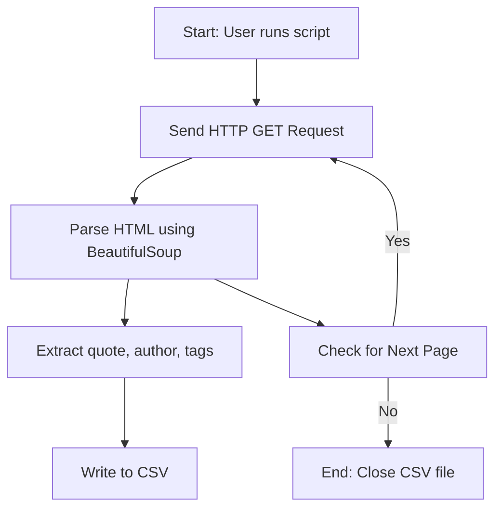
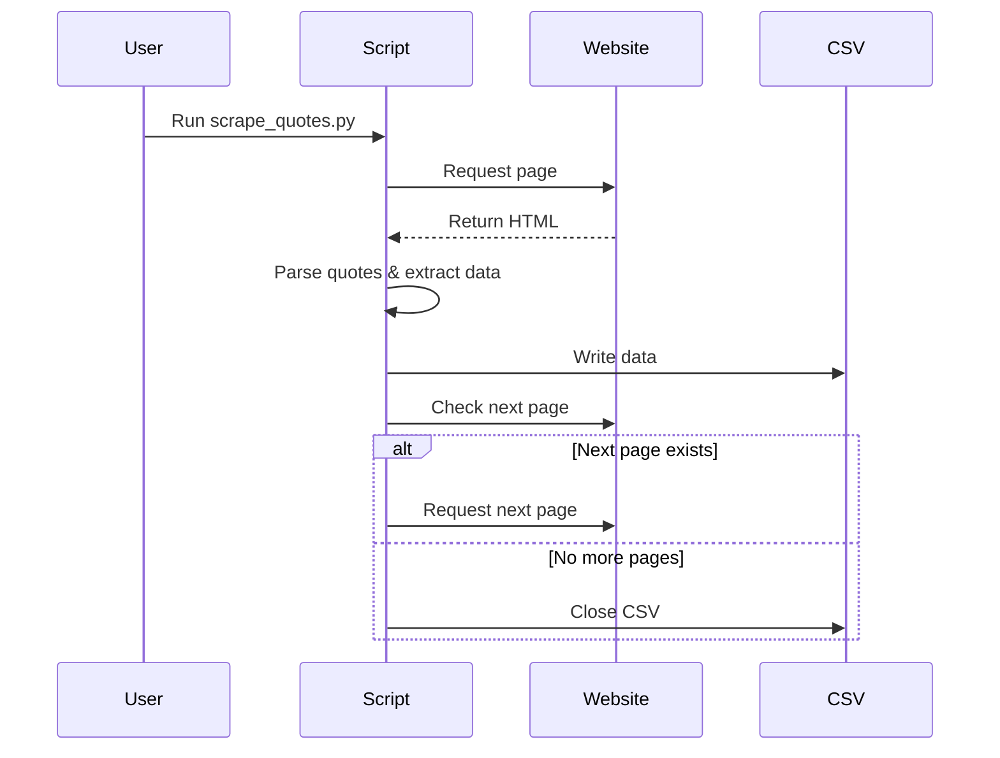

# 📜 Quotes Scraper - Cool_Project_2

[](https://github.com/alok-kumar8765/Cool_Project_2)  
[](https://github.com/alok-kumar8765/Cool_Project_2/stargazers)  
[](https://github.com/alok-kumar8765/Cool_Project_2/issues)  
[](https://github.com/alok-kumar8765/Cool_Project_2/blob/main/LICENSE)

---

## 📖 Description
**Quotes Scraper** is a Python-based web scraper that extracts quotes, authors, and tags from [Quotes to Scrape](http://quotes.toscrape.com). It automatically navigates through all pages and stores the results in a structured CSV file.  

Key features:  
- Automated multi-page scraping  
- Structured CSV output  
- Extracts quote text, author, and associated tags  
- Exception handling to prevent runtime errors  

This project is ideal for learning web scraping, data aggregation, and preprocessing textual datasets for NLP or analytics.

---

## 🗂 Table of Contents

<details>
<summary>Click to expand</summary>

1. [Installation](#installation)  
2. [Usage](#usage)  
3. [Code Explanation](#code-explanation)  
4. [Architecture & Flow](#architecture--flow)  
5. [Mermaid Diagrams](#mermaid-diagrams)  
6. [Pros & Cons](#pros--cons)  
7. [Real-world Use Cases](#real-world-use-cases)  
8. [Contributing](#contributing)  
9. [License](#license)  

</details>

---

## ⚙️ Installation

<details>
<summary>Click to expand</summary>

```bash
# Clone the repository
git clone https://github.com/alok-kumar8765/Cool_Project_2.git
cd Cool_Project_2/Scrape_quotes

# Install required packages
pip install requests beautifulsoup4
````

</details>

---

## 🏃 Usage

<details>
<summary>Click to expand</summary>

```bash
python scrape_quotes.py
```

* The script scrapes all quotes from the website.
* Output CSV file: `quote_list.csv`.
* Each row contains: `quote`, `author`, `tags`.
* Automatically navigates to next page until the last page.

</details>

---

## 📝 Code Explanation

<details>
<summary>Click to expand</summary>

* **Libraries Used**:

  * `requests`: Fetches HTML pages.
  * `BeautifulSoup`: Parses HTML for scraping.
  * `csv`: Writes structured output to CSV.

* **Core Logic**:

  1. Send HTTP request to `http://quotes.toscrape.com`.
  2. Parse HTML using BeautifulSoup.
  3. Extract each quote's text, author, and tags.
  4. Write extracted data to CSV.
  5. Check for the "Next" page and repeat until last page.
  6. Exception handling ensures the CSV file is closed even if errors occur.

* **Output**: `quote_list.csv` containing all scraped data.

</details>

---

## 🏛 Architecture & Flow

<details>
<summary>Click to expand</summary>

### 1️⃣ High-Level Architecture

* **Input Layer**: Website URL (`http://quotes.toscrape.com`).
* **Processing Layer**: Python script fetches, parses, and extracts data.
* **Output Layer**: Writes extracted quotes to `quote_list.csv`.

### 2️⃣ Flow

1. Fetch initial page HTML.
2. Parse quotes, authors, and tags.
3. Write data to CSV.
4. Identify and fetch next page if available.
5. Repeat until no next page exists.
6. Close CSV file.

</details>

---

## 📊 Mermaid Diagrams

<details>
<summary>Click to expand</summary>





---

## ✅ Pros & Cons

<details>
<summary>Click to expand</summary>

**Pros**

* Simple, lightweight Python scraper.
* Auto-pagination support.
* Structured CSV output for analytics.
* Minimal dependencies (requests + BeautifulSoup + CSV).

**Cons**

* Only works for `quotes.toscrape.com`.
* No database integration for larger datasets.
* Basic error handling, may fail with dynamic sites.

</details>

---

## 🌐 Real-world Use Cases

<details>
<summary>Click to expand</summary>

* **Text Analytics**: Build datasets for NLP tasks (sentiment analysis, topic modeling).
* **Quote Aggregators**: Automate collection of quotes for websites, apps, or dashboards.
* **Learning Web Scraping**: Beginner-friendly example for Python scraping.
* **Academic Research**: Analyze themes, authorship, or frequency of quotes.

**Example:**

> Collect 1000+ quotes with authors and tags, then perform sentiment analysis to identify motivational vs philosophical quotes for a mobile app.

</details>

---

## 🤝 Contributing

<details>
<summary>Click to expand</summary>

1. Fork the repository.
2. Create a feature branch (`git checkout -b feature-name`).
3. Commit your changes (`git commit -m 'Add feature'`).
4. Push to branch (`git push origin feature-name`).
5. Open a Pull Request.

</details>

---

## 📝 License

<details>
<summary>Click to expand</summary>

This project is licensed under the MIT License - see the [LICENSE](https://github.com/alok-kumar8765/Cool_Project_2/blob/main/LICENSE) file for details.

</details>

---

### 🔗 Repository Link

[https://github.com/alok-kumar8765/Cool_Project_2/tree/main/Scrape_quotes](https://github.com/alok-kumar8765/Cool_Project_2/tree/main/Scrape_quotes)


---

