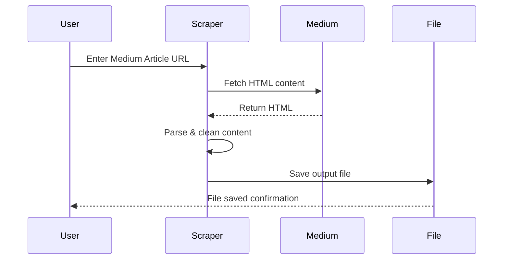

# 📝 Medium Article Scraper - Cool_Project_2

[](https://github.com/alok-kumar8765/Cool_Project_2)  
[](https://github.com/alok-kumar8765/Cool_Project_2/stargazers)  
[](https://github.com/alok-kumar8765/Cool_Project_2/issues)  
[](https://github.com/alok-kumar8765/Cool_Project_2/blob/main/LICENSE)

---

## 📖 Description
**Medium Article Scraper** is a Python-based utility that extracts full-text content from any Medium article URL. The scraper:  
- Captures article title, introduction, headings, and main content.  
- Cleans HTML tags and converts them to readable text.  
- Saves the article in a structured `.txt` file inside a dedicated directory.  

This project is ideal for offline reading, content analysis, research, or building datasets for NLP applications.  

---

## 🗂 Table of Contents

<details>
<summary>Click to expand</summary>

1. [Installation](#installation)  
2. [Usage](#usage)  
3. [Code Explanation](#code-explanation)  
4. [Architecture & Flow](#architecture--flow)  
5. [Mermaid Diagrams](#mermaid-diagrams)  
6. [Pros & Cons](#pros--cons)  
7. [Real-world Use Cases](#real-world-use-cases)  
8. [Contributing](#contributing)  
9. [License](#license)  

</details>

---

## ⚙️ Installation

<details>
<summary>Click to expand</summary>

```bash
# Clone the repository
git clone https://github.com/alok-kumar8765/Cool_Project_2.git
cd Cool_Project_2/Scraping\ Medium\ Articles

# Install dependencies
pip install requests beautifulsoup4
````

</details>

---

## 🏃 Usage

<details>
<summary>Click to expand</summary>

```bash
python scrape_medium_articles.py
```

1. Enter the URL of a Medium article when prompted.
2. The script validates the URL.
3. Scrapes the article title, headings, introduction, and main content.
4. Cleans HTML tags for readable text.
5. Saves the output in `./scraped_articles/Article_Title.txt`.

**Output Example:**

```
url: https://medium.com/@example/article-title
Title: EXAMPLE ARTICLE
Introduction
...
HEADING 1
...
HEADING 2
...
```

</details>

---

## 📝 Code Explanation

<details>
<summary>Click to expand</summary>

* **Libraries Used**:

  * `requests`: Fetches HTML content from Medium.
  * `BeautifulSoup`: Parses HTML for scraping headings, paragraphs, and tags.
  * `re`: Handles URL validation and HTML tag cleaning.
  * `os`: Manages directories and file paths.
  * `sys`: Exits script on invalid input.

* **Core Functions**:

  1. `get_page()`: Prompts user for Medium URL, validates, fetches HTML.
  2. `purify(text)`: Removes HTML tags and converts `<br>`/`<li>` to line breaks.
  3. `collect_text(soup)`: Compiles title, headings, introduction, and content into one string.
  4. `save_file(fin)`: Saves the cleaned text to a `.txt` file inside `scraped_articles` folder.

* **Driver Code**: Runs functions sequentially to scrape, clean, and save the article.

</details>

---

## 🏛 Architecture & Flow

<details>
<summary>Click to expand</summary>

### High-Level Architecture

* **Input Layer**: User provides Medium article URL.
* **Processing Layer**: Python script fetches, parses, cleans HTML, and extracts text.
* **Output Layer**: Saves text in a `.txt` file with article title as filename.

### Flow Steps

1. User enters URL.
2. Validate URL format.
3. Fetch HTML content.
4. Parse HTML to extract:

   * Title
   * Introduction
   * Headings
   * Body content
5. Clean HTML tags and format text.
6. Save formatted content to `.txt` file.

</details>

---

## 📊 Mermaid Diagrams

<details>
<summary>Click to expand</summary>

```mermaid
flowchart TD
    A[User Input: Medium Article URL] --> B[Validate URL]
    B --> C[Fetch HTML via Requests]
    C --> D[Parse HTML using BeautifulSoup]
    D --> E[Extract Title, Headings, Intro, Body]
    E --> F[Clean HTML Tags with purify()]
    F --> G[Save Text File in ./scraped_articles/]
```



---

## ✅ Pros & Cons

<details>
<summary>Click to expand</summary>

**Pros**

* Works on any Medium article URL.
* Outputs clean, readable text for offline reading or analysis.
* Lightweight, minimal dependencies.
* Future-ready for batch scraping or automation.

**Cons**

* Only supports Medium.com articles.
* Dynamic content like embedded videos/images not captured.
* Requires manual URL input; no bulk scraping yet.

</details>

---

## 🌐 Real-world Use Cases

<details>
<summary>Click to expand</summary>

* **Offline Reading**: Save articles for later reading without internet.
* **Content Analysis**: Analyze text, topics, or writing styles for research.
* **NLP Datasets**: Build datasets from Medium articles for AI/ML.
* **Archiving**: Maintain personal or team knowledge base of selected Medium articles.

**Example:**

> Scrape 50 Medium articles on AI topics to analyze trends, keywords, and sentiment for a research report.

</details>

---

## 🤝 Contributing

<details>
<summary>Click to expand</summary>

1. Fork the repository.
2. Create a feature branch (`git checkout -b feature-name`).
3. Commit your changes (`git commit -m 'Add feature'`).
4. Push to branch (`git push origin feature-name`).
5. Open a Pull Request.

</details>

---

## 📝 License

<details>
<summary>Click to expand</summary>

This project is licensed under the MIT License - see the [LICENSE](https://github.com/alok-kumar8765/Cool_Project_2/blob/main/LICENSE) file for details.

</details>

---

### 🔗 Repository Link

[https://github.com/alok-kumar8765/Cool_Project_2/tree/main/Scraping%20Medium%20Articles](https://github.com/alok-kumar8765/Cool_Project_2/tree/main/Scraping%20Medium%20Articles)


---

