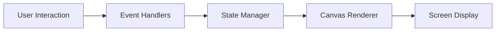
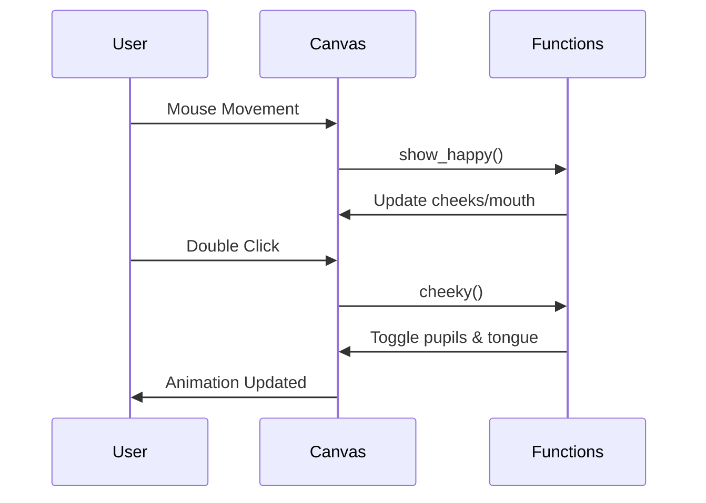

# 🐾 Screen Pet – Interactive Desktop Companion


[GitHub Repository Link](https://github.com/alok-kumar8765/Cool_Project_2/tree/main/Screen%20Pet)

---

## 📖 Table of Contents
<details>
<summary>Click to expand</summary>

1. [Project Overview](#project-overview)
2. [Features](#features)
3. [Installation & Setup](#installation--setup)
4. [Code Structure](#code-structure)
5. [Architecture & Diagrams](#architecture--diagrams)
    - [Data Flow Diagram (DFD)](#data-flow-diagram-dfd)
    - [System Architecture](#system-architecture)
    - [Interaction Flow](#interaction-flow)
6. [Usage & Demonstration](#usage--demonstration)
7. [Pros & Cons](#pros--cons)
8. [Real-world Use Cases](#real-world-use-cases)
9. [Contributing](#contributing)
10. [License](#license)

</details>

---

## 📌 Project Overview
<details>
<summary>Click to expand</summary>

**Screen Pet** is an interactive desktop companion built with Python’s `Tkinter` library. This project creates a cute, animated character on your screen that reacts to mouse movements and clicks. Users can engage with the pet to see blinking eyes, cheek expressions, tongue animations, and eye-crossing effects.  

Key highlights:
- Fun and interactive GUI using **Tkinter Canvas**
- Real-time animations responding to user actions
- Modular and readable Python code

</details>

---

## ✨ Features
<details>
<summary>Click to expand</summary>

- Blink animation every few seconds
- Mouse-over happiness detection
- Double-click for cheeky expressions (tongue out + crossed eyes)
- Normal, happy, and sad mouth states
- Eye-crossing animation
- Fully customizable colors and dimensions
- Lightweight and standalone Python application

</details>

---

## 🛠️ Installation & Setup
<details>
<summary>Click to expand</summary>

```bash
# 1. Clone the repository
git clone https://github.com/alok-kumar8765/Cool_Project_2.git

# 2. Navigate to Screen Pet folder
cd Cool_Project_2/Screen\ Pet

# 3. Install Python dependencies (Tkinter comes preinstalled with Python)
python screen_pet.py

# 4. Run the project
python screen_pet.py
````

Requirements:

* Python 3.10+
* Tkinter (usually pre-installed)
* Cross-platform: Windows, Linux, MacOS

</details>

---

## 🗂️ Code Structure

<details>
<summary>Click to expand</summary>

```
Screen Pet/
│
├── screen_pet.py         # Main Tkinter application
├── README.md             # Project documentation
```

**Core Components**:

* `Canvas` – Main drawing canvas for the pet
* `toggle_eyes()` – Blink effect
* `toggle_pupils()` – Eye-crossing animation
* `toggle_tongue()` – Tongue animation
* `show_happy()` / `hide_happy()` – Cheek & mouth expression
* `sad()` – Mood decay effect over time

</details>

---

## 🏗️ Architecture & Diagrams

<details>
<summary>Click to expand</summary>

### Data Flow Diagram (DFD)

```mermaid
flowchart TD
    User(Mouse) -->|Moves| Canvas
    Canvas -->|Triggers| Expression Module
    Expression Module -->|Updates| GUI Elements
    GUI Elements -->|Renders| Screen Pet
```

### System Architecture



### Interaction Flow



</details>

---

## 🚀 Usage & Demonstration

<details>
<summary>Click to expand</summary>

* Hover mouse over pet → pet smiles with cheeks showing
* Double-click → pet becomes cheeky (tongue out + eyes cross)
* Wait → pet blinks automatically every few seconds
* Pet becomes sad if not interacted with for long durations

**Example:**

```python
# Detect mouse over pet
c.bind('<Motion>', show_happy)
# Trigger cheeky animation
c.bind('<Double-1>', cheeky)
```

</details>

---

## ✅ Pros & Cons

<details>
<summary>Click to expand</summary>

**Pros:**

* Lightweight, no external dependencies
* Fun and interactive, suitable for demos
* Easy to extend and customize
* Cross-platform support

**Cons:**

* Limited functionality (no AI or advanced interactivity)
* Purely GUI-based, not networked
* Simple animations (may appear basic for large-scale enterprise use)

</details>

---

## 🌍 Real-world Use Cases

<details>
<summary>Click to expand</summary>

* **Desktop Companions:** Fun pets for productivity apps or desktops
* **Educational Tools:** Demonstrating GUI programming and event-driven Python
* **Gamification:** Small interactive elements in apps or learning platforms
* **UX Testing:** Testing user interaction on animations

**Example:**
A productivity app can include this pet to react to user inactivity, reminding them to take breaks.

</details>

---

## 🤝 Contributing

<details>
<summary>Click to expand</summary>

Contributions are welcome! Steps:

1. Fork the repository
2. Create a feature branch (`git checkout -b feature-name`)
3. Commit your changes (`git commit -m 'Add new feature'`)
4. Push to branch (`git push origin feature-name`)
5. Create a Pull Request

---

## 📄 License

<details>
<summary>Click to expand</summary>

This project is licensed under the MIT License.
See [LICENSE](https://github.com/alok-kumar8765/Cool_Project_2/blob/main/LICENSE) for details.

</details>


---

