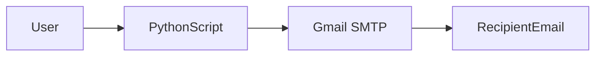
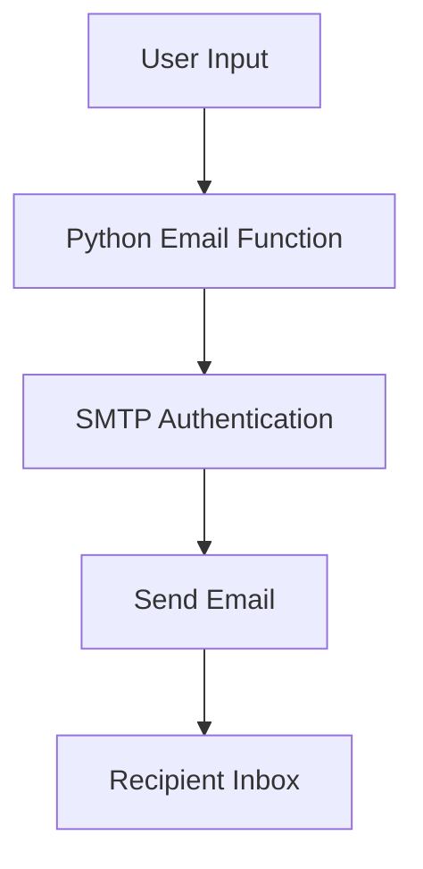
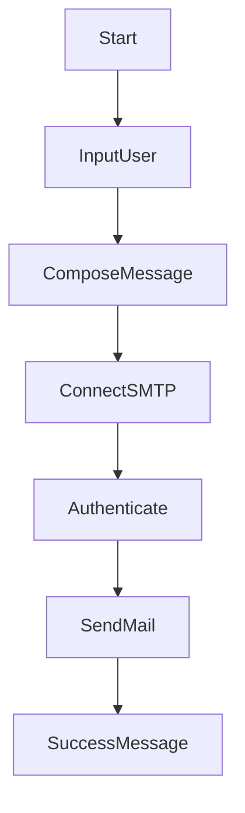

# 📧 Send Automatic Emails (Python)

<strong>📌 Enterprise-Grade README</strong>

A **production-style, enterprise-documented Python utility** for sending automated emails using SMTP (Gmail). This project demonstrates **secure email automation**, **SMTP workflow**, and **basic user interaction**, packaged with professional documentation standards.

---

## 🏷️ Badges

📊 Project Status & Metadata

---

## 📚 Table of Contents

🧭 Navigate Documentation

1. Project Overview
2. Features
3. Code Explanation
4. Architecture Diagram
5. Data Flow Diagram (DFD)
6. Execution Flow Diagram
7. Mermaid Diagrams
8. Real-World Use Cases
9. Pros & Cons
10. Security Considerations
11. Example Scenario
12. SEO Keywords

---

## 🚀 Project Overview

🔍 Description

This Python script enables **automatic email sending** using Gmail’s SMTP server. It collects user input, establishes a secure connection using **TLS**, authenticates via **App Password**, and sends a customized welcome email.

Designed for:

* Learning SMTP fundamentals
* Email automation demos
* Backend service prototypes

---

## ✨ Features

⚙️ Key Capabilities

* 📩 Automated email delivery
* 🔐 Secure SMTP authentication (TLS)
* 🧑 Personalized email content
* ⚡ Lightweight & fast execution
* 🧩 Easy integration into larger systems

---

## 🧠 Code Explanation

🧩 Step-by-Step Breakdown

* **User Input**: Collects name and recipient email
* **Message Formatting**: Uses Python f-string
* **SMTP Connection**: Gmail SMTP (smtp.gmail.com:587)
* **Security Layer**: STARTTLS encryption
* **Authentication**: Gmail App Password
* **Email Dispatch**: `sendmail()` method

---

## 🏗️ System Architecture

🏛️ Architecture Diagram

---

## 📊 Data Flow Diagram (DFD)

📈 Level 0 DFD

---

## 🔁 Execution Flow Diagram

🔄 Program Flow

---

## 🌍 Real-World Use Cases

🏢 Practical Applications

* ✅ User registration confirmation emails
* 📢 Automated notifications
* 🏫 Educational SMTP demos
* 🛠️ Backend microservices alerts
* 📬 Internal system messaging

---

## ⚖️ Pros & Cons

✔️ Advantages

* Simple and easy to understand
* Secure communication
* Minimal dependencies
* Ideal for automation learning

❌ Limitations

* Hardcoded credentials (not production-safe)
* No error handling
* Gmail-specific SMTP
* Not scalable without enhancements

---

## 🔐 Security Considerations

🛡️ Best Practices

* Use **Environment Variables** for credentials
* Enable **2FA + App Passwords**
* Avoid committing secrets to GitHub
* Add exception handling and logging

---

## 🧪 Example Scenario

📌 Sample Workflow

**Scenario**: A new user signs up on a platform.

**Process**:

1. User enters name and email
2. Script sends welcome email automatically
3. User receives confirmation instantly

---

## 🔍 SEO Optimized Keywords

📈 Search Engine Optimization

* Python SMTP Email Automation
* Send Email Using Python
* Gmail SMTP Python Script
* Automated Email System Python
* Python Backend Email Service

---

## 📎 Repository Link

🔗 GitHub

👉 [https://github.com/alok-kumar8765/Cool_Project_2/tree/main/Send%20Automatic%20Emails](https://github.com/alok-kumar8765/Cool_Project_2/tree/main/Send%20Automatic%20Emails)

---

### ⭐ If you find this project useful, consider giving it a star on GitHub!
