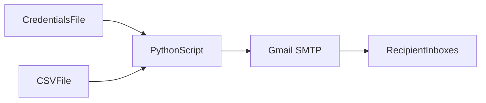
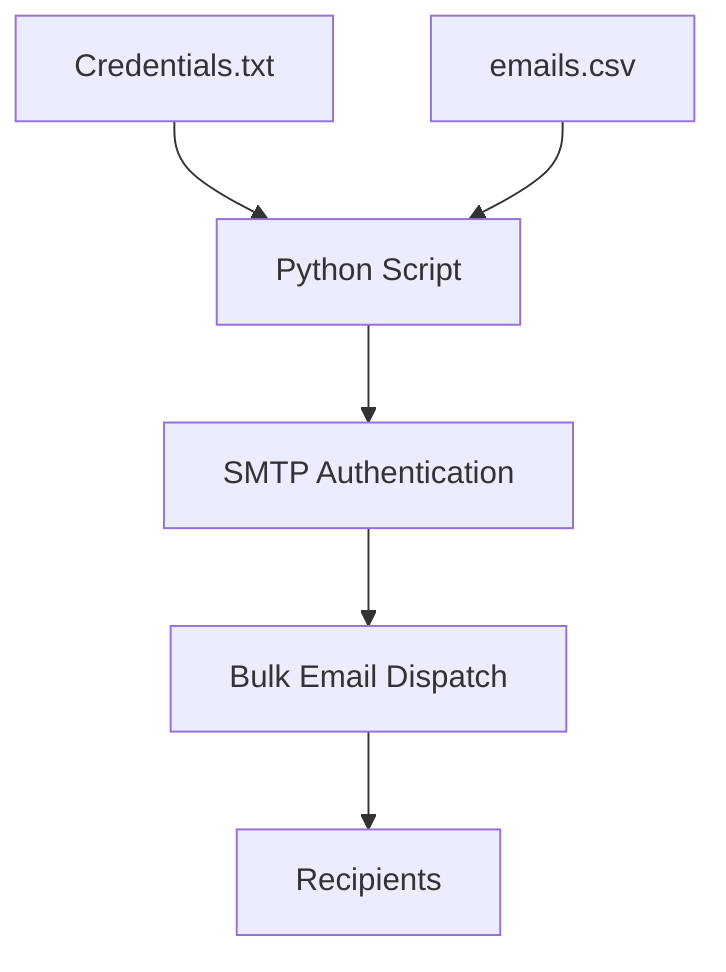
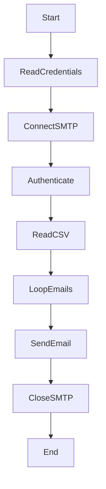

# 📧 Send Emails from CSV (Python)

<strong>📌 Enterprise-Grade README Documentation</strong>

A **professional, enterprise-style Python email automation utility** that reads recipient email addresses from a CSV file and sends bulk emails securely using Gmail SMTP. This project demonstrates **file-based email automation**, **secure credential handling**, and **scalable notification workflows**.

---

## 🏷️ Badges

📊 Project Health & Metadata

---

## 📚 Table of Contents

🧭 Documentation Index

1. Project Overview
2. Key Features
3. Code Explanation
4. Architecture Diagram
5. Data Flow Diagram (DFD)
6. Execution Flow Diagram
7. Mermaid Diagrams
8. Real-World Use Cases
9. Pros & Cons
10. Security Best Practices
11. Example Workflow
12. SEO Keywords

---

## 🚀 Project Overview

🔍 Description

This Python script enables **bulk email sending** by reading recipient addresses from a CSV file. Credentials are stored externally, and emails are sent securely using **TLS-encrypted SMTP**.

Ideal for:

* Bulk notifications
* Educational demos
* Lightweight backend automation
* CSV-driven workflows

---

## ✨ Key Features

⚙️ Core Capabilities

* 📂 Reads recipients from CSV file
* 📩 Bulk email automation
* 🔐 Secure Gmail SMTP with TLS
* 🗝️ External credential management
* 🧩 Modular, readable Python functions

---

## 🧠 Code Explanation

🧩 Functional Breakdown

* **get_credentials()**: Reads email & app password from file
* **login()**: Establishes secure SMTP session using TLS
* **send_mail()**:

  * Connects to Gmail SMTP server
  * Creates reusable email message
  * Iterates over CSV recipients
  * Sends email to each address
  * Gracefully terminates session

---

## 🏗️ System Architecture

🏛️ High-Level Architecture

---

## 📊 Data Flow Diagram (DFD)

📈 Level 0 DFD

---

## 🔁 Execution Flow Diagram

🔄 Program Execution Flow

---

## 🌍 Real-World Use Cases

🏢 Practical Applications

* 📢 Bulk announcements (events, updates)
* 🏫 Student notifications via CSV lists
* 🛠️ Internal corporate alerts
* 📬 Marketing or onboarding emails (small scale)
* 🧪 Learning SMTP & CSV automation

---

## ⚖️ Pros & Cons

✔️ Advantages

* Simple and maintainable
* CSV-based scalability
* Secure email transmission
* Easy integration into pipelines

❌ Limitations

* No exception handling
* Gmail SMTP dependency
* Plain text email only
* Not optimized for very large lists

---

## 🔐 Security Best Practices

🛡️ Recommendations

* Use **App Passwords**, not real Gmail passwords
* Store credentials in **environment variables**
* Add logging & error handling
* Never commit credentials to GitHub
* Implement rate limiting for bulk sends

---

## 🧪 Example Workflow

📌 Real-World Example

**Scenario**: University sends course updates to students.

**Steps**:

1. Admin prepares `emails.csv`
2. Credentials stored in `credentials.txt`
3. Script sends update to all recipients
4. Students receive email simultaneously

---

## 🔍 SEO Optimized Keywords

📈 Search Engine Tags

* Python Send Email from CSV
* Bulk Email Automation Python
* Gmail SMTP Python Example
* Python CSV Email Script
* Automated Notification System Python

---

## 📎 Repository Link

🔗 GitHub Repository

👉 [https://github.com/alok-kumar8765/Cool_Project_2/tree/main/Send_email_from_csv](https://github.com/alok-kumar8765/Cool_Project_2/tree/main/Send_email_from_csv)

---

### ⭐ If this project helped you, consider starring the repository on GitHub!
