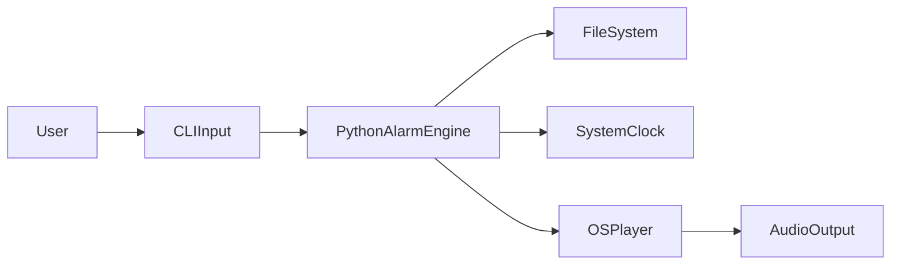
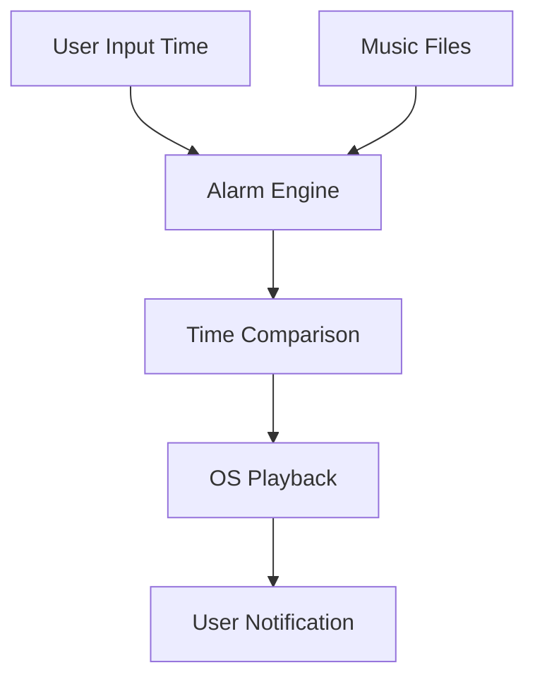
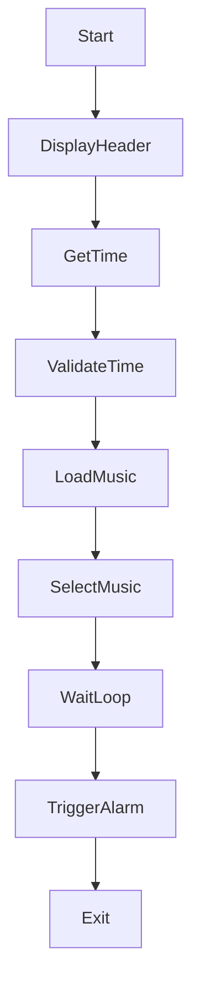

# ⏰ Set Alarm – Python Console Application

<details open>
<summary><strong>📌  README Documentation</strong></summary>

A **professional,  Python alarm application** that allows users to set a system alarm, select alarm music dynamically, and trigger playback at the specified time. This project showcases **time-based automation**, **file system handling**, **input validation**, and **OS-level process execution**.

</details>

---

## 🏷️ Badges

<details>
<summary>📊 Project Metadata & Health</summary>


</details>

---

## 📚 Table of Contents

<details open>
<summary>🧭 Documentation Index</summary>

1. Project Overview
2. Key Features
3. Folder Structure
4. Code Explanation
5. System Architecture
6. Data Flow Diagram (DFD)
7. Execution Flow Diagram
8. Mermaid Diagrams
9. Real-World Use Cases
10. Pros & Cons
11. Security & OS Notes
12. Example Workflow
13. SEO Keywords

</details>

---

## 🚀 Project Overview

<details>
<summary>🔍 Description</summary>

This Python-based **alarm clock utility** allows users to set a custom alarm time via CLI and select an alarm tone from a local music directory. At the scheduled time, the program automatically plays the selected audio file using the operating system.

This project is suitable for:

* Learning time-based triggers in Python
* OS command execution
* File system sanitization and validation
* CLI-based automation tools

</details>

---

## ✨ Key Features

<details>
<summary>⚙️ Core Capabilities</summary>

* ⏱️ Time-based alarm scheduling
* 🎵 Dynamic alarm music selection
* 🧹 Automatic filename sanitization
* 📂 Folder-based music management
* 🖥️ OS-level media playback
* 🧩 Modular and readable code design

</details>

---

## 📁 Folder Structure

<details>
<summary>🗂️ Project Layout</summary>

```
Set_Alarm/
│── alarm.py
│── musics/
│   ├── alarm1.mp3
│   ├── morning_tone.wav
│   └── ...
```

</details>

---

## 🧠 Code Explanation

<details>
<summary>🧩 Functional Breakdown</summary>

* **display_header()**: Displays formatted CLI banner
* **set_alarm()**:

  * Validates time input using regex
  * Normalizes time format
  * Loads and sanitizes music filenames
  * Allows user to select alarm sound
  * Continuously checks system time
  * Triggers alarm playback via subprocess
* **rename_files_with_whitespaces()**: Replaces spaces with underscores
* **clean_filename()**: Formats filenames for user-friendly display

</details>

---

## 🏗️ System Architecture

<details>
<summary>🏛️ High-Level Architecture</summary>



</details>

---

## 📊 Data Flow Diagram (DFD)

<details>
<summary>📈 Level 0 DFD</summary>



</details>

---

## 🔁 Execution Flow Diagram

<details>
<summary>🔄 Program Execution Flow</summary>



</details>

---

## 🌍 Real-World Use Cases

<details>
<summary>🏢 Practical Applications</summary>

* ⏰ Personal alarm / reminder system
* 🏫 Study or exam reminder tool
* 🛠️ System automation triggers
* 🧪 Python datetime learning project
* 💼 CLI utilities for productivity

</details>

---

## ⚖️ Pros & Cons

<details>
<summary>✔️ Advantages</summary>

* Simple and user-friendly CLI
* Flexible alarm tone selection
* No external dependencies
* Clear modular design

</details>

<details>
<summary>❌ Limitations</summary>

* Windows-specific playback command
* Busy-wait loop (CPU usage)
* No snooze or repeat feature
* No GUI support

</details>

---

## 🔐 Security & OS Notes

<details>
<summary>🛡️ Important Considerations</summary>

* Uses `subprocess` for OS-level execution
* Designed for **Windows CMD** environment
* Avoid running untrusted media files
* For cross-platform support, use `playsound` or `pygame`

</details>

---

## 🧪 Example Workflow

<details>
<summary>📌 Real-World Example</summary>

**Scenario**: User wants a morning alarm at 06:30.

**Steps**:

1. Run the script
2. Enter `06:30` when prompted
3. Select preferred alarm tone
4. Program waits in background
5. Music plays automatically at 06:30

</details>

---

## 🔍 SEO Optimized Keywords

<details>
<summary>📈 Search Engine Tags</summary>

* Python Alarm Clock Script
* Set Alarm Using Python
* Python Datetime Automation
* CLI Alarm Application Python
* Python System Automation Tool

</details>

---

## 📎 Repository Link

<details open>
<summary>🔗 GitHub Repository</summary>

👉 [https://github.com/alok-kumar8765/Cool_Project_2/tree/main/Set_Alarm](https://github.com/alok-kumar8765/Cool_Project_2/tree/main/Set_Alarm)

</details>

---

### ⭐ If this project helped you, consider starring the repository on
