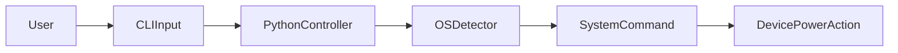
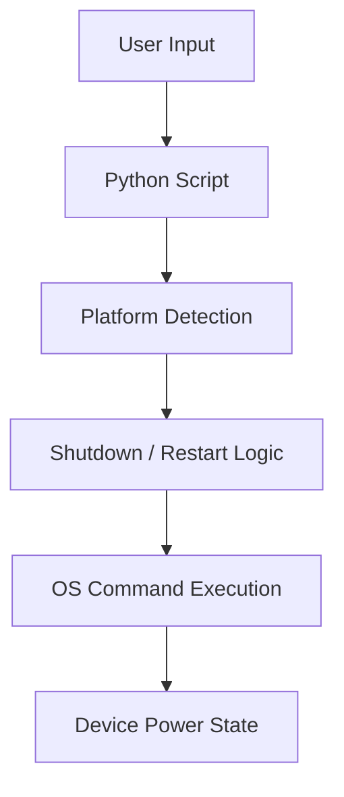
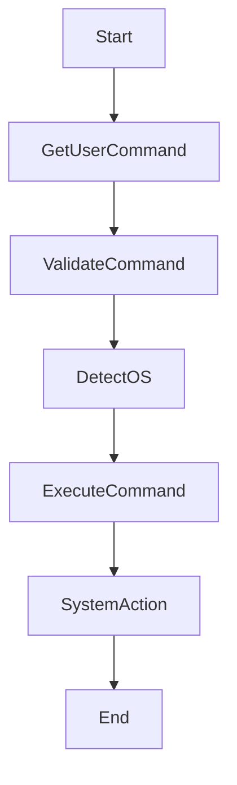

# 🔌 Shutdown or Restart Your Device – Python Automation Tool

<strong>📌 README Documentation</strong>

A **professional, Python system automation utility** that allows users to **shutdown or restart their device** using a simple command-line interface. The script intelligently detects the operating system and executes the appropriate system command, demonstrating **cross-platform OS automation**, **command execution**, and **platform-aware scripting**.

---

## 🏷️ Badges

📊 Project Metadata & Health

---

## 📚 Table of Contents

🧭 Documentation Index

1. Project Overview
2. Key Features
3. Supported Platforms
4. Code Explanation
5. System Architecture
6. Data Flow Diagram (DFD)
7. Execution Flow Diagram
8. Mermaid Diagrams
9. Real-World Use Cases
10. Pros & Cons
11. Security & Safety Notes
12. Example Workflow
13. SEO Keywords

---

## 🚀 Project Overview

🔍 Description

This Python utility provides a **safe and unified interface** to shutdown or restart a device across major operating systems. By leveraging Python’s `platform` module, the script dynamically selects the correct OS command, making it ideal for **automation scripts**, **system administration tasks**, and **learning OS-level operations in Python**.

---

## ✨ Key Features

⚙️ Core Capabilities

* 🔍 Automatic OS detection
* 🔄 Restart device command
* ⛔ Shutdown device command
* 🖥️ Cross-platform support
* 🧩 Minimal and readable codebase
* ⚡ Instant system-level execution

---

## 🖥️ Supported Platforms

🧪 Compatibility Matrix

* ✅ Windows
* ✅ Linux
* ✅ macOS (Darwin)
* ❌ Unsupported / Unknown OS (graceful handling)

---

## 🧠 Code Explanation

🧩 Functional Breakdown

* **shutdown()**

  * Detects OS type
  * Executes OS-specific shutdown command

* **restart()**

  * Detects OS type
  * Executes OS-specific restart command

* **User Input Handler**

  * Accepts `r` (restart) or `s` (shutdown)
  * Routes execution safely

---

## 🏗️ System Architecture

🏛️ High-Level Architecture

---

## 📊 Data Flow Diagram (DFD)

📈 Level 0 DFD

---

## 🔁 Execution Flow Diagram

🔄 Program Execution Flow

---

## 🌍 Real-World Use Cases

🏢 Practical Applications

* 🖥️ IT system administration scripts
* 🏭 Automated kiosk or lab shutdown
* 🧪 Learning OS automation with Python
* 🕒 Scheduled maintenance tasks
* ⚙️ DevOps local automation utilities

---

## ⚖️ Pros & Cons

✔️ Advantages

* Extremely lightweight
* Cross-platform logic
* Easy to extend (schedule, GUI, remote)
* Clear and readable implementation

❌ Limitations

* Requires admin/root privileges
* No confirmation prompt
* Immediate execution (no delay)
* No logging or rollback

---

## 🔐 Security & Safety Notes

🛡️ Important Considerations

* Must be run with appropriate system permissions
* Use carefully to avoid accidental shutdowns
* Add confirmation prompts in production
* Avoid exposing this script to untrusted users

---

## 🧪 Example Workflow

📌 Real-World Example

**Scenario**: Admin wants to restart a machine remotely.

**Steps**:

1. Run the script
2. Enter `r` when prompted
3. Script detects OS
4. Device restarts immediately

---

## 🔍 SEO Optimized Keywords

📈 Search Engine Tags

* Python Shutdown Script
* Restart Computer Using Python
* Python System Automation
* Cross Platform Shutdown Python
* Python OS Command Execution

---

## 📎 Repository Link

🔗 GitHub Repository

👉 [https://github.com/alok-kumar8765/Cool_Project_2/tree/main/Shutdown_or_restart_your_device](https://github.com/alok-kumar8765/Cool_Project_2/tree/main/Shutdown_or_restart_your_device)

---

### ⭐ If this project helped you, consider starring the repository
