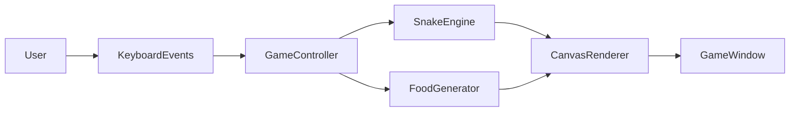
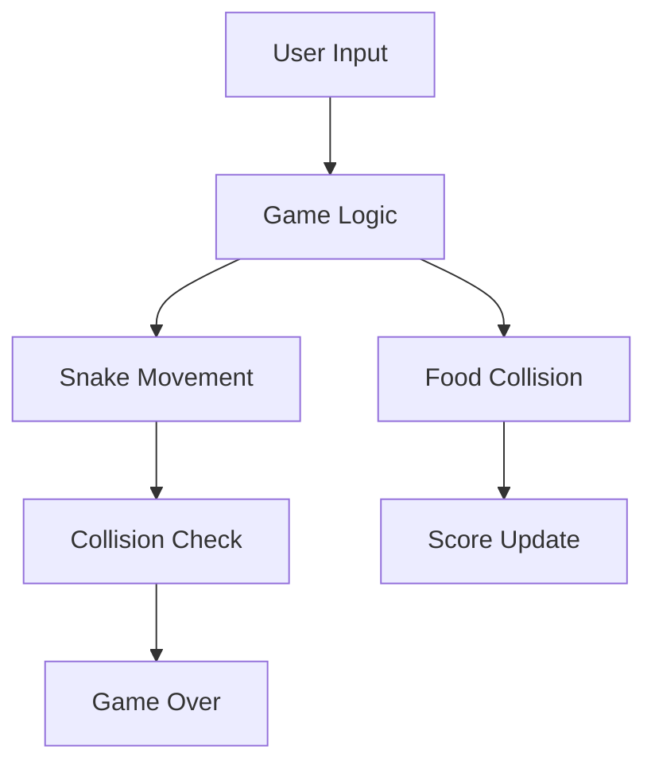
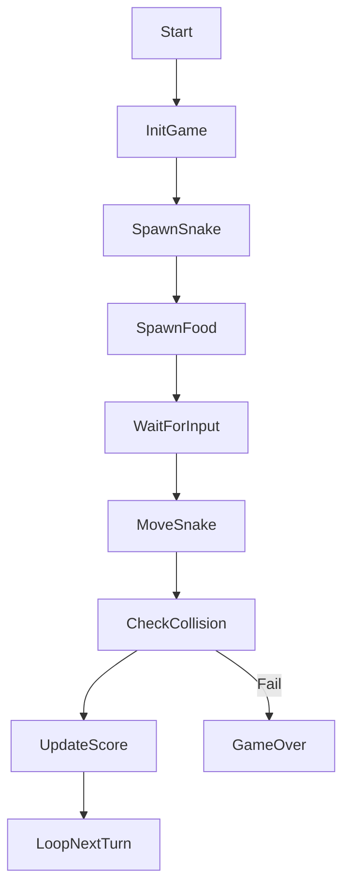

# 🐍 Snake Game – Python (Tkinter GUI)

<strong>📌 README Documentation</strong>

A **professionally documented, Python GUI game** built using **Tkinter**, implementing the classic **Snake Game**. This project demonstrates **event-driven programming**, **real-time game loops**, **collision detection**, and **GUI rendering**, making it an excellent reference for both learning and showcasing Python desktop applications.

---

## 🏷️ Badges

📊 Project Metadata & Health

---

## 📚 Table of Contents

🧭 Documentation Index

1. Project Overview
2. Game Features
3. Game Configuration
4. Code Explanation
5. System Architecture
6. Data Flow Diagram (DFD)
7. Game Loop & Execution Flow
8. Mermaid Diagrams
9. Real-World Use Cases
10. Pros & Cons
11. Performance & Design Notes
12. Example Gameplay Flow
13. SEO Keywords

---

## 🚀 Project Overview

🔍 Description

This project is a **classic Snake Game implemented in Python using Tkinter**. The player controls a snake that grows longer as it consumes food. The game ends if the snake collides with the wall or with itself.

The project highlights:

* GUI-based game development
* Event handling with keyboard input
* Real-time rendering and collision detection

---

## ✨ Game Features

🎮 Core Capabilities

* 🐍 Dynamic snake movement
* 🍎 Random food generation
* 📈 Real-time score tracking
* 🎯 Collision detection (wall & self)
* ⌨️ Keyboard-based controls
* 🖥️ Smooth GUI rendering using Canvas

---

## ⚙️ Game Configuration

🛠️ Tunable Parameters

* `GAME_WIDTH` / `GAME_HEIGHT` – Game window size
* `SPEED` – Snake movement speed
* `SPACE_SIZE` – Grid cell size
* `BODY_PARTS` – Initial snake length
* `SNAKE_COLOR`, `FOOD_COLOR`, `BACKGROUND_COLOR`

---

## 🧠 Code Explanation

🧩 Component Breakdown

* **Snake Class**

  * Maintains snake body coordinates
  * Handles snake rendering on canvas

* **Food Class**

  * Randomly spawns food within grid

* **next_turn()**

  * Core game loop
  * Updates movement, growth, and score

* **change_direction()**

  * Handles keyboard input
  * Prevents reverse direction

* **check_collisions()**

  * Detects wall and self collisions

* **game_over()**

  * Displays end screen

---

## 🏗️ System Architecture

🏛️ High-Level Architecture

---

## 📊 Data Flow Diagram (DFD)

📈 Level 0 DFD

---

## 🔁 Game Loop & Execution Flow

🔄 Execution Flow

---

## 🌍 Real-World Use Cases

🏢 Practical Applications

* 🎮 Beginner-friendly game development demo
* 🧪 Learning event-driven programming
* 🖥️ GUI application portfolio project
* 📚 Teaching OOP concepts in Python
* 🚀 Base template for advanced games

---

## ⚖️ Pros & Cons

✔️ Advantages

* Clean and readable structure
* Uses standard Python library only
* Demonstrates real-time GUI logic
* Easy to extend (levels, sound, pause)

❌ Limitations

* No pause/resume feature
* Fixed grid and speed
* Single-player only
* No mobile or web support

---

## ⚡ Performance & Design Notes

🛠️ Engineering Considerations

* Uses Tkinter `after()` for game loop
* Efficient canvas redraw strategy
* Grid-based movement simplifies collision logic

---

## 🧪 Example Gameplay Flow

📌 Real-World Example

**Scenario**: Player starts a new game.

**Steps**:

1. Launch the application
2. Control snake using arrow keys
3. Eat food to increase score
4. Avoid walls and self
5. Game ends on collision

---

## 🔍 SEO Optimized Keywords

📈 Search Engine Tags

* Python Snake Game
* Snake Game using Tkinter
* Python GUI Game Development
* Classic Snake Game Python
* Tkinter Game Example

---

## 📎 Repository Link

🔗 GitHub Repository

👉 [https://github.com/alok-kumar8765/Cool_Project_2/tree/main/Snake%20Game](https://github.com/alok-kumar8765/Cool_Project_2/tree/main/Snake%20Game)

---

### ⭐ If you enjoyed this game, consider starring the repository on GitHub!
