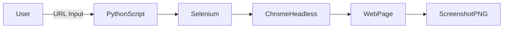
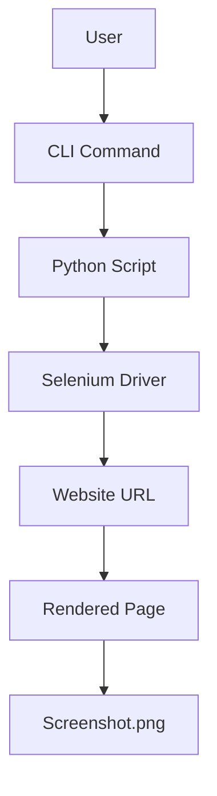
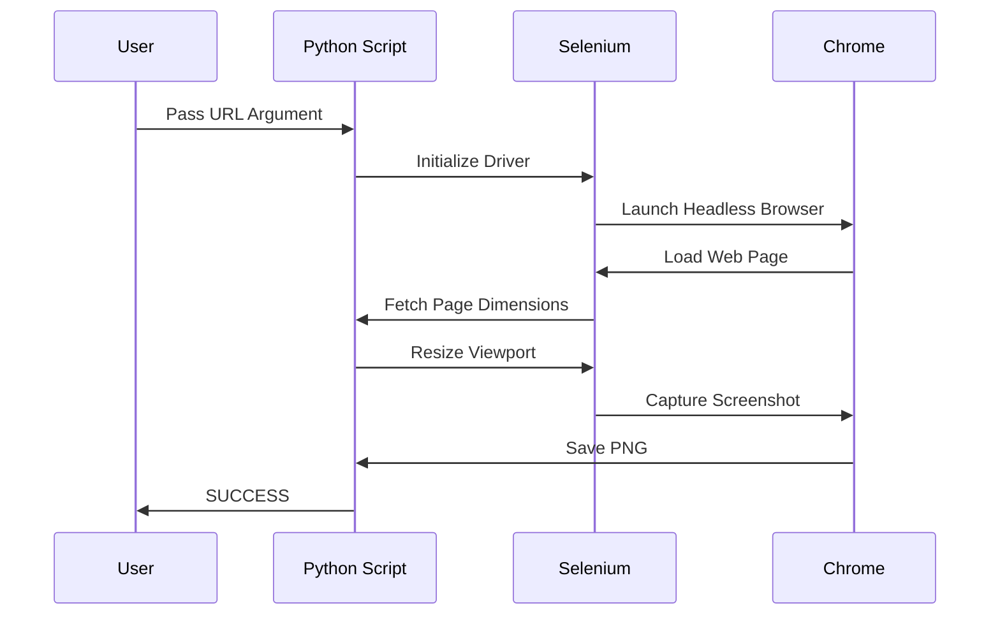

# 📸 Snapshot of Given Website  
### Headless Website Screenshot Automation Tool


---

## 📌 Project Overview

<details>
<summary><strong>🔽 Description</strong></summary>

**Snapshot of Given Website** is a lightweight, headless automation utility built using **Python + Selenium** that captures **full-page screenshots** of any given website URL without launching a visible browser window.

The tool is optimized for **CI/CD pipelines, server environments, audits, SEO analysis, UI regression testing, and monitoring dashboards**.

</details>

---

## 📚 Table of Contents

<details>
<summary><strong>🔽 Expand Table of Contents</strong></summary>

1. Project Overview  
2. Key Features  
3. Tech Stack  
4. Installation  
5. Usage  
6. Architecture  
7. Data Flow Diagram (DFD)  
8. Execution Flow Diagram  
9. Mermaid Diagrams  
10. Real-World Use Cases  
11. Example Scenarios  
12. Pros & Cons  
13. Limitations  
14. Security & Compliance Notes  
15. SEO & Automation Benefits  
16. Future Enhancements  

</details>

---

## ✨ Key Features

<details>
<summary><strong>🔽 Core Capabilities</strong></summary>

- 🚀 Headless Chrome execution (no GUI required)
- 📐 Full-page screenshot capture (auto scroll width & height)
- 🧠 Dynamic viewport resizing
- ⚙️ CLI-driven execution
- 🖼️ High-resolution PNG output
- 🧪 CI/CD friendly
- 🔐 Safe for server & cloud environments

</details>

---

## 🛠️ Tech Stack

<details>
<summary><strong>🔽 Technology Breakdown</strong></summary>

- **Language:** Python 3.8+
- **Automation:** Selenium WebDriver
- **Browser Engine:** Google Chrome (Headless)
- **Driver Management:** chromedriver-binary
- **Execution Mode:** Command Line Interface (CLI)

</details>

---

## ⚙️ Installation

<details>
<summary><strong>🔽 Setup Instructions</strong></summary>

```bash
pip install selenium chromedriver-binary
````

Ensure **Google Chrome** is installed on the system.

</details>

---

## ▶️ Usage

<details>
<summary><strong>🔽 How to Run</strong></summary>

```bash
python snapshot.py https://example.com
```

📁 Output:

```text
screenshot.png
```

</details>

---

## 🧱 Architecture Overview

<details>
<summary><strong>🔽 High-Level Architecture</strong></summary>



</details>

---

## 🔄 Data Flow Diagram (DFD)

<details>
<summary><strong>🔽 DFD – Level 1</strong></summary>



</details>

---

## 🔁 Execution Flow Diagram

<details>
<summary><strong>🔽 Program Flow</strong></summary>



</details>

---

## 🌍 Real-World Use Cases

<details>
<summary><strong>🔽 Industry Applications</strong></summary>

* 📊 **SEO Audits** – Visual page verification
* 🧪 **UI Regression Testing** – Snapshot comparison
* 📸 **Website Monitoring** – Periodic screenshots
* ☁️ **CI/CD Pipelines** – Headless validation
* 🏢 **Enterprise Compliance** – UI proof capture
* 🛍️ **E-commerce QA** – Homepage/product visuals

</details>

---

## 🧪 Example Scenario

<details>
<summary><strong>🔽 Example</strong></summary>

**Scenario:**
A DevOps team runs nightly builds and captures UI screenshots of production pages to detect unexpected UI changes.

**Execution:**

```bash
python snapshot.py https://company-dashboard.com
```

**Result:**
`screenshot.png` archived for visual diff comparison.

</details>

---

## ✅ Pros & ❌ Cons

<details>
<summary><strong>🔽 Analysis</strong></summary>

### ✅ Pros

* Extremely lightweight
* Headless & server-safe
* Easy CLI integration
* Accurate full-page capture
* Minimal dependencies

### ❌ Cons

* No error screenshots on failure
* Static output filename
* No multi-URL batching
* No JS wait conditions

</details>

---

## ⚠️ Limitations

<details>
<summary><strong>🔽 Known Constraints</strong></summary>

* Dynamic content loading may require explicit waits
* Authentication-based pages not supported by default
* Single URL per execution
* Chrome dependency required

</details>

---

## 🔐 Security & Compliance Notes

<details>
<summary><strong>🔽 Security Considerations</strong></summary>

* No data persistence
* No credential handling
* Safe for sandboxed servers
* Suitable for SOC-compliant pipelines

</details>

---

## 📈 SEO & Automation Benefits

<details>
<summary><strong>🔽 Why This Tool Matters</strong></summary>

* Improves **visual SEO audits**
* Enables **automated UI monitoring**
* Enhances **DevOps automation**
* Reduces manual QA effort
* Improves deployment confidence

</details>

---

## 🚀 Future Enhancements

<details>
<summary><strong>🔽 Roadmap</strong></summary>

* 📂 Dynamic file naming
* ⏱️ Explicit wait support
* 📦 Multi-URL batch mode
* 🌐 Proxy support
* 🧪 Screenshot diff comparison
* ☁️ Cloud function deployment

</details>

---

## 👨‍💻 Author

**Alok Kumar**
GitHub: [alok-kumar8765/Cool_Project_2](https://github.com/alok-kumar8765/Cool_Project_2)

---

## 📄 License

This project is licensed under the **MIT License** — free for personal and commercial use.

---

⭐ *If this project helped you, please consider starring the repository!*


---

