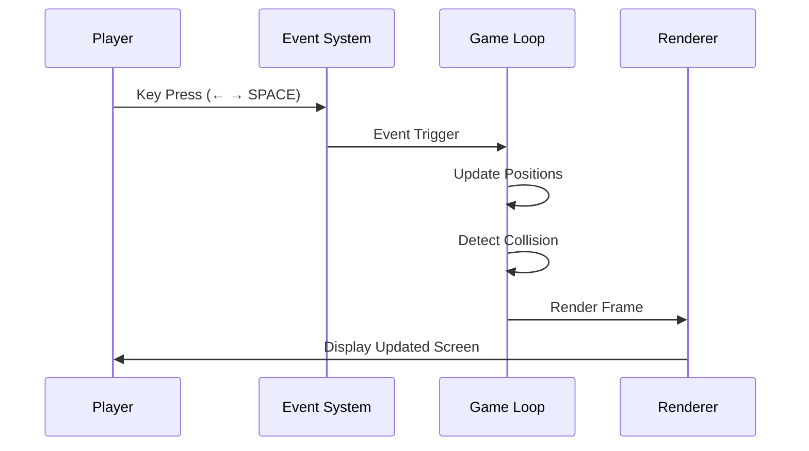

# 🚀 Space Bullet Shooter Game  
### 2D Arcade Shooting Game using Python & Pygame


---

## 📌 Project Overview

<details>
<summary><strong>🔽 Description</strong></summary>

**Space Bullet Shooter Game** is a classic **2D arcade-style space shooting game** built using **Python and Pygame**.  
The player controls a spaceship, fires bullets to destroy incoming enemies, scores points, and survives until enemies breach the defense line.

This project demonstrates **real-time game loops, collision detection, event-driven programming, audio handling, sprite rendering, and state management**—making it suitable for **learning game development fundamentals and showcasing Python graphical programming skills**.

</details>

---

## 📚 Table of Contents

<details>
<summary><strong>🔽 Expand Table of Contents</strong></summary>

1. Project Overview  
2. Key Features  
3. Tech Stack  
4. Game Architecture  
5. Data Flow Diagram (DFD)  
6. Game Execution Flow  
7. Controls & Gameplay  
8. Real-World Use Cases  
9. Example Gameplay Scenario  
10. Pros & Cons  
11. Limitations  
12. Performance Notes  
13. Future Enhancements  
14. Author & Credits  

</details>

---

## ✨ Key Features

<details>
<summary><strong>🔽 Core Features</strong></summary>

- 🎮 Real-time 2D arcade gameplay
- 🚀 Player-controlled spaceship movement
- 🔫 Bullet firing mechanics
- 👾 Multiple enemy spawning system
- 💥 Collision detection using distance calculation
- 🔊 Background music & sound effects
- 🧮 Live score tracking
- ❌ Game-over detection logic
- 🖥️ Fixed-resolution optimized rendering (800×600)

</details>

---

## 🛠️ Tech Stack

<details>
<summary><strong>🔽 Technology Breakdown</strong></summary>

- **Programming Language:** Python 3.x  
- **Game Engine:** Pygame  
- **Math Engine:** Python Math Library  
- **Audio Engine:** Pygame Mixer  
- **Design Pattern:** Procedural Game Loop  
- **Assets:** PNG sprites, WAV audio  

</details>

---

## 🧱 Game Architecture

<details>
<summary><strong>🔽 High-Level Architecture</strong></summary>

```mermaid
graph TD
    Player --> InputHandler
    InputHandler --> GameLoop
    GameLoop --> Player
    GameLoop --> Enemies
    GameLoop --> Bullet
    Bullet --> CollisionDetector
    CollisionDetector --> ScoreManager
    Enemies --> GameOverChecker
    GameLoop --> Renderer
    Renderer --> Screen
````

</details>

---

## 🔄 Data Flow Diagram (DFD)

<details>
<summary><strong>🔽 DFD – Level 1</strong></summary>

```mermaid
flowchart TD
    A[Player Input] --> B[Event Handler]
    B --> C[Game Logic Engine]
    C --> D[Player Movement]
    C --> E[Enemy Movement]
    C --> F[Bullet Mechanics]
    F --> G[Collision Detection]
    G --> H[Score Update]
    C --> I[Render Engine]
    I --> J[Display Screen]
```

</details>

---

## 🔁 Game Execution Flow

<details>
<summary><strong>🔽 Game Loop Flow</strong></summary>



</details>

---

## 🎮 Controls & Gameplay

<details>
<summary><strong>🔽 Controls</strong></summary>

* ⬅️ **Left Arrow:** Move spaceship left
* ➡️ **Right Arrow:** Move spaceship right
* 🔲 **Spacebar:** Fire bullet

</details>

---

## 🌍 Real-World Use Cases

<details>
<summary><strong>🔽 Practical Applications</strong></summary>

* 🎓 Learning **game development fundamentals**
* 🧠 Understanding **event-driven programming**
* 🖥️ Demonstrating **graphics & animation handling**
* 🔊 Audio integration using Python
* 📂 Portfolio project for **Python developers**
* 🎮 Foundation for advanced game engines (Unity, Godot)

</details>

---

## 🧪 Example Gameplay Scenario

<details>
<summary><strong>🔽 Example</strong></summary>

A player launches the game, moves the spaceship horizontally to dodge enemies, fires bullets to destroy them, earns points, and continues until enemies cross the lower boundary—triggering **GAME OVER** and displaying the final score.

</details>

---

## ✅ Pros & ❌ Cons

<details>
<summary><strong>🔽 Analysis</strong></summary>

### ✅ Pros

* Simple and easy-to-understand codebase
* Real-time rendering and sound integration
* Beginner-friendly game architecture
* Efficient collision detection
* Good demonstration of Pygame fundamentals

### ❌ Cons

* No difficulty scaling
* No levels or boss enemies
* Fixed screen resolution
* Single bullet firing at a time
* Procedural structure (not OOP-based)

</details>

---

## ⚠️ Limitations

<details>
<summary><strong>🔽 Known Constraints</strong></summary>

* No pause/resume functionality
* No settings or menu system
* Hardcoded assets and paths
* Limited enemy AI behavior

</details>

---

## ⚙️ Performance Notes

<details>
<summary><strong>🔽 Optimization Insights</strong></summary>

* Uses `pygame.time.Clock()` for FPS control
* Efficient sprite blitting
* Lightweight collision checks
* Suitable for low-end systems

</details>

---

## 🚀 Future Enhancements

<details>
<summary><strong>🔽 Roadmap</strong></summary>

* 🧠 Smarter enemy AI
* 🏆 Level progression system
* 💾 High-score persistence
* 🎯 Power-ups & multiple bullets
* 🎨 Animated sprites
* 🧩 Object-Oriented refactor
* 🌐 Multiplayer support

</details>

---

## 👨‍💻 Author & Credits

<details>
<summary><strong>🔽 Author Information</strong></summary>

**Author:** Alok Kumar
**Date:** 06/09/2025
**Repository:**
🔗 [https://github.com/alok-kumar8765/Cool_Project_2](https://github.com/alok-kumar8765/Cool_Project_2)

© All Rights Reserved

</details>

---

⭐ **If you found this project helpful, please consider starring the repository!**


---

