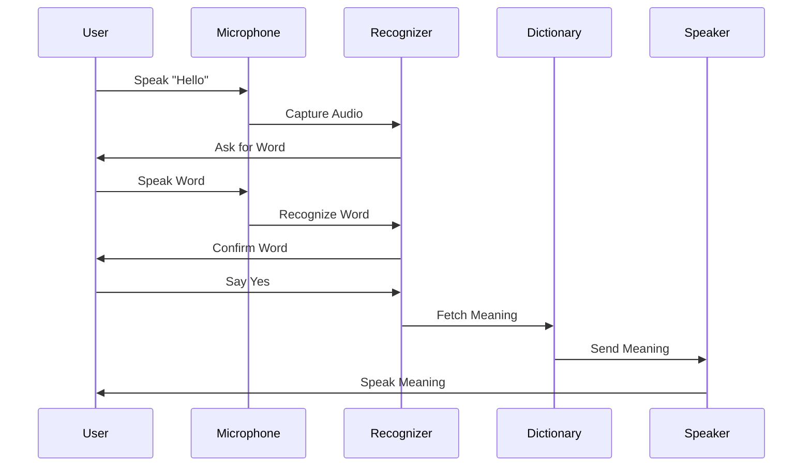

# 🗣️ Speaking Dictionary  
### Voice-Controlled Dictionary using Python


---

## 📌 Project Overview

<details>
<summary><strong>🔽 Description</strong></summary>

**Speaking Dictionary** is a **voice-activated intelligent dictionary system** built using **Python**, capable of **listening, understanding, processing, and speaking word meanings aloud**.

The application simulates a **basic voice assistant**, combining **Speech-to-Text (STT)**, **Natural Language Processing**, and **Text-to-Speech (TTS)** technologies to deliver a **hands-free learning experience**.

This project is ideal for **AI beginners, accessibility tools, voice-based systems, and educational applications**.

</details>

---

## 📚 Table of Contents

<details>
<summary><strong>🔽 Expand Table of Contents</strong></summary>

1. Project Overview  
2. Key Features  
3. Technology Stack  
4. System Architecture  
5. Data Flow Diagram (DFD)  
6. Program Execution Flow  
7. Voice Interaction Workflow  
8. Real-World Use Cases  
9. Example Scenario  
10. Pros & Cons  
11. Limitations  
12. Security & Privacy Notes  
13. Performance Considerations  
14. Future Enhancements  
15. Author & Repository  

</details>

---

## ✨ Key Features

<details>
<summary><strong>🔽 Core Features</strong></summary>

- 🎤 Voice-based system activation using keyword **“Hello”**
- 🧠 Speech-to-Text using **Google Speech Recognition**
- 📖 Word meaning retrieval using **PyDictionary**
- 🔊 Text-to-Speech output using **pyttsx3**
- 🤖 Interactive confirmation (Yes / No)
- ♿ Hands-free & accessibility-friendly
- 🧪 Robust exception handling
- 🔄 Multi-stage voice interaction

</details>

---

## 🛠️ Technology Stack

<details>
<summary><strong>🔽 Tech Breakdown</strong></summary>

- **Programming Language:** Python 3.x  
- **Speech Recognition:** `speech_recognition`  
- **Dictionary Engine:** `PyDictionary`  
- **Text-to-Speech (Offline):** `pyttsx3`  
- **Speech Engine:** Google Speech API  
- **Microphone Input:** PyAudio backend  

</details>

---

## 🧱 System Architecture

<details>
<summary><strong>🔽 High-Level Architecture</strong></summary>

```mermaid
graph TD
    User --> Microphone
    Microphone --> SpeechRecognizer
    SpeechRecognizer --> CommandProcessor
    CommandProcessor --> DictionaryEngine
    DictionaryEngine --> MeaningExtractor
    MeaningExtractor --> TextToSpeech
    TextToSpeech --> Speaker
````

</details>

---

## 🔄 Data Flow Diagram (DFD)

<details>
<summary><strong>🔽 DFD – Level 1</strong></summary>

```mermaid
flowchart TD
    A[User Voice Input] --> B[Speech Recognition]
    B --> C[Keyword Validation]
    C --> D[Word Capture]
    D --> E[Confirmation Check]
    E --> F[Dictionary Lookup]
    F --> G[Meaning Output]
    G --> H[Voice Response]
```

</details>

---

## 🔁 Program Execution Flow

<details>
<summary><strong>🔽 Execution Flow</strong></summary>



</details>

---

## 🗣️ Voice Interaction Workflow

<details>
<summary><strong>🔽 Interaction Steps</strong></summary>

1. User says **“Hello”** to activate system
2. System asks for the word
3. User speaks the word
4. System confirms recognition
5. Dictionary fetches meaning
6. Meaning is spoken aloud

</details>

---

## 🌍 Real-World Use Cases

<details>
<summary><strong>🔽 Practical Applications</strong></summary>

* 📚 Language learning tools
* ♿ Accessibility solutions for visually impaired users
* 🧠 AI voice assistant foundations
* 🎓 Educational voice-based software
* 🗣️ Pronunciation & vocabulary training
* 🤖 Conversational AI demos

</details>

---

## 🧪 Example Scenario

<details>
<summary><strong>🔽 Example</strong></summary>

A student says **“Hello”**, then speaks the word **“Innovation”**.
The system confirms the word and **reads the dictionary meaning aloud**, enabling hands-free learning.

</details>

---

## ✅ Pros & ❌ Cons

<details>
<summary><strong>🔽 Analysis</strong></summary>

### ✅ Pros

* Fully voice-controlled
* Beginner-friendly AI project
* Offline TTS support
* Strong exception handling
* Enhances accessibility

### ❌ Cons

* Requires active internet for speech recognition
* Limited natural language understanding
* Single-word interaction only
* Platform-dependent speech engine (Windows optimized)

</details>

---

## ⚠️ Limitations

<details>
<summary><strong>🔽 Known Constraints</strong></summary>

* No GUI interface
* No pronunciation playback
* Accuracy depends on microphone quality
* Not multilingual by default

</details>

---

## 🔐 Security & Privacy Notes

<details>
<summary><strong>🔽 Compliance & Safety</strong></summary>

* No data storage
* No voice recordings saved
* Temporary in-memory processing only
* Safe for local execution

</details>

---

## ⚙️ Performance Considerations

<details>
<summary><strong>🔽 Optimization Notes</strong></summary>

* Lightweight processing
* Minimal memory footprint
* Real-time response
* Suitable for low-end systems

</details>

---

## 🚀 Future Enhancements

<details>
<summary><strong>🔽 Roadmap</strong></summary>

* 🌐 Multilingual support
* 🧠 NLP-based sentence understanding
* 🖥️ GUI using Tkinter / PyQt
* 📱 Mobile assistant integration
* 🗂️ Offline dictionary support
* 🤖 Wake-word detection

</details>

---

## 👨‍💻 Author & Repository

<details>
<summary><strong>🔽 Author Details</strong></summary>

**Author:** Alok Kumar
**Repository:**
🔗 [https://github.com/alok-kumar8765/Cool_Project_2](https://github.com/alok-kumar8765/Cool_Project_2)
**Module Path:** `Speaking_Dictionary`

© All Rights Reserved

</details>

---

⭐ **If this project helped you, please consider starring the repository!**

---
