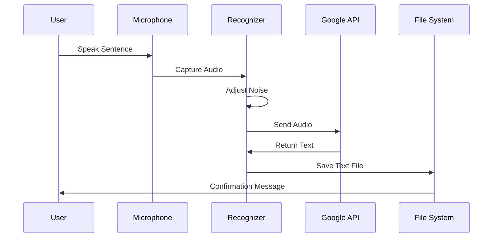

# 🎙️ Speech to Text System  
### Voice Recognition & Transcription Utility using Python


---

## 📌 Project Overview

<details>
<summary><strong>🔽 Description</strong></summary>

**Speech to Text System** is a lightweight **voice recognition and transcription tool** developed using **Python and the SpeechRecognition library**.  
It captures live audio from a microphone, converts speech into text using **Google Speech Recognition**, and persists the recognized content into a text file.

This project demonstrates **real-time audio processing, speech-to-text AI integration, noise handling, and file persistence**, making it ideal for **automation, accessibility, voice-driven workflows, and AI learning projects**.

</details>

---

## 📚 Table of Contents

<details>
<summary><strong>🔽 Expand Table of Contents</strong></summary>

1. Project Overview  
2. Key Features  
3. Technology Stack  
4. System Architecture  
5. Data Flow Diagram (DFD)  
6. Execution Flow Diagram  
7. Voice Processing Workflow  
8. Real-World Use Cases  
9. Example Scenario  
10. Pros & Cons  
11. Limitations  
12. Security & Privacy Notes  
13. Performance Considerations  
14. Future Enhancements  
15. Author & Repository  

</details>

---

## ✨ Key Features

<details>
<summary><strong>🔽 Core Capabilities</strong></summary>

- 🎤 Real-time microphone audio capture
- 🧠 Speech-to-Text conversion using Google API
- 🔇 Automatic ambient noise adjustment
- 📝 Text transcription saved to file
- ⚡ Lightweight & fast execution
- ♿ Accessibility-friendly voice input
- 🧪 Exception handling for unclear speech

</details>

---

## 🛠️ Technology Stack

<details>
<summary><strong>🔽 Tech Breakdown</strong></summary>

- **Programming Language:** Python 3.x  
- **Speech Recognition:** `speech_recognition`  
- **Audio Input:** System Microphone  
- **Speech Engine:** Google Speech Recognition API  
- **Output Format:** Plain text file (`.txt`)  

</details>

---

## 🧱 System Architecture

<details>
<summary><strong>🔽 High-Level Architecture</strong></summary>

```mermaid
graph TD
    User --> Microphone
    Microphone --> SpeechRecognizer
    SpeechRecognizer --> AudioProcessor
    AudioProcessor --> GoogleSpeechAPI
    GoogleSpeechAPI --> TextOutput
    TextOutput --> FileSystem
````

</details>

---

## 🔄 Data Flow Diagram (DFD)

<details>
<summary><strong>🔽 DFD – Level 1</strong></summary>

```mermaid
flowchart TD
    A[User Speech] --> B[Microphone Input]
    B --> C[Noise Adjustment]
    C --> D[Speech Recognition Engine]
    D --> E[Text Extraction]
    E --> F[File Writer]
    F --> G[you_said_this.txt]
```

</details>

---

## 🔁 Execution Flow Diagram

<details>
<summary><strong>🔽 Program Flow</strong></summary>



</details>

---

## 🎧 Voice Processing Workflow

<details>
<summary><strong>🔽 Processing Steps</strong></summary>

1. Initialize speech recognizer
2. Capture live audio from microphone
3. Adjust for ambient noise
4. Convert speech to text
5. Handle recognition errors
6. Save output to text file

</details>

---

## 🌍 Real-World Use Cases

<details>
<summary><strong>🔽 Practical Applications</strong></summary>

* ♿ Accessibility tools for hands-free input
* 🧠 AI voice assistant foundations
* 📝 Voice-based note-taking systems
* 🧪 Speech recognition learning projects
* 🎓 Educational demonstrations
* 🏢 Voice-driven automation workflows

</details>

---

## 🧪 Example Scenario

<details>
<summary><strong>🔽 Example</strong></summary>

A developer speaks **“Deploy the application tomorrow”** into the microphone.
The system converts the speech into text and saves it into `you_said_this.txt` for later processing or automation.

</details>

---

## ✅ Pros & ❌ Cons

<details>
<summary><strong>🔽 Analysis</strong></summary>

### ✅ Pros

* Simple and clean implementation
* Real-time speech recognition
* Noise adjustment improves accuracy
* Easy to integrate into larger systems
* Beginner-friendly AI project

### ❌ Cons

* Requires internet connectivity
* Limited language support by default
* No GUI interface
* Accuracy depends on microphone quality

</details>

---

## ⚠️ Limitations

<details>
<summary><strong>🔽 Known Constraints</strong></summary>

* Single sentence capture per execution
* No continuous listening mode
* No punctuation optimization
* No multilingual configuration

</details>

---

## 🔐 Security & Privacy Notes

<details>
<summary><strong>🔽 Compliance & Safety</strong></summary>

* No audio stored permanently
* No user data retention
* Temporary in-memory processing
* Safe for local execution

</details>

---

## ⚙️ Performance Considerations

<details>
<summary><strong>🔽 Optimization Insights</strong></summary>

* Minimal CPU & memory usage
* Fast transcription response
* Suitable for low-end systems
* Scales well for automation scripts

</details>

---

## 🚀 Future Enhancements

<details>
<summary><strong>🔽 Roadmap</strong></summary>

* 🌐 Multilingual speech support
* 🔁 Continuous listening mode
* 🖥️ GUI interface (Tkinter / PyQt)
* 📱 Mobile integration
* 🧠 NLP intent classification
* ☁️ Cloud-based transcription pipeline

</details>

---

## 👨‍💻 Author & Repository

<details>
<summary><strong>🔽 Author Information</strong></summary>

**Author:** Alok Kumar
**Repository:**
🔗 [https://github.com/alok-kumar8765/Cool_Project_2](https://github.com/alok-kumar8765/Cool_Project_2)
**Module Path:** `Speech_to_text`

© All Rights Reserved

</details>

---

⭐ **If this project helped you, please consider starring the repository!**


---

