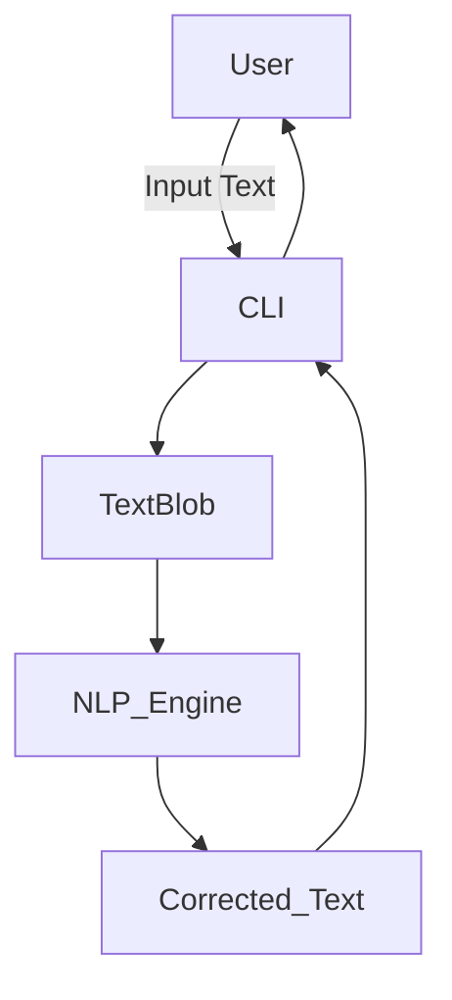
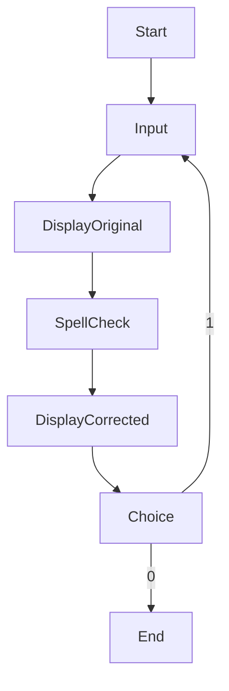
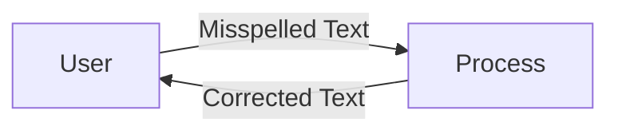

# 🧠 Cool Project 2 — Spell Checker using TextBlob

<p align="center">
  
  
  
  
  
</p>

---

## 📌 Project Title
**Interactive Spell Checker using TextBlob (Python CLI Tool)**

---

<details>
<summary><h2>📖 Description</h2></summary>

This project is a **command-line based interactive spell checker** built using **Python** and the **TextBlob NLP library**.  
It allows users to input a word or sentence and instantly receive a **corrected version** using Natural Language Processing techniques.

The program runs in a loop, enabling continuous spell-checking until the user chooses to exit.

</details>

---

<details>
<summary><h2>📚 Table of Contents</h2></summary>

- 📖 Description  
- ⚙️ Technologies Used  
- 🧩 Code Explanation  
- 🏗️ Architecture Diagram  
- 🔄 Flow Diagram  
- 📊 Data Flow Diagram (DFD)  
- 🚀 How It Works  
- 💡 Use Cases  
- 🌍 Real-World Applications  
- ✅ Pros  
- ❌ Cons  
- 📦 Installation  
- ▶️ Execution  
- 🧪 Example  
- 📜 License  

</details>

---

<details>
<summary><h2>⚙️ Technologies Used</h2></summary>

- **Python 3.x**
- **TextBlob**
- **Natural Language Processing (NLP)**
- **CLI (Command Line Interface)**

</details>

---

<details>
<summary><h2>🧩 Code Explanation</h2></summary>

### 🔹 Step-by-Step Breakdown

- Import `TextBlob` for spell correction
- Run an infinite loop using a control variable
- Accept user input (incorrect spelling)
- Display original input
- Use `TextBlob.correct()` to fix spelling
- Ask user whether to retry or exit

### 🔹 Core Logic
- `TextBlob(a).correct()` internally:
  - Tokenizes words
  - Matches against a trained corpus
  - Suggests most probable correction

</details>

---

<details>
<summary><h2>🏗️ System Architecture (Mermaid)</h2></summary>



</details>

---

<details>
<summary><h2>🔄 Flow Diagram (Mermaid)</h2></summary>



</details>

---

<details>
<summary><h2>📊 Data Flow Diagram (DFD)</h2></summary>



</details>

---

<details>
<summary><h2>🚀 How It Works</h2></summary>

- User enters a word or sentence

- System processes input using NLP

- Spellings are corrected probabilistically

- Output is displayed instantly

- User chooses to continue or exit


</details>

---

<details>
<summary><h2>💡 Use Cases</h2></summary>

- Spell checking during learning

- Improving typing accuracy

- NLP experimentation

- CLI automation tools

- Preprocessing text for ML models


</details>

---

<details>
<summary><h2>🌍 Real-World Applications</h2></summary>

### 📌 Examples

Search Engines

> Google suggesting correct spellings


Chat Applications

> Auto-correction while typing


E-Learning Platforms

> Helping students improve writing


Content Moderation Systems

> Cleaning noisy user input


</details>

---

<details>
<summary><h2>✅ Pros</h2></summary>

- Easy to understand

- Lightweight & fast

- NLP-powered correction

- Beginner friendly

- Reusable in other projects


</details>

---

<details>
<summary><h2>❌ Cons</h2></summary>

- Limited context awareness

- Not ideal for large documents

- Depends on TextBlob accuracy

- CLI-only (no GUI)


</details>

---

<details>
<summary><h2>📦 Installation</h2></summary>

```
pip install textblob
python -m textblob.download_corpora
```

</details>

---

<details>
<summary><h2>▶️ Execution</h2></summary>

```
python spell_checker.py
```
</details>

---

<details>
<summary><h2>🧪 Example</h2></summary>

```cli
Enter the word to be checked:- speling
original text: speling
corrected text: spelling
Try Again? 1 : 0
```

</details>

---

<details>
<summary><h2>📜 License</h2></summary>

This project is licensed under the MIT License.
You are free to use, modify, and distribute it.

</details>

---

<p align="center">
⭐ If you found this useful, don’t forget to star the repo!  
</p>

---

