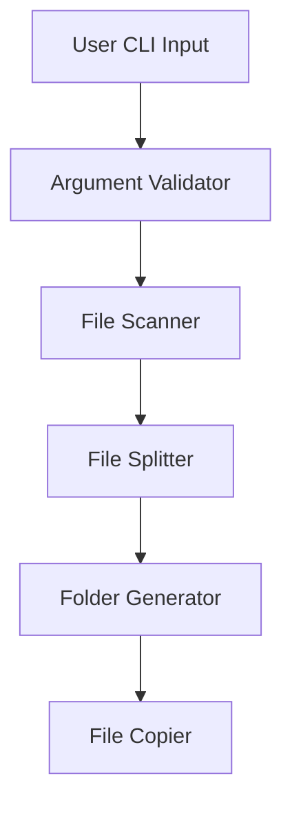
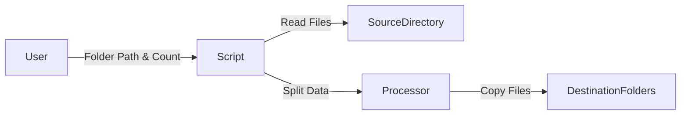
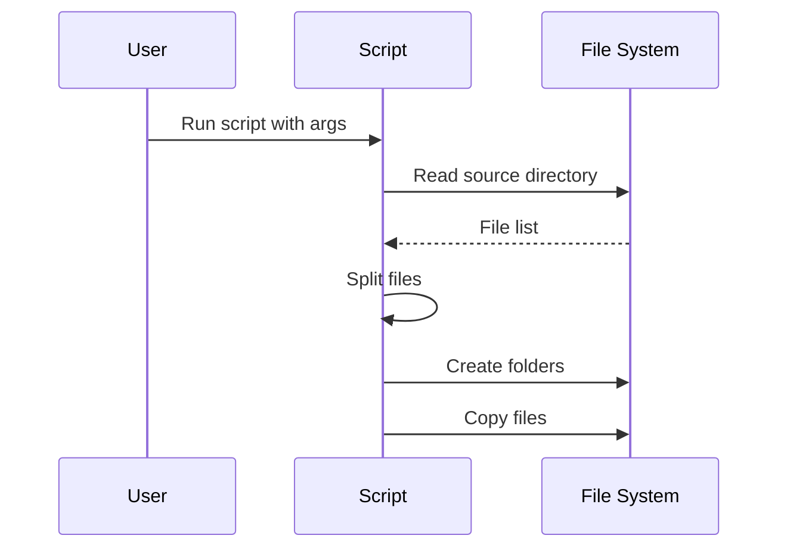

# 📂 Cool_Project_2 — File Split & Copy Automation Tool

<p align="center">
  <b>Automated File Distribution Utility using Python</b><br>
  Efficiently split and copy files into multiple folders based on a defined count
</p>

<p align="center">
  <a href="https://github.com/alok-kumar8765/Cool_Project_2">
    
  </a>
  
  
  
  
</p>

---

## 🧾 Project Overview

<details>
<summary><b>📌 Description</b></summary>

This project is a **Python-based file automation tool** that:

- Reads files from a source directory
- Splits them into **batches of fixed size**
- Copies each batch into **auto-generated folders**
- Preserves file metadata during copying

It is especially useful for **data preparation, batch processing, backups, and automation workflows**.

</details>

---

## 📑 Table of Contents

<details>
<summary><b>📚 Expand Index</b></summary>

1. Project Overview  
2. Features  
3. Tech Stack  
4. How It Works  
5. Code Explanation  
6. Architecture Diagram  
7. Data Flow Diagram (DFD)  
8. Process Flow Diagram  
9. Usage Instructions  
10. Example  
11. Real-World Use Cases  
12. Pros & Cons  
13. Future Improvements  
14. Author  

</details>

---

## ✨ Features

<details>
<summary><b>🚀 Key Highlights</b></summary>

- 📁 Automatically scans input directory
- 🔢 Splits files into configurable batch sizes
- 🗂 Creates destination folders dynamically
- 📄 Preserves file metadata (`copy2`)
- ⚡ Lightweight & fast
- 🧩 Modular & reusable functions
- 🖥 CLI-based execution

</details>

---

## 🛠 Tech Stack

<details>
<summary><b>🧰 Technologies Used</b></summary>

- **Language:** Python 3.x
- **Libraries:**
  - `glob` – File pattern matching
  - `os` – OS-level operations
  - `shutil.copy2` – Metadata-preserving copy
  - `sys` – CLI argument handling

</details>

---

## ⚙️ How It Works

<details>
<summary><b>🧠 Logical Explanation</b></summary>

1. User provides:
   - Source folder path
   - Number of files per batch
2. Script fetches all files from source
3. Files are split into chunks
4. Each chunk is copied into:
   - `data_0`, `data_1`, `data_2`, ...
5. Destination folders are auto-created if missing

</details>

---

## 🧩 Code Explanation

<details>
<summary><b>📜 Function Breakdown</b></summary>

- **`get_files(path)`**
  - Fetches all files from a directory

- **`getfullpath(path)`**
  - Converts relative paths to absolute paths

- **`copyfiles(src, dst)`**
  - Copies files safely (creates folder if needed)

- **`split(data, count)`**
  - Generator that splits files into batches

- **`start_process(path, count)`**
  - Orchestrates splitting and copying logic

- **`__main__` block**
  - Handles CLI arguments and validations

</details>

---

## 🏗 Architecture Diagram

<details>
<summary><b>📐 System Architecture</b></summary>


</details>

---

## 🔄 Data Flow Diagram (DFD)

<details>
<summary><b>📊 DFD Level 1</b></summary>


</details>

---

## 🔁 Process Flow Diagram

<details>
<summary><b>🔀 Execution Flow</b></summary>



</details>

---

## ▶️ Usage Instructions

<details>
<summary><b>🧪 How to Run</b></summary>

```
python split_and_copy.py <input_folder_path> <count>
```

📌 Example:

```
python split_and_copy.py ./images 20
```

This will create:

```
data_0/
data_1/
data_2/
```

Each containing 20 files (or remaining).

</details>

---

## 🌍 Real-World Use Cases

<details>
<summary><b>💡 Practical Applications</b></summary>

- 📦 Dataset preparation for ML training

- 📤 Uploading files with API limits

- 💾 Backup chunking

- 🧪 Test data distribution

- 🗃 Archiving large directories

- 📸 Image batch processing


</details>

---

## ⚖️ Pros & Cons

<details>
<summary><b>✅ Advantages</b></summary>

- Simple & readable code

- No external dependencies

- Fast execution

- Cross-platform

- Safe file copying


</details><details>
<summary><b>⚠️ Limitations</b></summary>

- No logging system

- No parallel processing

- Copies only (no move/delete)

- Flat directory handling only


</details>

---

## 🔮 Future Improvements

<details>
<summary><b>🚧 Enhancements</b></summary>

- Add logging & error handling

- Parallel copying (multithreading)

- GUI interface

- Config file support

- File type filtering

- Dry-run mode


</details>

---

👤 Author

<details>
<summary><b>🙋 About Me</b></summary>Alok Kumar
🔗 GitHub: alok-kumar8765
📦 Project: Cool_Project_2

If you find this useful, ⭐ the repo!

</details>

---

<p align="center">
  <b>🚀 Happy Automating!</b>
</p>

---

