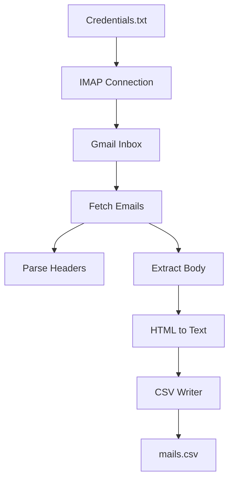
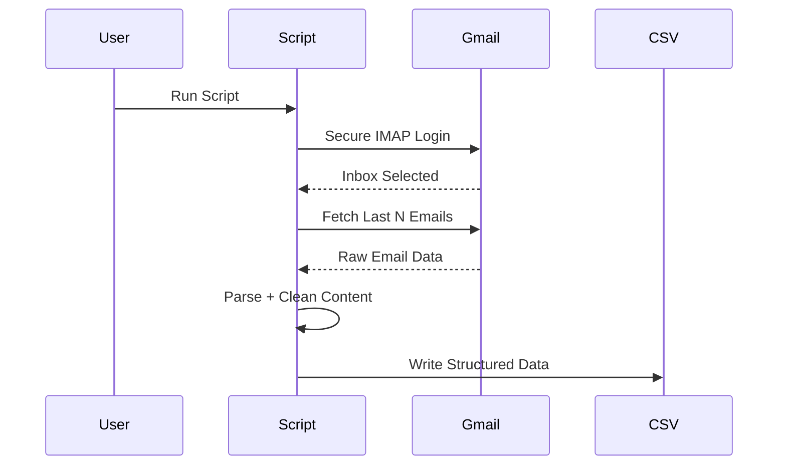
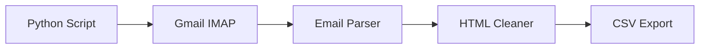

# 📧 IMAP Email Poller to CSV Exporter

<p align="center">
  <b>A professional Python utility to securely fetch emails from Gmail (IMAP) and export them into a structured CSV file.</b>
</p>

<p align="center">
  <a href="https://github.com/alok-kumar8765/Cool_Project_2"></a>
  
  
  
  
</p>

---

## 📌 Project Description

<details>
<summary><b>Click to expand</b></summary>

This project is a **Python-based IMAP email polling system** that:

- Securely connects to **Gmail IMAP**
- Fetches the **latest N emails**
- Extracts:
  - Date
  - Sender
  - Subject
  - Email body (HTML → plain text)
- Stores all extracted data into a **CSV file**
- Handles multipart emails gracefully
- Uses **BeautifulSoup** for clean text extraction

Designed for **automation, logging, analytics, and email processing pipelines**.

</details>

---

## 📚 Table of Contents

<details>
<summary><b>Click to expand</b></summary>

1. Architecture Overview  
2. Data Flow Diagram (DFD)  
3. System Flow Diagram  
4. Code Explanation  
5. Folder & File Structure  
6. Configuration & Credentials  
7. Execution Flow  
8. Mermaid Diagrams  
9. Pros & Cons  
10. Real World Use Cases  
11. Example Scenarios  
12. Security Considerations  
13. Limitations  
14. Future Enhancements  

</details>

---

## 🏗 Architecture Overview

<details>
<summary><b>Click to expand</b></summary>

**High-Level Components:**

- IMAP Client (`imaplib`)
- Email Parser (`email`, `policy`)
- HTML Cleaner (`BeautifulSoup`)
- CSV Writer (`csv`)
- Secure SSL Layer (`ssl`)
- Logging Module (`logging`)

**Architecture Style:**  
➡️ Procedural + Modular Utility Script

</details>

---

## 🔁 Data Flow Diagram (DFD)

<details>
<summary><b>Click to expand</b></summary>



</details>

---

🔄 System Flow Diagram

<details>
<summary><b>Click to expand</b></summary>



</details>

---

## 🧠 Code Explanation (Module-wise)

<details>
<summary><b>Click to expand</b></summary>

## 1️⃣ Connection Handling

- Uses imaplib.IMAP4_SSL

- Secure SSL context

- Credentials loaded from file


## 2️⃣ Email Parsing

> email.message_from_bytes

### Handles:

- Multipart emails

- Attachments (ignored)

- Plain & HTML content


## 3️⃣ Text Extraction

- Uses BeautifulSoup

- Converts HTML → clean plain text


## 4️⃣ CSV Export

- UTF-8 encoding

- Structured columns:

- Date

- From

- Subject

- Body


## 5️⃣ Logging

- Graceful error handling

- Warnings instead of crashes


</details>

---

## 📂 Folder & File Structure

<details>
<summary><b>Click to expand</b></summary>

```text
Cool_Project_2/
│
├── credentials.txt     # Gmail username & app password
├── mails.csv           # Output file
├── imap_poller.py      # Main script
└── README.md
```

</details>

---

## ⚙️ Configuration & Credentials

<details>
<summary><b>Click to expand</b></summary>

> credentials.txt

```
your_email@gmail.com
your_app_password
```

⚠️ Use Gmail App Passwords, NOT your main password.

</details>

---

## ▶ Execution Flow

<details>
<summary><b>Click to expand</b></summary>

- Read credentials

- Establish IMAP SSL connection

- Select inbox

- Fetch latest N emails

- Parse headers & body

- Clean HTML

- Export to CSV

- Exit safely


</details>

---

## 📊 Mermaid Architecture Diagram

<details>
<summary><b>Click to expand</b></summary>



</details>

---

## ✅ Pros & ❌ Cons

<details>
<summary><b>Click to expand</b></summary>

## ✅ Pros

- Lightweight & fast

- Secure IMAP over SSL

- Clean CSV output

- Easy to automate

- Minimal dependencies


## ❌ Cons

- Gmail-specific (IMAP config)

- No attachment saving

- No OAuth (uses app password)

- Single mailbox support


</details>

---

## 🌍 Real World Use Cases

<details>
<summary><b>Click to expand</b></summary>

- 📈 Email analytics

- 🧾 Compliance email archiving

- 🤖 Email-based automation

- 📊 CRM email ingestion

- 🛠 Monitoring alert emails


</details>

---

## 🧪 Example Scenarios

<details>
<summary><b>Click to expand</b></summary>

- Export last 100 support emails for audit

- Log security alerts into CSV

- Process invoice emails

- Feed emails into ML pipelines

- Backup important communications


</details>

---

## 🔐 Security Considerations

<details>
<summary><b>Click to expand</b></summary>

- Uses SSL encryption

- Credentials stored locally (recommended .gitignore)

- No plaintext logging

- Gmail App Password required


</details>

---

## 🚧 Limitations

<details>
<summary><b>Click to expand</b></summary>
- No pagination

- No parallel fetching

- No database storage

- Manual credential handling


</details>

---

## 🚀 Future Enhancements

<details>
<summary><b>Click to expand</b></summary>

- OAuth2 authentication

- Attachment export

- Database support (PostgreSQL)

- Async IMAP fetching

- Dockerized deployment

- Web dashboard


</details>

---

👨‍💻 Author

Alok Kumar

🔗 GitHub: https://github.com/alok-kumar8765


---

📜 License

This project is licensed under the MIT License.


---

⭐ If you like this project, don’t forget to star the repo!

---

