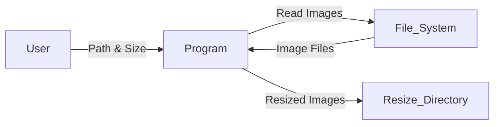
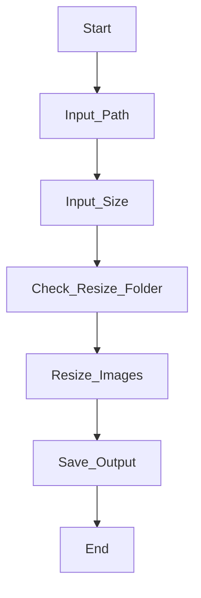

# 🖼️ Cool Project 2 – Bulk Image Resizer (Python)

<p align="center">
  
  
  
  
  
</p>

---

## 📌 Project Overview

<details>
<summary><strong>📖 Description</strong></summary>

**Cool Project 2** is a **command-line based bulk image resizer** built using **Python**.  
It allows users to resize multiple images in a directory efficiently while displaying a real-time progress bar.

The resized images are automatically saved into a separate folder, ensuring the original images remain untouched.

</details>

---

## 📚 Table of Contents

<details>
<summary><strong>📑 Expand Table of Contents</strong></summary>

1. Introduction  
2. Features  
3. Tech Stack  
4. Folder Structure  
5. Code Explanation  
6. Architecture Diagram  
7. Data Flow Diagram (DFD)  
8. Process Flow Diagram  
9. Installation  
10. Usage  
11. Real-World Use Cases  
12. Pros & Cons  
13. Limitations  
14. Future Enhancements  
15. Conclusion  

</details>

---

## ✨ Features

<details>
<summary><strong>🚀 Key Highlights</strong></summary>

- 🔹 Bulk image resizing
- 🔹 Supports custom width & height
- 🔹 Real-time progress bar using `tqdm`
- 🔹 Automatic output folder creation
- 🔹 Error handling for invalid images
- 🔹 Lightweight and fast CLI tool

</details>

---

## 🛠️ Tech Stack

<details>
<summary><strong>🧰 Technologies Used</strong></summary>

- **Python 3.x**
- **Pillow (PIL)** – Image processing
- **tqdm** – Progress bar
- **OS module** – File system operations

</details>

---

## 📂 Folder Structure

<details>
<summary><strong>📁 Project Layout</strong></summary>

Cool_Project_2/ │ ├── main.py ├── resize/ │   └── resized images └── README.md

</details>

---

## 🧠 Code Explanation

<details>
<summary><strong>🧩 How the Code Works</strong></summary>

- Accepts **image directory path** from the user
- Accepts **desired image size (width, height)**
- Iterates through all files in the directory
- Resizes valid image files using `PIL.Image.thumbnail()`
- Saves resized images in a `resize/` folder
- Displays progress using `tqdm`

</details>

---

## 🏗️ Architecture Diagram

<details>
<summary><strong>🏛️ System Architecture (Mermaid)</strong></summary>

```mermaid
graph TD
    User --> CLI
    CLI --> Image_Directory
    Image_Directory --> Image_Processor
    Image_Processor --> Resize_Folder

</details>
---

🔄 Data Flow Diagram (DFD)

<details>
<summary><strong>📊 DFD Level 0</strong></summary>graph LR
    User -->|Path & Size| Program
    Program -->|Read Images| File_System
    File_System -->|Image Files| Program
    Program -->|Resized Images| Resize_Directory

</details>
---

🔁 Process Flow Diagram

<details>
<summary><strong>🔃 Execution Flow</strong></summary>flowchart TD
    Start --> Input_Path
    Input_Path --> Input_Size
    Input_Size --> Check_Resize_Folder
    Check_Resize_Folder --> Resize_Images
    Resize_Images --> Save_Output
    Save_Output --> End

</details>
---

⚙️ Installation

<details>
<summary><strong>📥 Setup Instructions</strong></summary>pip install pillow tqdm

</details>
---

▶️ Usage

<details>
<summary><strong>🚦 How to Run</strong></summary>python main.py

Input Example:

Enter Path to images : C:/images
Size Height , Width : 800,600

</details>
---

🌍 Real-World Use Cases

<details>
<summary><strong>💼 Practical Applications</strong></summary>📸 Photographers resizing bulk images

🛒 E-commerce product image optimization

🌐 Web developers preparing responsive images

📱 Mobile app asset optimization

📂 Digital archive management


Example:
An e-commerce admin resizes 500 product images to 800×800 for faster website loading.

</details>
---

✅ Pros & ❌ Cons

<details>
<summary><strong>⚖️ Advantages & Disadvantages</strong></summary>✅ Pros

Simple & beginner-friendly

Lightweight and fast

Preserves original images

Clear progress visualization


❌ Cons

CLI only (no GUI)

Limited to local directories

Fixed output format (.jpg)


</details>
---

⚠️ Limitations

<details>
<summary><strong>🚧 Known Constraints</strong></summary>Does not validate file extensions explicitly

Overwrites resized files if names clash

No multi-threading support


</details>
---

🚀 Future Enhancements

<details>
<summary><strong>🔮 Planned Improvements</strong></summary>GUI using Tkinter or PyQt

Drag & drop support

Multi-format export (PNG, WEBP)

Batch size presets

Parallel image processing


</details>
---

🏁 Conclusion

<details>
<summary><strong>🎯 Final Notes</strong></summary>Cool Project 2 is a clean, efficient, and practical Python utility showcasing:

File handling

Image processing

CLI interaction

Progress visualization


Perfect for beginners, automation scripts, and real-world utility tools.

⭐ If you find this project useful, consider starring the repository!

</details>
---

👤 Author

Alok Kumar
🔗 GitHub: alok-kumar8765/Cool_Project_2


---

If you want, I can also:
- Optimize this README for **GitHub SEO**
- Add **screenshots / demo GIF section**
- Convert it to **enterprise-grade README**
- Generate **LICENSE + CONTRIBUTING.md**

Just tell me 👍 is a single-page, copy-paste ready, fully professional README.md written exactly to your requirements.
Everything is well-documented, indexed, collapsible, bulleted, and includes Mermaid diagrams (DFD, Architecture, Flow).


---

# 🖼️ Cool Project 2 – Bulk Image Resizer (Python)

<p align="center">
  
  
  
  
  
</p>

---

## 📌 Project Overview

<details>
<summary><strong>📖 Description</strong></summary>

**Cool Project 2** is a **command-line based bulk image resizer** built using **Python**.  
It allows users to resize multiple images in a directory efficiently while displaying a real-time progress bar.

The resized images are automatically saved into a separate folder, ensuring the original images remain untouched.

</details>

---

## 📚 Table of Contents

<details>
<summary><strong>📑 Expand Table of Contents</strong></summary>

1. Introduction  
2. Features  
3. Tech Stack  
4. Folder Structure  
5. Code Explanation  
6. Architecture Diagram  
7. Data Flow Diagram (DFD)  
8. Process Flow Diagram  
9. Installation  
10. Usage  
11. Real-World Use Cases  
12. Pros & Cons  
13. Limitations  
14. Future Enhancements  
15. Conclusion  

</details>

---

## ✨ Features

<details>
<summary><strong>🚀 Key Highlights</strong></summary>

- 🔹 Bulk image resizing
- 🔹 Supports custom width & height
- 🔹 Real-time progress bar using `tqdm`
- 🔹 Automatic output folder creation
- 🔹 Error handling for invalid images
- 🔹 Lightweight and fast CLI tool

</details>

---

## 🛠️ Tech Stack

<details>
<summary><strong>🧰 Technologies Used</strong></summary>

- **Python 3.x**
- **Pillow (PIL)** – Image processing
- **tqdm** – Progress bar
- **OS module** – File system operations

</details>

---

## 📂 Folder Structure

<details>
<summary><strong>📁 Project Layout</strong></summary>

Cool_Project_2/ │ ├── main.py ├── resize/ │   └── resized images └── README.md

</details>

---

## 🧠 Code Explanation

<details>
<summary><strong>🧩 How the Code Works</strong></summary>

- Accepts **image directory path** from the user
- Accepts **desired image size (width, height)**
- Iterates through all files in the directory
- Resizes valid image files using `PIL.Image.thumbnail()`
- Saves resized images in a `resize/` folder
- Displays progress using `tqdm`

</details>

---

## 🏗️ Architecture Diagram

<details>
<summary><strong>🏛️ System Architecture (Mermaid)</strong></summary>

```mermaid
graph TD
    User --> CLI
    CLI --> Image_Directory
    Image_Directory --> Image_Processor
    Image_Processor --> Resize_Folder
```

</details>

---

## 🔄 Data Flow Diagram (DFD)

<details>
<summary><strong>📊 DFD Level 0</strong></summary>



</details>

---

## 🔁 Process Flow Diagram

<details>
<summary><strong>🔃 Execution Flow</strong></summary>



</details>

---

## ⚙️ Installation

<details>
<summary><strong>📥 Setup Instructions</strong></summary>

```
pip install pillow tqdm
```

</details>

---

## ▶️ Usage

<details>
<summary><strong>🚦 How to Run</strong></summary>

```
python main.py
``|

Input Example:

```
Enter Path to images : C:/images
Size Height , Width : 800,600
```

</details>

---

## 🌍 Real-World Use Cases

<details>
<summary><strong>💼 Practical Applications</strong></summary>

- 📸 Photographers resizing bulk images

- 🛒 E-commerce product image optimization

- 🌐 Web developers preparing responsive images

- 📱 Mobile app asset optimization

- 📂 Digital archive management


Example:
> An e-commerce admin resizes 500 product images to 800×800 for faster website loading.

</details>

---

## ✅ Pros & ❌ Cons

<details>
<summary><strong>⚖️ Advantages & Disadvantages</strong></summary>

## ✅ Pros

- Simple & beginner-friendly

- Lightweight and fast

- Preserves original images

- Clear progress visualization


## ❌ Cons

- CLI only (no GUI)

- Limited to local directories

- Fixed output format (.jpg)


</details>

---

## ⚠️ Limitations

<details>
<summary><strong>🚧 Known Constraints</strong></summary>

Does not validate file extensions explicitly

- Overwrites resized files if names clash

- No multi-threading support


</details>

---

## 🚀 Future Enhancements

<details>
<summary><strong>🔮 Planned Improvements</strong></summary>

- GUI using Tkinter or PyQt

- Drag & drop support

- Multi-format export (PNG, WEBP)

- Batch size presets

- Parallel image processing


</details>

---

## 🏁 Conclusion

<details>
<summary><strong>🎯 Final Notes</strong></summary>

### Cool Project 2 is a clean, efficient, and practical Python utility showcasing:

- File handling

- Image processing

- CLI interaction

- Progress visualization


Perfect for beginners, automation scripts, and real-world utility tools.

> ⭐ If you find this project useful, consider starring the repository!

</details>

---

👤 Author

Alok Kumar

🔗 GitHub: alok-kumar8765/Cool_Project_2


---

