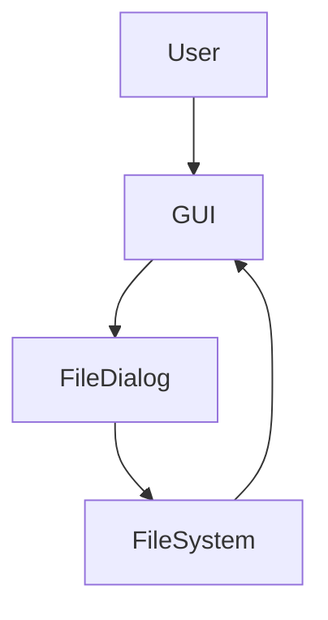
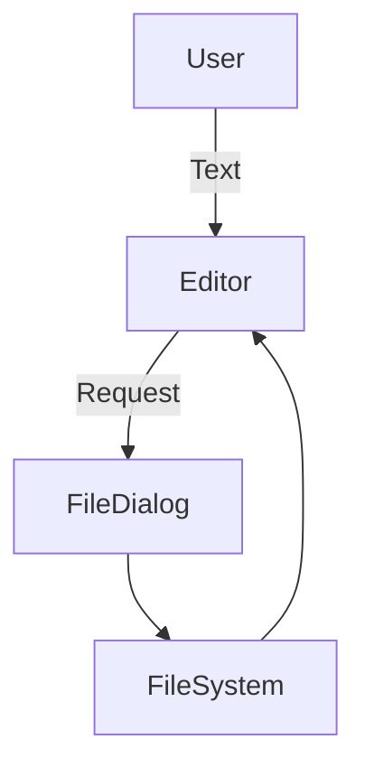
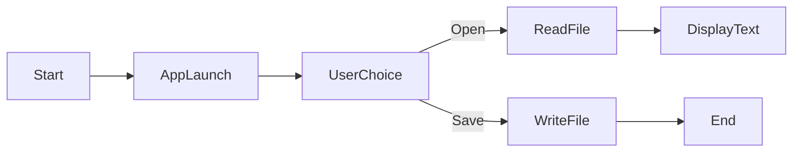

## 📘 DETAILED PROJECT REPORT

(Cool_Project_2 — Python Tkinter Text Editor)


---

## 1️⃣ Abstract

> The Cool_Project_2 is a desktop-based Text Editor Application developed using Python and Tkinter.
> The project focuses on building a lightweight GUI application that enables users to open, edit, and save text files efficiently. It demonstrates file handling, event-driven programming, and GUI layout management in Python.


---

## 2️⃣ Introduction

- Text editors are fundamental tools in computing environments. While many advanced editors exist, beginners often require a simple, distraction-free application.

### This project aims to:

- Provide a minimal text editor

- Help learners understand GUI programming

- Serve as a base for advanced editor features


---

## 3️⃣ Objectives

- ✔ Create a user-friendly text editor

- ✔ Implement file open and save operations

- ✔ Understand Tkinter widgets and layouts

- ✔ Demonstrate Python file handling

- ✔ Build cross-platform desktop software


---

## 4️⃣ Scope of the Project

### Included:

- Open text files

- Edit content

- Save files

- GUI-based interaction


- Not Included:

- Syntax highlighting

- Rich text formatting

- Cloud storage

- Multi-tab editing


---

## 5️⃣ Technology Stack

### Component	Technology

- Programming Language	Python 3.x
- GUI Framework	Tkinter
- IDE	VS Code / PyCharm
- OS Support	Windows, Linux, macOS


---

## 6️⃣ System Requirements

### Hardware:

- Minimum 2 GB RAM

- Any x64 processor


### Software:

- Python 3.x

- OS: Windows / Linux / macOS


---

## 7️⃣ System Architecture

- Architecture Description:

- User interacts with GUI

- GUI triggers file dialogs

- File system handles read/write

- Text is displayed/updated in editor



---

8️⃣ Data Flow Diagram (DFD)



---

9️⃣ Flow Diagram



---

## 🔟 Module Description

## 📂 File Open Module

- Opens system file explorer

- Reads text file content

- Displays content in editor


## 💾 File Save Module

- Saves edited text

- Supports .txt and all file formats


## 🖥 GUI Module

- Text widget for editing

- Buttons for operations

- Responsive layout


---

## 1️⃣1️⃣ Advantages

- Lightweight

- Beginner-friendly

- No external dependencies

- Cross-platform

- Easy to extend


---

## 1️⃣2️⃣ Limitations

- No syntax highlighting

- No autosave

- No formatting options

- Limited to basic text files


---

## 1️⃣3️⃣ Real-World Applications

- Student note editing

- Office quick file edits

- Educational demonstrations

- Lightweight internal tools


Example:
> In computer labs where heavy software is restricted, this editor can be used safely.


---

## 1️⃣4️⃣ Future Enhancements

- Search & Replace

- Dark Mode

- Syntax Highlighting

- Auto-save

- Multi-file tabs


---

- 1️⃣5️⃣ Conclusion

The Cool_Project_2 Text Editor successfully demonstrates Python GUI development using Tkinter.
It is an ideal project for beginners and serves as a foundation for advanced desktop applications.


---

## 📦 Packaging Project into EXE (Windows)

- ✅ Tool Used: PyInstaller


---

🔹 Step-by-Step EXE Creation Guide

## 1️⃣ Install PyInstaller

```
pip install pyinstaller
```

---

## 2️⃣ Navigate to Project Folder

cd Cool_Project_2


---

## 3️⃣ Create Executable

```
pyinstaller --onefile --windowed text_editor.py
```

📌 Replace text_editor.py with your actual filename.


---

## 4️⃣ Output Files

|Folder	||Purpose |

|dist/	|| Final .exe file |
|build/	|| Temporary build files |
|.spec	|| Build configuration |


---

## 5️⃣ Run EXE

```
dist/text_editor.exe
```

- ✔ Runs without Python installed
- ✔ Double-click execution


---

🔹 Optional: Custom Icon

```
pyinstaller --onefile --windowed --icon=icon.ico text_editor.py
```

---

## 📁 Final Project Structure

```text
Cool_Project_2/
│
├── text_editor.py
├── README.md
├── Project_Report.pdf
├── dist/
│   └── text_editor.exe
├── build/
└── text_editor.spec
```

---

